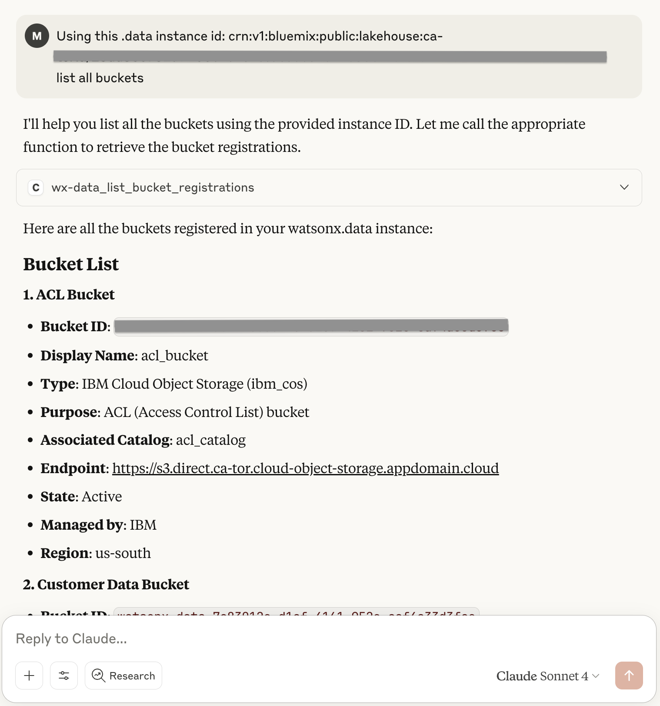

# IBM watsonx.data Demo

This guide shows you how to integrate MCP Composer with IBM watsonx.data API and then test it using MCP Inspector or Claude Desktop.

## Overview

IBM watsonx.data exposes API and provides OpenAPI specification that is available at `./spec/wx-data-openapi.json.`

This demo consists of two examples:
- connection from MCP Inspector to MCP Composer running in HTTP mode
- connection from Claude Dektop to MCP Composer running in STDIO mode

## Configuration
Prepare a new configuration file by providing values for the following attributes:
- endpoint - watsonx.data API endpoint
- apikey - watsonx.data apikey

and customize `custom_routes` according to your specific needs.
```
[
  {
    "id": "wx-data",
    "type": "openapi",
    "open_api": {
      "endpoint": "...",
      "spec_filepath": "./spec/wx-data-openapi.json",
      "custom_routes": [
        {
          "methods": [
            "GET",
            "POST"
          ],
          "pattern": ".*/",
          "mcp_type": "TOOL"
        },
        {
          "methods": [
            "DELETE",
            "PUT",
            "PATCH"
          ],
          "pattern": ".*/",
          "mcp_type": "EXCLUDE"
        }
      ]
    },
    "auth_strategy": "dynamic_bearer",
    "auth": {
      "auth_prefix": "Bearer",
      "apikey": "...",
      "token_url": "https://iam.cloud.ibm.com/identity/token"
    },
    "_id": "wx-data"
  }
]
```
When starting MCP Composer, this configuration file should be passed as an environment variable:
```
SERVER_CONFIG_FILE_PATH="./wx-data-config.json"
```
## MCP Inspector example
Follow this [MCP Inspector Demo](/examples/mcp-inspector) to start MCP Composer in HTTP mode and connect to it using MCP Inspector. You will gain access to the exposed MCP tools, which you can call.

## Claude Desktop example
You need at least a Claude Desktop Pro plan to use the tools exposed by MCP Composer. Start your Claude Desktop application and go to `Claude -> Settings -> Developer` and click `Edit Config`.
Then you will need to edit the 'claude_desktop_config.json' file using your preferred editor and add MCP Composer to the list of `mcpServers`.
```
{
  "mcpServers": {
    "composer":{
      "command":"/opt/homebrew/bin/uv",
      "args":[
        "--directory",
        ".../mcp-composer/test/",
        "run",
        "test_composer.py"
      ]
    }
  }
}
```
Restart Claude Desktop and, you can start using tools exposed by MCP Composer.
The first step in a conversation is to provide the `Instance identifier` (CRN) that should be used during the interaction. Below is an example of a conversation with watsonx.data.

