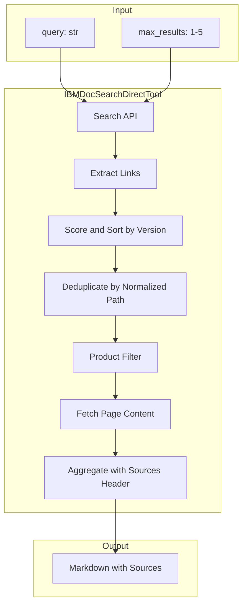
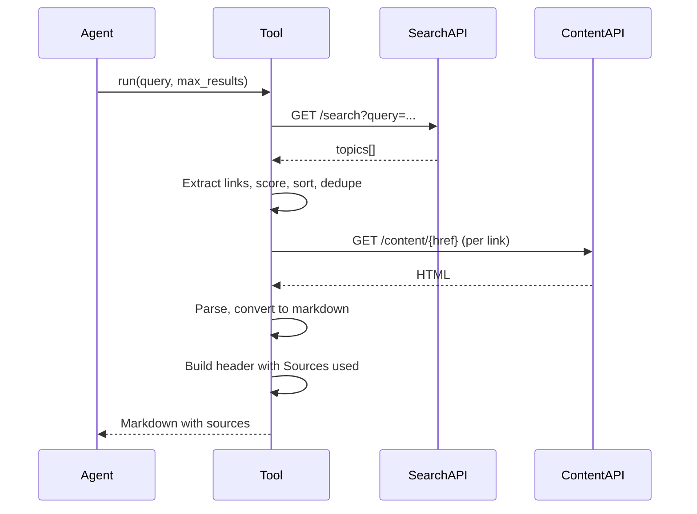

# IBM Doc Search Direct Tool — Design Document

## Overview

The IBM Doc Search Direct Tool is an MCP tool that searches IBM documentation via the public IBM Docs API and returns full page content as markdown. It is designed for agent use: a single call performs search, fetches pages, and returns comprehensive results with clear source attribution.

## Table of Contents

1. [Purpose and Scope](#purpose-and-scope)
2. [Architecture](#architecture)
3. [Version Preference and Attribution](#version-preference-and-attribution)
4. [Data Flow](#data-flow)
5. [Configuration](#configuration)
6. [Output Format](#output-format)
7. [Error Handling](#error-handling)
8. [Design Decisions](#design-decisions)

---

## Purpose and Scope

### Problem

IBM documentation exists in multiple product versions (e.g., watsonx-data 1.0 vs watsonx w-and-w 2.3.x). When an agent searches for a topic, the IBM Docs API may return results from older versions before newer ones. Without version preference, the agent could receive outdated information.

Additionally, agents need to know which documentation sources were used so they can cite correctly or retry with different queries.

### Solution

The tool implements:

1. **Version preference**: Sort and deduplicate results so newer documentation versions (e.g., watsonx w-and-w 2.3.x) are preferred over older ones (e.g., watsonx-data 1.0).
2. **Source attribution**: Include a prominent "Sources used" section at the top of the response listing all URLs used.

### Out of Scope

- The tool does not modify IBM Docs API behavior; it only reorders and filters results.
- It does not support authentication or private documentation.
- It does not cache results.

---

## Architecture



### Components

| Component | Responsibility |
|-----------|----------------|
| Search API | Calls `https://www.ibm.com/docs/api/v1/search` with query, lang, limit |
| Extract Links | Parses topics into link dicts (title, url, href, snippet, product) |
| Score and Sort | Applies version scoring; sorts by (preferred_product, major, minor) descending |
| Deduplicate | Normalizes paths (removes version segments); keeps first occurrence |

---

## Version Preference and Attribution

### Version Scoring

The tool uses `_score_url_version(url) -> Tuple[int, int, int]` to produce a sort key:

1. **Preferred product path** (1 or 0): URLs containing `watsonx/w-and-w` or `2.3` (configurable) score 1; others score 0.
2. **Major version**: Parsed from path (e.g., `2.3.x` → 2).
3. **Minor version**: Parsed from path (e.g., `2.3.x` → 3).

Sort key: `(has_preferred, major, minor)` — higher values first.

**Example:**

| URL | Score | Rank |
|-----|-------|------|
| `.../watsonx/w-and-w/2.3.x/...` | (1, 2, 3) | 1 |
| `.../watsonx-data/1.0/...` | (0, 1, 0) | 2 |

### Deduplication Order

Links are sorted **before** deduplication. The first occurrence of each normalized path is kept. Because newer/preferred versions are sorted first, they are retained when duplicates exist.

### Preferred Product Paths

Configurable via `preferred_product_paths`:

- Default: `["watsonx/w-and-w", "2.3"]` — favors watsonx w-and-w 2.3.x over watsonx-data 1.0.
- Custom: Pass a list of path substrings to prefer (e.g., `["watsonx-data", "2.0"]`).

### Sources Attribution

The response header includes a "Sources used" block:

```markdown
**IBM Docs Search Results** — 3 page(s) returned for query: "flight service connectors" (2.1s).

**Sources used:**
- https://www.ibm.com/docs/en/watsonx/w-and-w/2.3.x?topic=service-supported-connectors-in-flight
- https://www.ibm.com/docs/en/watsonx/w-and-w/2.3.x?topic=service-other-topic
- ...

This response contains the full content of all matched pages. Do not call this tool again for the same topic.
```

Each page section also includes `**Source:** {url}` for per-page attribution.

---

## Data Flow



---

## Configuration

| Parameter | Type | Default | Description |
|-----------|------|---------|-------------|
| `products` | str | `""` | Comma-separated product filter (e.g., `"instana,mq"`)
| `max_results` | int | 3 | Default max pages per call |
| `language` | str | `"en"` | Language code for search |
| `timeout` | int | 30 | HTTP timeout in seconds |
| `preferred_product_paths` | List[str] | `["watsonx/w-and-w", "2.3"]` | Path substrings to prefer when sorting |

### Example

```python
from mcp_composer.core.tools import IBMDocSearchDirectTool

tool = IBMDocSearchDirectTool(
    config={
        "name": "ibm_doc_search_direct",
        "products": "watsonx",
        "preferred_product_paths": ["watsonx/w-and-w", "2.3"],
        "timeout": 30,
    }
)
composer.add_tool(tool)
```

---

## Output Format

1. **Header**: Query, page count, elapsed time.
2. **Sources used**: Bullet list of all URLs.
3. **Per-page sections**:
   - `# {title}`
   - `**Source:** {url}`
   - `**Product:** {product}`
   - Full markdown content

---

## Error Handling

| Error | User-facing message |
|-------|---------------------|
| Invalid input | Generic message (no validation details) |
| Timeout | Generic message |
| Connection error | Generic message |
| HTTP error | Generic message |
| Parse error | Generic message |

All errors return: *"The IBM documentation search could not complete. Try again later or rephrase your query."*

Detailed errors are logged for debugging.

---

## Design Decisions

### 1. Sort before deduplication

Deduplication uses normalized path (version segments removed). Sorting first ensures the preferred version is kept when multiple versions exist for the same topic.

### 2. Configurable preferred paths

Different deployments may prefer different product/version combinations. Default targets watsonx w-and-w 2.3.x; others can override.

### 3. Simple version parsing

Version is extracted with regex `(\d+)\.(\d+)(?:\.\w+)?` from the path. This covers common patterns (2.3.x, 1.0) without complex parsing.

### 4. Generic error messages

Agent-facing error messages are generic to avoid exposing internal details or encouraging retries.

### 5. Sources at top

Listing sources at the top makes it clear which docs were used before the agent reads the content.

---

## References

- [IBM Docs Search API](https://www.ibm.com/docs/api/v1/search)
- [IBM Docs Content API](https://www.ibm.com/docs/api/v1/content)
- [Supported connectors for Flight service (watsonx w-and-w 2.3.x)](https://www.ibm.com/docs/en/watsonx/w-and-w/2.3.x?topic=service-supported-connectors-in-flight)
