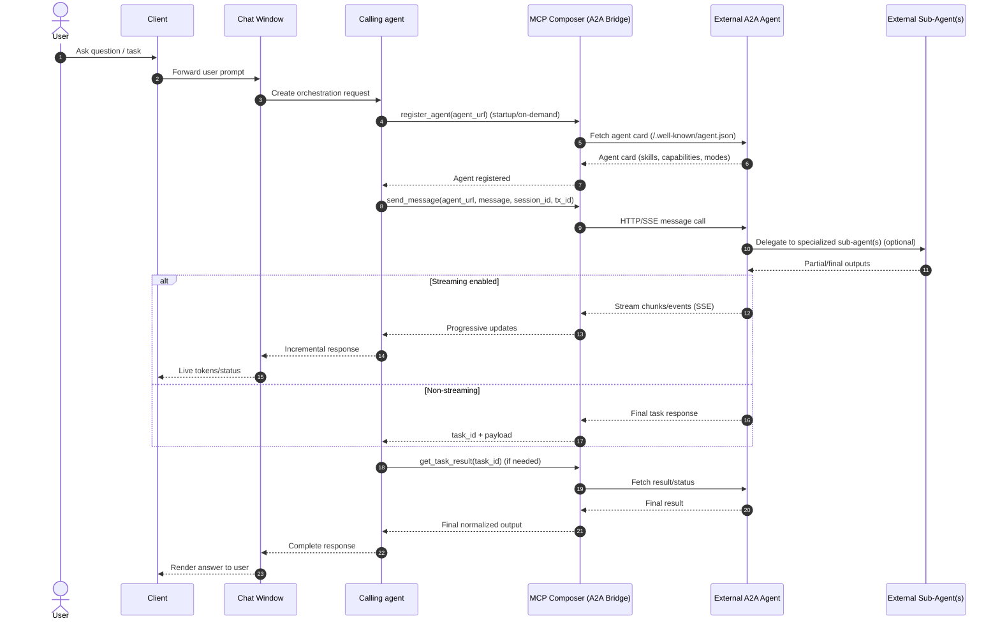

# A2A (Agent-to-Agent) Integration

The A2A (Agent-to-Agent) module provides MCP tools for seamless communication and task management between different agents. This enables MCP Composer to interact with external A2A-compliant agents, allowing for distributed agent orchestration and task delegation.

## 📋 Overview

The A2A integration allows MCP Composer to:

- **Register external agents** from A2A-compliant services
- **Send messages** to registered agents and receive responses
- **Manage tasks** across multiple agents
- **Discover agents** using semantic similarity search with embeddings
- **Access agent resources** through MCP resource endpoints

## 🔌 External A2A Agent Connectivity

This section explains how an external A2A agent (outside MCP Composer) is
connected from a client.

### Sequence diagram



### End-to-end request path

1. **User request enters the client**
   - The client sends the request to the calling agent.
2. **The calling agent decides to delegate**
   - The calling agent selects the external A2A agent (directly by URL or via
     `find_agent`).
3. **Agent is registered (one-time or startup-time)**
   - Composer calls `register_agent(url)`.
   - Registration resolves the external agent card (typically from
     `/.well-known/agent.json`) and persists metadata.
4. **Message is sent to external agent**
   - Composer calls `send_message(agent_url, message)`.
   - Correlation context (for example: `agent_id`, transaction/request ID,
     and `session_id`) should be propagated by the caller so downstream logs
     can be traced end-to-end.
   - `session_id` is the conversation context key for multi-turn continuity.
     The external agent should treat it as required context input.
5. **Transport and response handling**
   - For non-streaming agents, Composer returns a normal task response.
   - For streaming-capable agents (`capabilities.streaming = true`), the
     response can be consumed progressively over HTTP/SSE depending on the
     agent implementation.
6. **Task lifecycle management**
   - Composer returns a `task_id`.
   - Use `get_task_result(task_id)` for polling/fetching final output.
   - Use `cancel_task(task_id)` if the upstream request is cancelled or
     times out.

### What the external agent must expose

At minimum, the external service should provide:

- A valid A2A agent card (name, URL, capabilities, modes, skills)
- A reachable message/task endpoint that can process incoming requests
- Stable task identifiers so Composer can map `task_id -> agent`
- Optional streaming support when `capabilities.streaming` is enabled
- Session-aware request/response handling:
  - Accept `session_id` as input on each turn
  - Return the same `session_id` in each response payload/event
  - Preserve context keyed by `session_id` for multi-turn chat ("multi churn")

### Operational guidance for production

- **Register at startup** to avoid first-request latency.
- **Pass correlation IDs** (`session_id`, request/transaction ID) on every
  delegated call for observability.
- **Echo `session_id` in responses** so the composer can map replies to the
  correct conversation and maintain multi-turn context.
- **Keep task IDs in session state** so UI retries/reconnects can resume
  from `get_task_result`.
- **Set timeout + cancellation policy** to avoid orphaned long-running tasks.
- **Use health checks** and unregister unhealthy endpoints when needed.

### Multi-turn reliability contract (recommended)

`session_id` echoing is required but not sufficient alone. For robust
multi-turn behavior, use this request/response contract with external agents.

1. **Session identity**
   - Request includes `session_id` (required)
   - Response echoes same `session_id` (required)

2. **Turn identity**
   - Request includes `message_id` for each turn
   - Request/response includes `parent_message_id` (or `thread_id`) to keep turn lineage

3. **Async/task mapping**
   - Return stable `task_id` for async work
   - Every status/chunk/final event includes: `session_id`, `message_id`, `task_id`

4. **Ordering and idempotency**
   - Include `sequence` for streamed chunks/events
   - Include `idempotency_key` so retries do not create duplicate work

5. **State persistence**
   - External agent stores context keyed by `session_id` (and optional `thread_id`)
   - Define context TTL/eviction policy

6. **Failure semantics**
   - Standard states: `accepted`, `running`, `completed`, `failed`, `cancelled`
   - Errors include machine-readable code plus human-readable message

**Example envelope for each response/event:**

```json
{
  "session_id": "s-123",
  "message_id": "m-456",
  "task_id": "t-789",
  "sequence": 12,
  "status": "running",
  "payload": {
    "text": "Partial or final response chunk"
  },
  "error": null
}
```

## 🛠️ MCP Tools

### register_agent

Registers an A2A agent with the bridge server by fetching its agent card from the provided URL.

**Parameters:**

- `url` (string): URL of the A2A agent to register

**Example Usage:**

```python
# Register an agent
result = await composer.register_agent("https://agent.example.com")
print(result)
```

**Example Output:**

```json
{
  "status": "success",
  "agent": {
    "name": "Data Analysis Agent",
    "description": "Specialized agent for data analysis and insights",
    "url": "https://agent.example.com",
    "version": "1.0.0",
    "capabilities": {
      "streaming": false
    },
    "default_input_modes": ["text"],
    "default_output_modes": ["text"],
    "skills": [
      {
        "id": "data_analysis",
        "name": "Data Analysis",
        "description": "Analyze datasets and provide insights",
        "tags": ["analysis", "data"],
        "input_modes": ["text"],
        "output_modes": ["text"]
      }
    ]
  }
}
```

### list_agents

Retrieves a list of all registered A2A agents.

**Parameters:**

- None

**Example Usage:**

```python
# List all registered agents
agents = await composer.list_agents()
for agent in agents:
    print(f"Agent: {agent['name']} - {agent['description']}")
```

**Example Output:**

```json
[
  {
    "name": "Data Analysis Agent",
    "description": "Specialized agent for data analysis and insights",
    "url": "https://agent.example.com",
    "version": "1.0.0",
    "capabilities": {
      "streaming": false
    },
    "default_input_modes": ["text"],
    "default_output_modes": ["text"],
    "skills": [
      {
        "id": "data_analysis",
        "name": "Data Analysis",
        "description": "Analyze datasets and provide insights",
        "tags": ["analysis", "data"],
        "input_modes": ["text"],
        "output_modes": ["text"]
      }
    ]
  },
  {
    "name": "Code Review Agent",
    "description": "Agent specialized in code review and suggestions",
    "url": "https://code-agent.example.com",
    "version": "2.1.0",
    "capabilities": {
      "streaming": true
    },
    "default_input_modes": ["text"],
    "default_output_modes": ["text"],
    "skills": [
      {
        "id": "code_review",
        "name": "Code Review",
        "description": "Review code and provide improvement suggestions",
        "tags": ["code", "review", "development"],
        "input_modes": ["text"],
        "output_modes": ["text"]
      }
    ]
  }
]
```

### unregister_agent

Unregisters an A2A agent from the bridge server and cleans up associated task mappings.

**Parameters:**

- `url` (string): URL of the A2A agent to register

**Example Usage:**

```python
# Unregister an agent
result = await composer.unregister_agent("https://agent.example.com")
print(result)
```

**Example Output:**

```json
{
  "status": "success",
  "message": "Successfully unregistered agent: Data Analysis Agent",
  "removed_tasks": 3
}
```

### send_message

Sends a message to a registered A2A agent and returns the response with a
task ID, correlation fields, and an `envelope` for multi-turn mapping.

**Parameters:**

- `agent_url` (string): URL of the registered A2A agent
- `message` (string): Message to send to the agent
- `session_id` (string, optional): Conversation context. Sent on the A2A wire
  as `contextId` and duplicated in `metadata.session_id` so external agents
  can read either field. Use the same value on every turn in a thread.
- `message_id` (string, optional): Id for this turn. Auto-generated if omitted.
- `parent_message_id` (string, optional): Prior message id for strict turn
  lineage. Stored in `metadata.parent_message_id`.
- `thread_id` (string, optional): Optional logical thread id. Stored in
  `metadata.thread_id`.
- `transaction_id` (string, optional): Correlation / trace id. Stored in
  `metadata.transaction_id`.
- `idempotency_key` (string, optional): Stored in `metadata.idempotency_key`
  (deduplication is enforced by the remote agent, not the bridge)

**Example Usage:**

```python
# Send a message to an agent
result = await composer.send_message(
    "https://agent.example.com",
    "Analyze this dataset and provide insights",
    session_id="s-abc-123",
    message_id="m-0001",
)
print(f"Task ID: {result['task_id']}")
print(f"Envelope: {result['envelope']}")
print(f"Response: {result['raw']}")
```

**Example Output:**

```json
{
  "status": "success",
  "task_id": "task-12345-abcde",
  "session_id": "s-abc-123",
  "message_id": "m-0001",
  "envelope": {
    "session_id": "s-abc-123",
    "message_id": "m-0001",
    "task_id": "task-12345-abcde",
    "sequence": 1,
    "status": "completed"
  },
  "raw": [
    {
      "text": "I've analyzed the dataset. Here are the key insights: …",
      "messages": "I've analyzed the dataset. Here are the key insights: …",
      "message_id": "…",
      "task_id": "task-12345-abcde",
      "session_id": "s-abc-123",
      "metadata": { }
    }
  ]
}
```

Each item in `raw` mirrors the A2A `Message` where possible: `text` /
`messages` (same string, for backward compatibility), optional `message_id`,
`task_id`, `session_id` (from `contextId` when the agent echoes it), and
`metadata` when present.

### get_task_result

Retrieves the result of a completed task from an A2A agent. When the task
was created with a `session_id`, the response also includes that id for
mapping.

**Parameters:**

- `task_id` (string): ID of the task to retrieve results for

**Example Usage:**

```python
# Get task result
result = await composer.get_task_result("task-12345-abcde")
print(result)
```

**Example Output:**

```json
{
  "status": "success",
  "task_id": "task-12345-abcde",
  "session_id": "s-abc-123",
  "message_id": "m-0001",
  "raw": "Task completed successfully. The analysis shows strong positive correlations between user engagement and feature adoption rates."
}
```

### cancel_task

Cancels a running task on an A2A agent.

**Parameters:**

- `task_id` (string): ID of the task to cancel

**Example Usage:**

```python
# Cancel a running task
result = await composer.cancel_task("task-12345-abcde")
print(result)
```

**Example Output:**

```json
{
  "status": "success",
  "task_id": "task-12345-abcde",
  "session_id": "s-abc-123",
  "raw": "Task cancelled successfully"
}
```

### find_agent

Finds the most relevant A2A agent based on a natural language query using semantic similarity search with embeddings.

**Parameters:**

- `query` (string): Natural language query to search for relevant agents

**Example Usage:**

```python
# Find the best agent for a task
agent = await composer.find_agent("I need help analyzing sales data and creating visualizations")
print(f"Found agent: {agent['name']}")
print(f"Description: {agent['description']}")
```

**Example Output:**

```json
{
  "name": "Data Analysis Agent",
  "description": "Specialized agent for data analysis, visualization, and business intelligence",
  "url": "https://data-agent.example.com",
  "version": "1.0.0",
  "capabilities": {
    "streaming": false
  },
  "default_input_modes": ["text"],
  "default_output_modes": ["text"],
  "skills": [
    {
      "id": "data_visualization",
      "name": "Data Visualization",
      "description": "Create charts, graphs, and visual representations of data",
      "tags": ["visualization", "charts", "graphs"],
      "input_modes": ["text"],
      "output_modes": ["text"]
    },
    {
      "id": "statistical_analysis",
      "name": "Statistical Analysis",
      "description": "Perform statistical analysis on datasets",
      "tags": ["statistics", "analysis", "math"],
      "input_modes": ["text"],
      "output_modes": ["text"]
    }
  ]
}
```

## 📚 MCP Resources

### get_agent_cards

Retrieves all loaded agent cards as MCP resource URIs.

**Parameters:**

- None

**Example Output:**

```json
{
  "contents": [
    {
      "uri": "resource://agent_cards/list",
      "mimeType": "application/json",
      "text": "{\"agent_cards\":[\"resource://agent_cards/hello_world_agent\"]}"
    }
  ]
}
```

### get_agent_card

Retrieves a specific agent card by name as an MCP resource.

**Parameters:**

- `card_name` (string): Name of the agent card to retrieve


**Example Output:**

```json
{
  "contents": [
    {
      "uri": "agent://agent_cards/hello_world_agent",
      "mimeType": "application/json",
      "text": "{\"agent_card\":[{\"additionalInterfaces\":null,\"capabilities\":{\"extensions\":null,\"pushNotifications\":null,\"stateTransitionHistory\":null,\"streaming\":true},\"defaultInputModes\":[\"text\"],\"defaultOutputModes\":[\"text\"],\"description\":\"Just a hello world agent\",\"documentationUrl\":null,\"iconUrl\":null,\"name\":\"Hello World Agent\",\"preferredTransport\":\"JSONRPC\",\"protocolVersion\":\"0.3.0\",\"provider\":null,\"security\":null,\"securitySchemes\":null,\"signatures\":null,\"skills\":[{\"description\":\"just returns hello world\",\"examples\":[\"hi\",\"hello world\"],\"id\":\"hello_world\",\"inputModes\":null,\"name\":\"Returns hello world\",\"outputModes\":null,\"security\":null,\"tags\":[\"hello world\"]}],\"supportsAuthenticatedExtendedCard\":true,\"url\":\"http://localhost:9999/\",\"version\":\"1.0.0\"}]}"
    }
  ]
}
```

## ⚙️ Configuration

### Environment Variables

The A2A module uses the following environment variables:

```bash
# File paths for persistent storage
export A2A_AGENT_CONFIG_FILE="a2a_agent_config.json"
export A2A_TASK_AGENT_MAPPING_FILE="a2a_task_agent_mapping.json"
```

### Agent Registration

Agents are automatically persisted to the configured storage file. The system supports:

- **Automatic agent discovery** via well-known URLs (`/.well-known/agent.json`)
- **Manual agent registration** via direct API calls
- **Agent health monitoring** and automatic cleanup
- **Task mapping persistence** across restarts

## 💡 Use Cases

### 1. **Distributed Task Processing**

```python
# Register multiple specialized agents
await composer.register_agent("https://data-agent.example.com")
await composer.register_agent("https://code-agent.example.com")
await composer.register_agent("https://research-agent.example.com")

# Route tasks to appropriate agents
data_result = await composer.send_message("https://data-agent.example.com", "Analyze this dataset")
code_result = await composer.send_message("https://code-agent.example.com", "Review this code")
research_result = await composer.send_message("https://research-agent.example.com", "Research this topic")
```

### 2. **Agent Discovery and Selection**

```python
# Find the best agent for a specific task
agent = await composer.find_agent("I need help with machine learning model training")

# Send the task to the discovered agent
result = await composer.send_message(agent['url'], "Train a model on this dataset")
```

### 3. **Workflow Orchestration**

```python
# Create a multi-agent workflow
async def process_data_workflow(data):
    # Step 1: Data validation
    validator = await composer.find_agent("data validation")
    validation_result = await composer.send_message(validator['url'], f"Validate this data: {data}")
    
    # Step 2: Data analysis
    analyzer = await composer.find_agent("data analysis")
    analysis_result = await composer.send_message(analyzer['url'], f"Analyze this validated data: {validation_result}")
    
    # Step 3: Report generation
    reporter = await composer.find_agent("report generation")
    final_report = await composer.send_message(reporter['url'], f"Generate report from this analysis: {analysis_result}")
    
    return final_report

# Execute the workflow
result = await process_data_workflow(my_data)
```

## ⚠️ Error Handling

The A2A tools include comprehensive error handling:

```python
try:
    result = await composer.register_agent("https://invalid-agent.com")
except Exception as e:
    print(f"Registration failed: {e}")
    # Handle error appropriately
```

Common error scenarios:

- **Invalid agent URLs**: Returns error with message about failed connection
- **Agent not registered**: Returns error when trying to send messages to unregistered agents
- **Task not found**: Returns error when querying non-existent task IDs
- **Embedding failures**: Gracefully handles API failures during agent discovery

## ✅ Best Practices

### 1. **Agent Registration**

- Register agents during application startup for better performance
- Use well-known URLs for automatic agent discovery
- Implement health checks for registered agents

### 2. **Task Management**

- Store task IDs for long-running operations
- Implement timeout handling for task results
- Clean up completed tasks to manage memory

### 3. **Error Handling**

- Always wrap A2A calls in try-catch blocks
- Implement retry logic for transient failures
- Log errors for debugging and monitoring

### 4. **Performance Optimization**

- Cache agent embeddings for faster discovery
- Use streaming when available for large responses
- Monitor task completion times and agent performance

## 🔗 Integration with MCP Composer

The A2A tools integrate seamlessly with other MCP Composer features:

- **Authentication**: Supports authenticated agent communication
- **Middleware**: Can be extended with custom middleware for A2A calls
- **Monitoring**: Task execution is tracked in system metrics
- **Configuration**: Agent settings can be managed through unified config

## 🔍 Troubleshooting

### Common Issues

1. **Agent Registration Fails**
   - Check agent URL accessibility
   - Verify agent implements A2A protocol correctly
   - Check network connectivity and firewall settings

2. **Task Results Not Available**
   - Ensure task ID is valid and from the same session
   - Check if agent is still running and accessible
   - Implement timeout handling for long-running tasks

3. **Agent Discovery Not Working**
   - Verify embeddings API key is configured
   - Check agent cards are properly loaded
   - Ensure sufficient agent data for similarity matching

### Debug Mode

Enable debug logging to troubleshoot A2A operations:

```python
import logging
logging.getLogger('mcp_composer.a2a_service').setLevel(logging.DEBUG)
```

This will provide detailed logs about:

- Agent registration attempts
- Message sending and receiving
- Task creation and completion
- Embedding generation and similarity calculations

