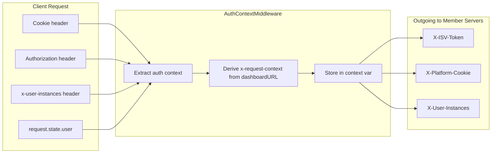

# Auth Context Middleware

The Auth Context Middleware extracts authentication information from incoming requests and makes it available to member server tools via context variables. This enables automatic forwarding of ISV tokens, platform cookies, and user instances to downstream API calls without modifying tool arguments.

## Overview



## Behavior

1. **On `on_call_tool`** – Before each tool execution, the middleware:
   - Extracts ISV token from `request.state.user.access_token` or `Authorization: ibm-platform <token>`
   - Extracts cookies from the `Cookie` header (only those in `forward_cookies`)
   - Extracts cookies from custom headers (e.g. `x-request-context` as header)
   - Extracts user instances from `user.identity.userInstances` or `x-user-instances` header
   - Derives `x-request-context` from the first instance's `dashboardURL` when not provided and `x-request-context` is in `forward_cookies`
   - Stores the auth context in a context variable for the duration of the tool call

2. **During tool execution** – Member servers (e.g. LayeredOpenAPIFactory) call `get_auth_context()` or `get_auth_headers()` to obtain the stored context and add it to outgoing HTTP requests.

3. **After tool execution** – The context variable is cleared.

---

## Configuration

```python
from mcp_composer.middleware.auth_context_middleware import AuthContextMiddleware, REQUEST_CONTEXT_KEY

# Solis Composer example
FORWARD_COOKIES = [
    "mcsp-glb-iam-test",  # or mcsp-glb-iam-dev, mcsp-glb-iam for prod
    REQUEST_CONTEXT_KEY,  # "x-request-context"
]

composer.add_middleware(
    AuthContextMiddleware(
        forward_cookies=FORWARD_COOKIES,
        add_isv_token=True,
        add_cookie_header=True,
    )
)
```

| Parameter | Default | Description |
|-----------|---------|-------------|
| `forward_cookies` | `[]` | Cookie names to extract and forward. Only these appear in `X-Platform-Cookie`. |
| `add_isv_token` | `True` | Whether to add `X-ISV-Token` to outgoing requests |
| `add_cookie_header` | `True` | Whether to add `X-Platform-Cookie` to outgoing requests |

---

## Headers

### Input Headers (read from client request)

| Header | Description |
|--------|-------------|
| `Cookie` | Standard cookie header. Only cookies whose names are in `forward_cookies` are extracted. |
| `Authorization` | Fallback for ISV token when `request.state.user` has no token. Expected format: `ibm-platform <token>`. |
| `x-user-instances` | JSON array of user instances. Used when `user.identity.userInstances` is not available. |
| `x-request-context` | Optional. If present as a header, used as the request context. Otherwise derived from `dashboardURL`. |

### Output Headers (sent to member servers)

| Header | Description |
|--------|-------------|
| `X-ISV-Token` | ISV access token from authenticated user |
| `X-Platform-Cookie` | Semicolon-separated `name=value` pairs for cookies in `forward_cookies` (e.g. `mcsp-glb-iam-test=session-xyz; x-request-context=https://...`) |
| `X-User-Instances` | JSON array of normalized user instances |

---

## x-request-context Derivation

`x-request-context` is the dashboard host URL (path before `?`). It is used when:

1. `x-request-context` is in `forward_cookies`
2. The client did not provide `x-request-context` (cookie or header)
3. User instances exist and the first instance has a `dashboardURL`

**Example:**

```
dashboardURL: "https://console-aws-cacentral1.lakehouse.dev.saas.ibm.com/v1/ams/iam/sso?crn=..."
x-request-context: "https://console-aws-cacentral1.lakehouse.dev.saas.ibm.com/v1/ams/iam/sso"
```

---

## User Instances

### Input Format

User instances can come from:

1. **`user.identity.userInstances`** (or `user_instances`) – from `request.state.user`
2. **`x-user-instances`** header – JSON string

**Expected input structure:**

```json
[
  {
    "id": "20251128-1445-2831-7084-4a9a364b8b6b",
    "subscriptionId": "20240430-2249-3023-2003-c61c1ea9c579",
    "name": "solisams",
    "dashboardURL": "https://console-aws-cacentral1.lakehouse.dev.saas.ibm.com/v1/ams/iam/sso?crn=crn:v1:...",
    "subscription": {
      "subscriptionName": "watsonx.data",
      "productId": "lakehouse"
    }
  }
]
```

| Field | Required | Purpose |
|-------|----------|---------|
| `id` | Yes | Instance ID → `instance_id` |
| `subscription.subscriptionName` | No | → `subscriptionName` |
| `subscription.productId` | No | → `productId` |
| `dashboardURL` | No | Used for `x-request-context` and `host` (URL before `?`) |

### Output Format (X-User-Instances)

Instances are normalized before forwarding:

```json
[
  {
    "instance_id": "20251128-1445-2831-7084-4a9a364b8b6b",
    "subscriptionName": "watsonx.data",
    "productId": "lakehouse",
    "host": "https://console-aws-cacentral1.lakehouse.dev.saas.ibm.com/v1/ams/iam/sso"
  }
]
```

---

## Complete Example

### Incoming request from client (e.g. MCP Inspector)

```http
GET /mcp HTTP/1.1
Cookie: mcsp-glb-iam-test=eyJhbGciOiJSUzI1NiIsInR5cCI6IkpXVCJ9...
x-user-instances: [{"id":"20251128-1445-2831-7084-4a9a364b8b6b","subscription":{"subscriptionName":"watsonx.data","productId":"lakehouse"},"dashboardURL":"https://console-aws-cacentral1.lakehouse.dev.saas.ibm.com/v1/ams/iam/sso"}]
X-Request-Id: inspector-request-123
```

### Auth context after extraction

```python
{
    "isv_token": "eyJhbGciOiJSUzI1NiIs...",  # from request.state.user.access_token
    "cookies": {
        "mcsp-glb-iam-test": "eyJhbGciOiJSUzI1NiIs...",
        "x-request-context": "https://console-aws-cacentral1.lakehouse.dev.saas.ibm.com/v1/ams/iam/sso"  # derived from dashboardURL
    },
    "authenticated": True,
    "user_instances": [
        {
            "instance_id": "20251128-1445-2831-7084-4a9a364b8b6b",
            "subscriptionName": "watsonx.data",
            "productId": "lakehouse",
            "host": "https://console-aws-cacentral1.lakehouse.dev.saas.ibm.com/v1/ams/iam/sso"
        }
    ]
}
```

### Outgoing request to member server

```http
GET /api/some-endpoint HTTP/1.1
X-ISV-Token: eyJhbGciOiJSUzI1NiIs...
X-Platform-Cookie: mcsp-glb-iam-test=eyJhbGciOiJSUzI1NiIs...; x-request-context=https://console-aws-cacentral1.lakehouse.dev.saas.ibm.com/v1/ams/iam/sso
X-User-Instances: [{"instance_id":"20251128-1445-2831-7084-4a9a364b8b6b","subscriptionName":"watsonx.data","productId":"lakehouse","host":"https://console-aws-cacentral1.lakehouse.dev.saas.ibm.com/v1/ams/iam/sso"}]
X-Request-Id: inspector-request-123
```

---

## API Reference

### `get_auth_context() -> Optional[Dict[str, Any]]`

Returns the current authentication context from the context variable, or `None` if not set.

### `get_auth_headers() -> Dict[str, str]`

Builds a dict of headers from the current auth context:

- `X-ISV-Token` – if token present
- `X-Platform-Cookie` – if cookies present (semicolon-separated)
- `X-User-Instances` – if user instances present (JSON string)

---

## FORWARD_COOKIES (Solis)

In Solis Composer, `FORWARD_COOKIES` is environment-dependent:

| Environment | Cookie name |
|-------------|-------------|
| `test` | `mcsp-glb-iam-test` |
| `dev` | `mcsp-glb-iam-dev` |
| `prod` | `mcsp-glb-iam` |

`x-request-context` is always included to support dashboard URL derivation.
