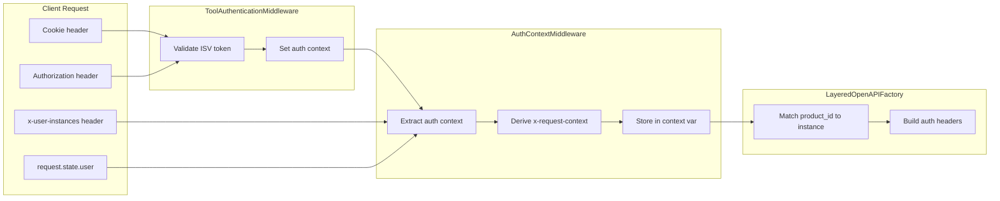

# ISV Auth Implementation Guide

This guide describes the full ISV (Independent Software Vendor) authentication flow in MCP Composer: token validation, auth context extraction, instance-based authorization, and how member servers use the context for downstream calls.

---

## Overview



**Flow in short:**

1. **ToolAuthenticationMiddleware** – Validates the ISV token (cookie or `Authorization: ibm-platform <token>`), builds auth context, stores it. Only runs for tools whose server has `solis_config.isIamEnabled`.
2. **AuthContextMiddleware** – Reads `x-user-instances` (first) or `user.identity`, normalizes instances, derives `x-request-context` from `dashboardURL`, stores full and simplified instance data. Also runs only when IAM is enabled for the tool.
3. **LayeredOpenAPIFactory** (e.g. `make_tool_call`) – Reads auth context, matches server `solis_config.product_id` to `instance.subscription.productId`, selects one active instance, builds headers (`X-ISV-Token`, `X-Platform-Cookie`, `X-User-Instances`, `Authorization: ibm-platform <cookie>` when using cookie-as-auth), and forwards the request.

---

## 1. ToolAuthenticationMiddleware (ISV token validation)

Validates the ISV token **before** the tool runs. If validation fails, the tool is not executed (401).

### Behavior

- Runs on `on_call_tool`.
- **IAM gate:** If `is_iam_enabled_for_tool(tool_name)` is provided and returns `False`, auth is skipped for that tool.
- **Discovery tools:** `get_service_info` and `get_type_info` skip validation (no backend call).
- **Exempt tools:** Optional `exempt_tools` list skips validation for those names.
- Uses **ISVTokenValidator** to validate the request (cookie or token); on success, builds auth context (token, cookies, user identity) and sets the context variable for the rest of the chain.

### Configuration

```python
from mcp_composer.core.auth.jwt.isv_token_validator import ISVTokenValidator
from mcp_composer.middleware.tool_auth_middleware import ToolAuthenticationMiddleware
from mcp_composer.middleware.auth_utils import tool_name_to_server_id

# Validator (env: local | test | dev | prod)
validator = ISVTokenValidator(
    environment="test",
    cache_enabled=True,
    cache_ttl=7200,
    timeout=30,
)

# Optional: only require auth for tools whose server has solis_config.isIamEnabled
def is_iam_enabled_for_tool(tool_name: str) -> bool:
    server_id = tool_name_to_server_id(tool_name)
    return server_manager.is_iam_enabled_for_server(server_id) if server_id else False

composer.add_middleware(
    ToolAuthenticationMiddleware(
        validator=validator,
        exempt_tools=None,  # optional: ["health_check", "list_tools"]
        is_iam_enabled_for_tool=is_iam_enabled_for_tool,
    )
)
```

---

## 2. AuthContextMiddleware (extract and forward context)

Extracts cookies, user instances, and optional auth token from the request and stores them so member servers can add the right headers to downstream calls.

### Instance source (priority)

1. **`x-user-instances` header (first)** – JSON string: array of instances or Solis wrapper `{ "userInstances": [...] }`. If present, this is used.
2. **`user.identity`** – Fallback: `user.identity.userInstances` or `user.identity.user_instances`, or `user.identity.instances.userInstances` (Solis API shape).

Supported shapes for the header value:

- Array of instance objects: `[{ "id": "...", "subscription": { "productId": "gi" }, ... }]`
- Solis wrapper: `{ "success": true, "userInstances": [ ... ] }`
- Single instance: `{ "id": "...", ... }` (normalized to a one-element list)

Normalization also unwraps a single-element list whose element has `userInstances` (e.g. `[{ "userInstances": [...] }]`).

### Cookie-as-auth

When `use_cookie_as_auth=True` and `auth_cookie_name` is set (e.g. `mcsp-glb-iam-test`), the middleware stores the cookie value in auth context as `auth_token`. LayeredOpenAPIFactory then sends `Authorization: ibm-platform <cookie_value>` on outgoing requests when present.

### IAM gate

If `is_iam_enabled_for_tool` is set, auth context is extracted only for tools whose server has `solis_config.isIamEnabled === true`. Otherwise the middleware runs for all tools (or only those matching `enabled_tool_patterns`, if set).

### Configuration

```python
from mcp_composer.middleware.auth_context_middleware import (
    AuthContextMiddleware,
    REQUEST_CONTEXT_KEY,
)

FORWARD_COOKIES = [
    "mcsp-glb-iam-test",   # or mcsp-glb-iam-dev, mcsp-glb-iam for prod
    REQUEST_CONTEXT_KEY,   # "x-request-context"
]

composer.add_middleware(
    AuthContextMiddleware(
        forward_cookies=FORWARD_COOKIES,
        add_isv_token=True,
        add_cookie_header=True,
        use_cookie_as_auth=True,
        auth_cookie_name="mcsp-glb-iam-test",
        enabled_tool_patterns=None,  # None = all tools (subject to IAM gate)
        is_iam_enabled_for_tool=is_iam_enabled_for_tool,
    )
)
```

| Parameter | Default | Description |
|-----------|---------|-------------|
| `forward_cookies` | `[]` | Cookie names to extract and forward in `X-Platform-Cookie`. |
| `add_isv_token` | `True` | Add `X-ISV-Token` to outgoing headers when building from context. |
| `add_cookie_header` | `True` | Add `X-Platform-Cookie` when building from context. |
| `use_cookie_as_auth` | `False` | If `True`, store auth cookie value as `auth_token` for `Authorization: ibm-platform <value>`. |
| `auth_cookie_name` | `"mcsp-glb-iam-test"` | Cookie name used when `use_cookie_as_auth=True`. |
| `enabled_tool_patterns` | `None` | If set, only tools whose name matches one of these patterns get auth context. |
| `is_iam_enabled_for_tool` | `None` | If set, only tools whose server has IAM enabled get auth context. |

---

## 3. Headers

### Input (read from client)

| Header | Description |
|--------|-------------|
| `Cookie` | Forwarded cookies are those listed in `forward_cookies`. |
| `Authorization` | Fallback for ISV token: `ibm-platform <token>`. |
| `x-user-instances` | **Primary source** for user instances (JSON array or wrapper). |
| `x-request-context` | Optional; if not provided, derived from first instance’s `dashboardURL`. |

### Output (sent to member servers)

| Header | Description |
|--------|-------------|
| `X-ISV-Token` | ISV access token from validated auth. |
| `X-Platform-Cookie` | `name=value; ...` for cookies in `forward_cookies`. |
| `X-User-Instances` | JSON array of normalized instances (`instance_id`, `productId`, `host`, etc.). |
| `Authorization` | When cookie-as-auth is used: `ibm-platform <cookie_value>`. |

---

## 4. User instances

### Input (x-user-instances or identity)

Full instance shape (each item may have `subscription.productId` or top-level `productId`):

```json
[
  {
    "id": "20260116-2134-3895-9036-5d9421c3f567",
    "state": "active",
    "name": "SolisDemo",
    "dashboardURL": "https://example.com/dashboard?crn=...",
    "subscription": {
      "productId": "gi",
      "subscriptionName": "Guardium Data Security Center SaaS"
    }
  }
]
```

Solis wrapper (also accepted in header):

```json
{
  "success": true,
  "userInstances": [
    { "id": "...", "subscription": { "productId": "gi" }, ... }
  ]
}
```

**Full Solis API response format** – The `x-user-instances` header can be the full Solis instances API response. The middleware uses only the **`userInstances`** array for auth and routing; `cohortInstances` is ignored.

```json
{
  "success": true,
  "cohortInstances": [
    {
      "cohort": "data",
      "products": {
        "lakehouse": [
          {
            "id": "20251128-1445-2831-7084-4a9a364b8b6b",
            "state": "active",
            "name": "solisams",
            "dashboardURL": "https://console-aws-cacentral1.lakehouse.dev.saas.ibm.com/v1/ams/iam/sso?crn=...",
            "subscription": {
              "productId": "lakehouse",
              "subscriptionName": "watsonx.data"
            }
          }
        ]
      }
    },
    {
      "cohort": "security",
      "products": {
        "gi": [
          {
            "id": "20260116-2134-3895-9036-5d9421c3f567",
            "state": "active",
            "name": "SolisDemo",
            "dashboardURL": "https://rel03.rel.guardium.security.ibm.com?mcsp_metadata=...",
            "subscription": {
              "productId": "gi",
              "subscriptionName": "Guardium Data Security Center SaaS"
            }
          }
        ]
      }
    }
  ],
  "userInstances": [
    {
      "id": "20251128-1445-2831-7084-4a9a364b8b6b",
      "state": "active",
      "name": "solisams",
      "dashboardURL": "https://console-aws-cacentral1.lakehouse.dev.saas.ibm.com/v1/ams/iam/sso?crn=...",
      "subscription": { "productId": "lakehouse", "subscriptionName": "watsonx.data" }
    },
    {
      "id": "20260116-2134-3895-9036-5d9421c3f567",
      "state": "active",
      "name": "SolisDemo",
      "dashboardURL": "https://rel03.rel.guardium.security.ibm.com?mcsp_metadata=...",
      "subscription": { "productId": "gi", "subscriptionName": "Guardium Data Security Center SaaS" }
    }
  ],
  "count": 5,
  "source": "api"
}
```

When this object is sent as `x-user-instances`, the middleware extracts **`userInstances`** and uses that list for authorization (productId matching) and for building the normalized `X-User-Instances` header. Each item in `userInstances` must have `id`, optional `state`, optional `subscription.productId`, and optional `dashboardURL` (used for host and x-request-context).

### Normalized output (in auth context and X-User-Instances)

- **`user_instances_full`** – Raw list of instance dicts (after unwrapping), used for authorization and routing.
- **`user_instances`** – Simplified list used for `X-User-Instances` header:

```json
[
  {
    "instance_id": "20260116-2134-3895-9036-5d9421c3f567",
    "subscriptionName": "Guardium Data Security Center SaaS",
    "productId": "gi",
    "host": "https://example.com/dashboard"
  }
]
```

- `instance_id` comes from the instance `id` (the product instance id).
- `productId` comes from `subscription.productId` or top-level `productId`.

---

## 5. x-request-context

- Value is the dashboard URL without query string (e.g. `https://example.com/dashboard`).
- Set when: `x-request-context` is in `forward_cookies`, the client did not send it, and the first instance has `dashboardURL`.
- Example: `dashboardURL: "https://example.com/dashboard?crn=..."` → `x-request-context: "https://example.com/dashboard"`.

---

## 6. Member server authorization (LayeredOpenAPIFactory)

For IAM-enabled layered OpenAPI servers (e.g. Gurdium):

1. **Config** – `member_servers.json` per server has `solis_config.product_id` (e.g. `"gi"`) and `solis_config.isIamEnabled: true`. The builder passes `product_id` into the factory.
2. **On `make_tool_call`** – Factory reads `user_instances_full` from auth context, then:
   - Requires at least one instance; otherwise returns 401 “No user instances available”.
   - Selects the first instance where `instance.subscription.productId` or top-level `productId` equals `solis_config.product_id` and `state == "active"`.
   - If none match: 401 “No instance with productId '<product_id>'. User instances have productIds: [...]”.
3. **Routing** – Host can be taken from the selected instance’s `dashboardURL` (base URL) for dynamic routing.
4. **Headers** – Factory adds:
   - `Authorization: ibm-platform <auth_token>` when cookie-as-auth is used and `auth_token` is set.
   - `X-ISV-Token` when present.
   - `X-Platform-Cookie` when present.
   - `X-User-Instances` (normalized list).
   - Instance-specific headers (e.g. from `_build_instance_headers`).

Discovery tools `get_service_info` and `get_type_info` do not perform this authorization and do not require instances.

---

## 7. Solis Composer example (full stack)

```python
import os
from mcp_composer import MCPComposer
from mcp_composer.core.auth.jwt.isv_token_validator import ISVTokenValidator
from mcp_composer.middleware.auth_context_middleware import (
    AuthContextMiddleware,
    REQUEST_CONTEXT_KEY,
)
from mcp_composer.middleware.auth_utils import tool_name_to_server_id
from mcp_composer.middleware.tool_auth_middleware import ToolAuthenticationMiddleware

# Environment and cookies
environment = os.getenv("MCP_COMPOSER_ENV", "test").strip().lower()
if environment == "local":
    environment = "test"
auth_cookie_name = os.getenv("ISV_AUTH_COOKIE_NAME", "mcsp-glb-iam-test").strip()
FORWARD_COOKIES = [auth_cookie_name, REQUEST_CONTEXT_KEY]

# Validator
isv_validator = ISVTokenValidator(
    environment=environment,
    cache_enabled=True,
    cache_ttl=7200,
    timeout=30,
)

composer = MCPComposer(name="solis-composer", auth=None)

# IAM gate: auth only for tools whose server has solis_config.isIamEnabled
def is_iam_enabled_for_tool(tool_name: str) -> bool:
    server_id = tool_name_to_server_id(tool_name)
    return composer._server_manager.is_iam_enabled_for_server(server_id) if server_id else False

# 1) Token validation (first)
composer.add_middleware(
    ToolAuthenticationMiddleware(
        validator=isv_validator,
        is_iam_enabled_for_tool=is_iam_enabled_for_tool,
    )
)

# 2) Auth context extraction (x-user-instances, cookies, cookie-as-auth)
composer.add_middleware(
    AuthContextMiddleware(
        forward_cookies=FORWARD_COOKIES,
        add_isv_token=True,
        add_cookie_header=True,
        use_cookie_as_auth=True,
        auth_cookie_name=auth_cookie_name,
        is_iam_enabled_for_tool=is_iam_enabled_for_tool,
    )
)

# ... other middleware (tracing, filter, error sanitization) ...
# ... setup_tools(composer); composer.setup_member_servers() ...
```

### Example client request (e.g. MCP Inspector)

```http
POST /mcp HTTP/1.1
Cookie: mcsp-glb-iam-test=eyJhbGciOiJSUzI1NiIs...
x-user-instances: [{"id":"20260116-2134-3895-9036-5d9421c3f567","state":"active","name":"SolisDemo","dashboardURL":"https://example.com/dashboard","subscription":{"productId":"gi","subscriptionName":"Guardium Data Security Center SaaS"}}]
```

### Example auth context (after both middlewares)

```python
{
    "isv_token": "eyJhbGciOiJSUzI1NiIs...",
    "cookies": {
        "mcsp-glb-iam-test": "eyJ...",
        "x-request-context": "https://example.com/dashboard"
    },
    "authenticated": True,
    "auth_token": "eyJ...",  # same cookie when use_cookie_as_auth=True
    "user_instances": [
        {
            "instance_id": "20260116-2134-3895-9036-5d9421c3f567",
            "subscriptionName": "Guardium Data Security Center SaaS",
            "productId": "gi",
            "host": "https://example.com/dashboard"
        }
    ],
    "user_instances_full": [ { "id": "20260116-...", "subscription": { "productId": "gi" }, ... } ]
}
```

### Example outgoing request to member server (e.g. Gurdium)

```http
POST /api/v1/policies/list HTTP/1.1
Authorization: ibm-platform eyJhbGciOiJSUzI1NiIs...
X-ISV-Token: eyJhbGciOiJSUzI1NiIs...
X-Platform-Cookie: mcsp-glb-iam-test=eyJ...; x-request-context=https://example.com/dashboard
X-User-Instances: [{"instance_id":"20260116-2134-3895-9036-5d9421c3f567","subscriptionName":"Guardium Data Security Center SaaS","productId":"gi","host":"https://example.com/dashboard"}]
```

---

## 8. API reference

### Auth context middleware

- **`get_auth_context() -> Optional[Dict[str, Any]]`** – Returns the current auth context from the context variable, or `None`.
- **`get_auth_headers() -> Dict[str, str]`** – Builds headers from the current context: `X-ISV-Token`, `X-Platform-Cookie`, `X-User-Instances`.

### Auth context keys

| Key | Description |
|-----|-------------|
| `isv_token` | ISV access token. |
| `cookies` | Dict of cookie name → value. |
| `authenticated` | True if token/cookie auth succeeded. |
| `auth_token` | Cookie value used for `Authorization: ibm-platform <value>` when `use_cookie_as_auth=True`. |
| `user_instances` | Simplified list for `X-User-Instances`. |
| `user_instances_full` | Full instance list for product_id matching and routing. |

### member_servers.json (per server)

For IAM-enabled layered OpenAPI:

```json
{
  "id": "mcp-gurdium",
  "solis_config": {
    "product_id": "gi",
    "isIamEnabled": true
  },
  "type": "openapi",
  "open_api": { "layered": true, ... }
}
```

- **`solis_config.product_id`** – Matched against user instances’ `subscription.productId` (or top-level `productId`) for authorization.
- **`solis_config.isIamEnabled`** – When `true`, ToolAuthenticationMiddleware and AuthContextMiddleware run for this server’s tools, and the factory enforces instance-based auth on `make_tool_call`.

---

## 9. FORWARD_COOKIES and environment

| Environment | Typical cookie name |
|-------------|---------------------|
| test / local | `mcsp-glb-iam-test` |
| dev | `mcsp-glb-iam-dev` |
| prod | `mcsp-glb-iam` |

Include `x-request-context` in `forward_cookies` when you want it derived from the first instance’s `dashboardURL` and sent in `X-Platform-Cookie`.
