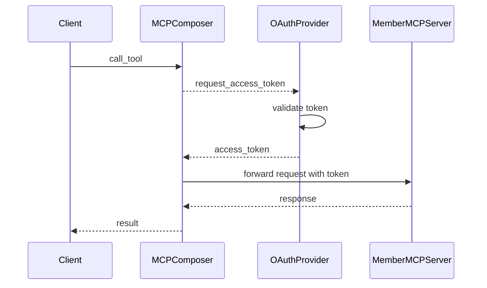
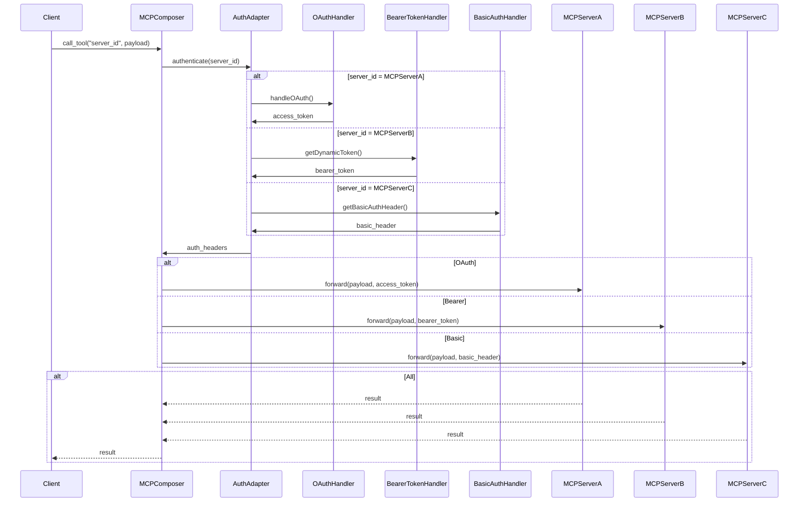

# Authentication

MCP Composer provides comprehensive authentication support for securing your MCP infrastructure and member servers.

## Overview

Authentication in MCP Composer works at multiple levels:

1. **Composer-level authentication** - Secures the MCP Composer itself
2. **Server-level authentication** - Handles authentication for each member server
3. **Tool-level authentication** - Applies specific authentication for individual tools
4. **Solis Platform authentication** - Applies specific authentication for individual tools

For the end-to-end ISV/IAM request path (token validation, auth context extraction, and middleware-driven header propagation), see the **[Solis Auth Context Middleware Guide](/guide/auth-context-middleware)**.

## 🔐 Authentication Methods

The **Auth Handler** supports the following authentication strategies:

### 1. JWT (JSON Web Token) Authentication

JWT authentication provides secure, stateless authentication using signed tokens. MCP Composer includes a dedicated JWT authentication module with support for FastMCP's built-in JWTVerifier.

**Quick Start:**

```python
from mcp_composer.core.auth.jwt import JWTProvider

# Load JWT provider from environment variables
jwt_provider = JWTProvider.from_env()

# Use with MCPComposer
composer = MCPComposer(
    name="secure-composer",
    auth=jwt_provider.verifier
)
```

**Features:**
- FastMCP JWTVerifier integration
- Support for PEM public keys and JWKS endpoints
- Token validation with issuer, audience, and scope verification
- Automatic token extraction from Authorization headers
- Comprehensive error handling for expired/invalid tokens
- Environment-based configuration

**Configuration Options:**

The JWT module supports **dynamic environment variable prefixes**, allowing you to configure different JWT settings for different composers or applications:

```python
# Example 1: Using default "JWT_" prefix
JWT_SECRET="-----BEGIN PUBLIC KEY-----\n...\n-----END PUBLIC KEY-----"
JWT_ALGORITHM=RS256
JWT_ISSUER=https://auth.example.com
JWT_AUDIENCE=your-api-audience

# Example 2: Using custom "MYAPP_JWT_" prefix
MYAPP_JWT_SECRET="-----BEGIN PUBLIC KEY-----\n...\n-----END PUBLIC KEY-----"
MYAPP_JWT_ALGORITHM=RS256
MYAPP_JWT_ISSUER=https://myapp.example.com
MYAPP_JWT_AUDIENCE=myapp-api

```

**Loading with Custom Prefix:**

```python
from mcp_composer.core.auth.jwt import JWTConfig, JWTAuthProvider

# Load with default "JWT_" prefix
jwt_provider = JWTAuthProvider.from_env()

# Load with custom prefix
jwt_config = JWTConfig.from_env(prefix="MYAPP_JWT_")
jwt_provider = JWTAuthProvider(config=jwt_config)

# Use in composer
composer = MCPComposer(
    name="my-composer",
    auth=jwt_provider.verifier
)
```

**For detailed JWT setup instructions, see:**
- [`modules/mcp_composer/composers/QUICK_START_JWT.md`](../../modules/mcp_composer/composers/QUICK_START_JWT.md) - 2-minute quick start
- [`modules/mcp_composer/composers/SOLIS_JWT_SETUP.md`](../../modules/mcp_composer/composers/SOLIS_JWT_SETUP.md) - Comprehensive setup guide
- [`modules/mcp_composer/src/mcp_composer/core/auth/jwt/README.md`](../../modules/mcp_composer/src/mcp_composer/core/auth/jwt/README.md) - Technical implementation details

### 2. Bearer Token Authentication

The most common authentication method for API-based services.

```python
# Server configuration with Bearer token
await composer.register_mcp_server({
    "id": "customer-api",
    "type": "openapi",
    "open_api": {
        "endpoint": "https://api.customers.com/mcp",
        "spec_filepath": "/path/to/openapi-spec.json"
    },
    "auth_strategy": "bearer",
    "auth": {
        "token": "your_bearer_token_here"
    }
})
```

**Features:**
- Automatic token inclusion in Authorization header
- Support for token refresh
- Secure token storage

**Note:** For JWT-based bearer tokens, see the JWT Authentication section above.

### 3. API Key Authentication

Simple key-based authentication for APIs.

```python
# Server configuration with API key
await composer.register_mcp_server({
    "id": "product-api",
    "type": "openapi",
    "open_api": {
        "endpoint": "https://api.products.com/mcp",
        "spec_filepath": "/path/to/openapi-spec.json"
    },
    "auth_strategy": "apikey",
    "auth": {
        "apikey": "your_api_key_here",
        "auth_prefix": "X-API-Key"  # Optional: custom header name
    }
})
```

**Features:**
- Customizable header names
- Support for query parameter authentication
- Simple key management

### 4. OAuth 2.0 Authentication

Full OAuth 2.0 support for enterprise services.

**Recommended:** Use environment variables in an `.env.oauth` file. See `.env.oauth.example` for the required variables. Example variables:

```
OAUTH_HOST=localhost
OAUTH_PORT=8000
OAUTH_SERVER_URL=http://localhost:8000
OAUTH_CLIENT_ID=your_client_id
OAUTH_CLIENT_SECRET=your_client_secret
OAUTH_CALLBACK_PATH=/auth/callback
OAUTH_AUTH_URL=https://provider.com/oauth/authorize
OAUTH_TOKEN_URL=https://provider.com/oauth/token
OAUTH_MCP_SCOPE=user
OAUTH_PROVIDER_SCOPE=openid
```

**Server configuration:**

```python
await composer.register_mcp_server({
    "id": "oauth-server",
    "type": "http",
    "endpoint": "https://api.oauth.com/mcp",
    "auth_strategy": "oauth2",
    "auth": {
        "client_id": os.getenv("OAUTH_CLIENT_ID"),
        "client_secret": os.getenv("OAUTH_CLIENT_SECRET"),
        "token_url": os.getenv("OAUTH_TOKEN_URL")
    }
})
```

> **Note:** The actual OAuth2 flow and callback handling is managed by the MCP Composer using the environment variables above. See the README and `.env.oauth.example` for more details.

**Features:**
- Full OAuth 2.0 flow support
- Automatic token refresh
- Scope management
- Authorization code flow



**OAuth Authentication Flow Sequence Explanation:**

1. **Client Request** → **MCPComposer**
   - Client initiates a tool call without needing to know OAuth details
   - MCPComposer receives the request and identifies the target server

2. **MCPComposer** → **OAuthProvider** (Token Request)
   - MCPComposer checks if a valid access token exists
   - If no token or expired, requests a new access token from OAuth provider
   - Uses stored client credentials (client_id, client_secret)

3. **OAuthProvider** → **OAuthProvider** (Token Validation)
   - OAuth provider validates the client credentials
   - Checks if the requested scopes are authorized
   - Generates or refreshes the access token

4. **OAuthProvider** → **MCPComposer** (Token Response)
   - Returns the access token to MCPComposer
   - Token is stored securely for future use
   - Includes token expiration information

5. **MCPComposer** → **MemberMCPServer** (Authenticated Request)
   - MCPComposer forwards the original client request
   - Includes the access token in the Authorization header
   - Request is now authenticated for the member server

6. **MemberMCPServer** → **MCPComposer** (Response)
   - Member server processes the authenticated request
   - Returns the result to MCPComposer
   - Response may include new token refresh information

7. **MCPComposer** → **Client** (Final Result)
   - MCPComposer forwards the result back to the client
   - Client receives the response without needing to handle OAuth complexity
   - Token management is completely transparent to the client

### 5. Dynamic Bearer (IBM IAM-style)

Dynamic token management for cloud services that require token exchange.

```python
await composer.register_mcp_server({
    "id": "ibm-service",
    "type": "openapi",
    "open_api": {
        "endpoint": "https://api.service.ibm.com/instances/{instance-id}/v1/",
        "spec_filepath": "/path/to/openapi-spec.json"
    },
    "auth_strategy": "dynamic_bearer",
    "auth": {
        "apikey": "your_ibm_cloud_apikey",
        "token_url": "https://iam.cloud.ibm.com/identity/token",
        "media_type": "json"  # Optional
    }
})
```

Here is a flow example 



**Token Exchange Flow Sequence Explanation:**

1. **Client Request** → **MCPComposer**
   - Client calls a tool with server_id and payload
   - No authentication knowledge required from client
   - MCPComposer receives the request and identifies target server

2. **MCPComposer** → **AuthAdapter** (Authentication Request)
   - MCPComposer delegates authentication to AuthAdapter
   - Passes server_id for authentication strategy selection
   - AuthAdapter acts as the central authentication coordinator

3. **AuthAdapter** → **Strategy Handlers** (Token Acquisition)
   - **MCPServerA (OAuth)**: Routes to OAuthHandler for OAuth2 flow
   - **MCPServerB (Dynamic Bearer)**: Routes to BearerTokenHandler for dynamic token generation
   - **MCPServerC (Basic)**: Routes to BasicAuthHandler for username/password

4. **Strategy Handlers** → **AuthAdapter** (Token Response)
   - **OAuthHandler**: Returns access_token from OAuth2 flow
   - **BearerTokenHandler**: Returns bearer_token from dynamic token exchange
   - **BasicAuthHandler**: Returns basic_header with encoded credentials

5. **AuthAdapter** → **MCPComposer** (Authentication Headers)
   - AuthAdapter consolidates all authentication information
   - Returns appropriate auth_headers for the specific server
   - Handles any token formatting or header construction

6. **MCPComposer** → **Member Servers** (Authenticated Forwarding)
   - **MCPServerA**: Request forwarded with OAuth access_token
   - **MCPServerB**: Request forwarded with dynamic bearer_token
   - **MCPServerC**: Request forwarded with basic authentication header

7. **Member Servers** → **MCPComposer** (Response Collection)
   - All member servers process authenticated requests
   - Return results to MCPComposer
   - Results may include new token information or refresh hints

8. **MCPComposer** → **Client** (Final Result)
   - MCPComposer consolidates all server responses
   - Returns unified result to client
   - Client receives response without authentication complexity

**Key Benefits of This Flow:**
- **Transparency**: Client doesn't need to know authentication details
- **Flexibility**: Supports multiple authentication strategies simultaneously
- **Centralization**: All authentication logic centralized in AuthAdapter
- **Scalability**: Easy to add new authentication strategies
- **Security**: Authentication credentials never exposed to client

## 🏗️ Authentication Builder Implementation

The authentication system is implemented using the **Adapter Design Pattern** in the `MCPServerBuilder` class. This pattern provides a unified interface for different authentication strategies while encapsulating their specific implementations.

### Core Builder Architecture

The `MCPServerBuilder` class handles authentication during server construction:

```python
class MCPServerBuilder:
    """Builds a FastMCP server from a config block."""
    
    async def _build_from_openapi(self) -> FastMCP:
        # ... spec loading logic ...
        
        auth_strategy = self.config[ConfigKey.AUTH_STRATEGY]
        auth_config = self.config.get(ConfigKey.AUTH, {})
        base_url = openapi_config[ConfigKey.ENDPOINT]
        
        # Authentication strategy routing
        match auth_strategy:
            case AuthStrategy.BASIC:
                # Basic authentication setup
            case AuthStrategy.DYNAMIC_BEARER:
                # Dynamic token client setup
            case AuthStrategy.BEARER:
                # Bearer token setup
            case AuthStrategy.APITOKEN:
                # API token setup
            case AuthStrategy.APIKEY:
                # API key setup
            case AuthStrategy.JSESSIONID.value:
                # Session-based authentication
            case _:
                # Default client
```

### Authentication Strategy Adapters

Each authentication strategy has its own adapter implementation:

#### 1. Basic Authentication Adapter
```python
case AuthStrategy.BASIC:
    logger.info("Setting up client for basic auth")
    username = auth_config.get(ConfigKey.USERNAME)
    password = auth_config.get(ConfigKey.PASSWORD)
    http_client = httpx.AsyncClient(
        base_url=base_url,
        auth=httpx.BasicAuth(username, password),
        headers=headers,
    )
```

#### 2. Dynamic Bearer Token Adapter
```python
case AuthStrategy.DYNAMIC_BEARER:
    http_client = DynamicTokenClient(
        base_url=base_url,
        token_url=auth_config.get(ConfigKey.Token_URL),
        api_key=auth_config.get(ConfigKey.APIKEY),
        media_type=auth_config.get(ConfigKey.MEDIA_TYPE, ""),
    )
```

#### 3. Bearer Token Adapter
```python
case AuthStrategy.BEARER:
    logger.info("Setting up header and client for bearer")
    headers[ConfigKey.AUTH_HEADER.value] = (
        f"Bearer {auth_config.get(ConfigKey.TOKEN)}"
    )
    http_client = httpx.AsyncClient(base_url=base_url, headers=headers)
```

#### 4. API Token Adapter
```python
case AuthStrategy.APITOKEN:
    logger.info("Setting up header and client for apiToken")
    headers[ConfigKey.AUTH_HEADER.value] = (
        f"{auth_config.get(ConfigKey.AUTH_PREFIX)} {auth_config.get(ConfigKey.TOKEN)}"
    )
    http_client = httpx.AsyncClient(base_url=base_url, headers=headers)
```

#### 5. API Key Adapter
```python
case AuthStrategy.APIKEY:
    logger.info("Setting up header and client for apikey")
    headers[ConfigKey.AUTH_HEADER.value] = (
        f"{auth_config.get(ConfigKey.AUTH_PREFIX)} {auth_config.get(ConfigKey.APIKEY)}"
    )
    http_client = httpx.AsyncClient(base_url=base_url, headers=headers)
```

#### 6. JSESSIONID Adapter
```python
case AuthStrategy.JSESSIONID.value:
    logger.info("Setting up header and client for jessionid")
    try:
        token_manager = DynamicTokenManager(
            base_url=base_url,
            auth_strategy=self.config[ConfigKey.AUTH_STRATEGY],
            login_url=auth_config.get(ConfigKey.LOGIN_URL),
            username=auth_config.get(ConfigKey.USERNAME),
            password=auth_config.get(ConfigKey.PASSWORD),
        )
        
        http_client = await token_manager.get_authenticated_http_client_for_jessonid()
    except Exception as e:
        logger.error("Authentication error: %s", e)
```

### Transport-Level Authentication

For HTTP/SSE/STDIO transport types, authentication is handled at the transport level:

```python
async def _build_from_transport(self, transport_type=None) -> FastMCP:
    # ... transport class selection ...
    
    if transport_type in {MemberServerType.HTTP, MemberServerType.SSE}:
        endpoint = config[ConfigKey.ENDPOINT]
        auth = None
        if oauth:
            FileTokenStorage.clear_all()
            auth = OAuth(mcp_url=endpoint)
        transport = TransportClass(url=endpoint, headers=headers, auth=auth)
        client = Client(transport, auth=auth)
        return FastMCP.as_proxy(client, name=self.mcp_id)
```

## 🔄 Complete Authentication Flow

The authentication flow integrates with the server building and tool execution pipeline:

```
1. Client Request
   └── call_tool("server_id", payload)
       │
       ▼
2. Tool Manager
   ├── Lookup tool in registry
   ├── Route to appropriate server
   ├── Apply tool filters
   └── Check tool permissions
       │
       ▼
3. Server Manager
   ├── Find target server
   ├── Check server health
   ├── Apply load balancing
   └── Handle failover
       │
       ▼
4. Server Builder (Authentication)
   ├── Parse auth_strategy from config
   ├── Route to appropriate auth adapter
   ├── Create authenticated HTTP client
   ├── Handle token refresh/rotation
   └── Build server with auth context
       │
       ▼
5. Auth Adapter (Strategy Pattern)
   ├── Basic Auth: httpx.BasicAuth
   ├── Bearer Token: Authorization header
   ├── Dynamic Bearer: DynamicTokenClient
   ├── API Key: Custom header
   ├── JSESSIONID: DynamicTokenManager
   └── OAuth2: OAuth flow handling
       │
       ▼
6. HTTP Client Creation
   ├── Base URL configuration
   ├── Authentication headers
   ├── Token management
   └── Error handling
       │
       ▼
7. Server Construction
   ├── FastMCP.from_openapi()
   ├── Route mapping
   ├── Tool registration
   └── Authentication integration
       │
       ▼
8. Request Execution
   ├── Authenticated HTTP requests
   ├── Response handling
   ├── Error processing
   └── Result filtering
```

## 🛠️ Configuration Examples

### Development Environment

```python
# Development setup with simple auth
composer = MCPComposer(name="Dev Composer")

await composer.register_mcp_server({
    "id": "dev-server",
    "type": "openapi",
    "open_api": {
        "endpoint": "http://localhost:8001",
        "spec_filepath": "/path/to/openapi-spec.json"
    },
    "auth_strategy": "apikey",
    "auth": {
        "apikey": "dev_key_123"
    }
})
```

### Production Environment

```python
# Production setup with OAuth
composer = MCPComposer(
    name="Production Composer",
    database_config={
        "type": "local_file",
        "file_path": "./mcp_servers.json"
    }
)

await composer.register_mcp_server({
    "id": "prod-server",
    "type": "openapi",
    "open_api": {
        "endpoint": "https://api.production.com/mcp",
        "spec_filepath": "/path/to/openapi-spec.json"
    },
    "auth_strategy": "oauth2",
    "auth": {
        "client_id": os.getenv("OAUTH_CLIENT_ID"),
        "client_secret": os.getenv("OAUTH_CLIENT_SECRET"),
        "token_url": os.getenv("OAUTH_TOKEN_URL")
    }
})
```

### Multi-Environment Setup

```python
# config.py
import os

def get_auth_config(environment: str):
    if environment == "development":
        return {
            "auth_strategy": "apikey",
            "auth": {"apikey": "dev_key"}
        }
    elif environment == "staging":
        return {
            "auth_strategy": "bearer",
            "auth": {"token": os.getenv("STAGING_TOKEN")}
        }
    elif environment == "production":
        return {
            "auth_strategy": "oauth2",
            "auth": {
                "client_id": os.getenv("PROD_CLIENT_ID"),
                "client_secret": os.getenv("PROD_CLIENT_SECRET"),
                "token_url": os.getenv("PROD_TOKEN_URL")
            }
        }
    
    raise ValueError(f"Unknown environment: {environment}")

# main.py
env = os.getenv("ENVIRONMENT", "development")
auth_config = get_auth_config(env)

await composer.register_mcp_server({
    "id": "multi-env-server",
    "type": "openapi",
    "open_api": {
        "endpoint": os.getenv("API_URL"),
        "spec_filepath": "/path/to/openapi-spec.json"
    },
    **auth_config
})
```

## 🔒 Security Best Practices

### 1. JWT Token Security

When using JWT authentication with dynamic prefixes:

```python
# ✅ DO: Use custom prefixes for different applications
MYAPP_JWT_SECRET="-----BEGIN PUBLIC KEY-----\n...\n-----END PUBLIC KEY-----"
OTHERAPP_JWT_SECRET="-----BEGIN PUBLIC KEY-----\n...\n-----END PUBLIC KEY-----"

# ✅ DO: Store public keys in environment variables
JWT_SECRET="-----BEGIN PUBLIC KEY-----\n...\n-----END PUBLIC KEY-----"

# ✅ DO: Use JWKS endpoints for automatic key rotation
JWT_JWKS_URI=https://auth.example.com/.well-known/jwks.json

# ✅ DO: Validate issuer and audience
JWT_ISSUER=https://auth.example.com
JWT_AUDIENCE=your-api-audience

# ✅ DO: Require specific scopes
JWT_REQUIRED_SCOPES=read,write,admin

# ✅ DO: Use different prefixes for different environments
DEV_JWT_SECRET="dev-public-key"
PROD_JWT_SECRET="prod-public-key"

# ❌ DON'T: Hardcode private keys in code
# ❌ DON'T: Skip token validation
# ❌ DON'T: Use weak algorithms (e.g., HS256 for public APIs)
# ❌ DON'T: Mix environment variables from different apps without prefixes
```

**JWT Security Checklist:**
- Always validate token signature
- Verify issuer and audience claims
- Check token expiration (exp claim)
- Validate required scopes
- Use strong algorithms (RS256, ES256)
- Rotate keys regularly via JWKS
- Never expose private keys
- Use HTTPS for all token transmission

### 2. Environment Variables

Always store sensitive credentials in environment variables:

```python
import os
await composer.register_mcp_server({
    "id": "secure-server",
    "type": "openapi",
    "open_api": {
        "endpoint": "https://api.secure.com/mcp",
        "spec_filepath": "/path/to/openapi-spec.json"
    },
    "auth_strategy": "bearer",
    "auth": {
        "token": os.getenv("API_TOKEN")
    }
})
```

### 3. Token Rotation

Implement token rotation for enhanced security. See the README for examples.

### 4. Credential Encryption

Encrypt sensitive credentials before storage. See the README for examples.

## 🔍 Troubleshooting

### Common Authentication Issues

1. **Invalid Token**
   ```python
   # Check token validity
   try:
       await composer.member_health()
   except AuthenticationError as e:
       print(f"Authentication failed: {e}")
       # Refresh token or update configuration
   ```

2. **Token Expired**
   ```python
   # Handle token expiration
   async def handle_token_expiration(server_id: str):
       new_token = await refresh_token(server_id)
       await composer.update_mcp_server_config(
           server_id,
           {"auth": {"token": new_token}}
       )
   ```

3. **OAuth Flow Issues**
   ```python
   # Debug OAuth flow
   import logging
   logging.getLogger("mcp_composer.auth_handler.oauth").setLevel(logging.DEBUG)
   ```

### Debugging Authentication

Enable debug logging for authentication:

```python
import logging

# Enable debug logging
logging.basicConfig(level=logging.DEBUG)
logging.getLogger("mcp_composer.auth_handler").setLevel(logging.DEBUG)
logging.getLogger("mcp_composer.core.member_servers.builder").setLevel(logging.DEBUG)
```

## 📚 Next Steps

- **[Solis Auth Context Middleware Guide](/guide/auth-context-middleware)** - Deep dive into ISV/IAM auth context flow
- **[Examples](/examples)** - Real-world authentication examples
- **[API Reference](/api/)** - Complete API documentation
- **[Configuration Guide](/guide/configuration)** - Learn about configuration options 