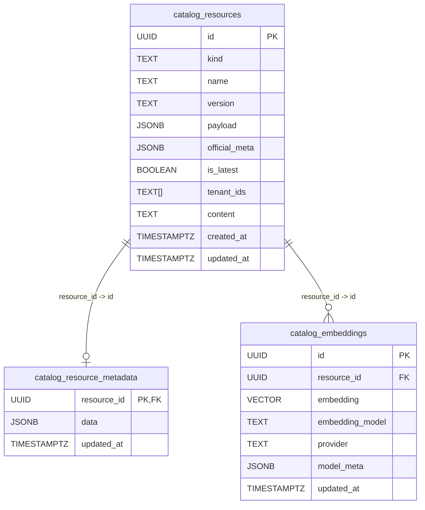

# Catalog Composer Guide

This guide explains how to run and use the catalog-focused composer at `modules/mcp_composer/composers/catalog_composer.py`.

`catalog_composer` is the lightweight runtime for catalog operations only:
- skill catalog MCP
- agent catalog MCP
- workflow catalog MCP
- startup skill loader refresh loop

Use this when you need catalog management without Solis ISV auth/doc-search middleware.

## 1) How to Use the Catalog Feature

### What it starts

When enabled, the composer mounts three MCP sub-servers:
- `skill-catalog`
- `agent-catalog`
- `workflow-catalog`

The server transport is controlled by `MCP_MODE`:
- `sse` (default)
- `http`
- `stdio`

### Run it

From repository root:

```bash
python modules/mcp_composer/composers/catalog_composer.py
```

Or from `modules/mcp_composer`:

```bash
python composers/catalog_composer.py
```

### Required/important environment variables

- `MCP_MODE`: `http | sse | stdio` (default `sse`)
- `MCP_ENABLE_SKILL_CATALOG_MCP`: `true|false` (default `true`)
- `MCP_ENABLE_AGENT_CATALOG_MCP`: `true|false` (default `true`)
- `MCP_ENABLE_WORKFLOW_CATALOG_MCP`: `true|false` (default `true`)

Optional startup skill loader controls:
- `SOLIS_TENANT_ID`: only load startup skills visible to a tenant
- `SOLIS_ALLOWED_TOOLS`: comma-separated tool allowlist filter
- `SOLIS_SKILL_REFRESH_INTERVAL_SECS`: polling interval (seconds, min effective 5)

## 2) Database Setup for Catalog Composer

Catalog DB selection is handled by `get_catalog_db()` in `catalog_factory.py`.

### Option A: PostgreSQL (recommended for shared/runtime environments)

Set:

```bash
MCP_DATABASE_TYPE=postgres
```

Then provide either:

1. Full URL:

```bash
MCP_DATABASE_URL=postgresql://<db_user>:<db_dwp>@<db_host>:5432/<db_name> # pragma: allowlist secret (example only)
```

or

2. Individual fields:

```bash
MCP_DATABASE_HOST=localhost
MCP_DATABASE_PORT=5432
MCP_DATABASE_NAME=mcp_catalog
MCP_DATABASE_USER=<db_user>
MCP_DATABASE_dwp=<db_dwp>
```

> [!WARNING]
> Secret hygiene: never commit real credentials/tokens to docs, `.env`, or examples.
> Keep secrets in your runtime secret manager (or local untracked env files) and use placeholders in checked-in documentation.

Optional:
- `CATALOG_RESOURCE_METADATA_JSON_COLUMN=data` (or `private_meta` for legacy schema)

### PostgreSQL schema setup (required SQL)

If you use Postgres, you must apply the catalog schema SQL before running the composer.

Schema file:
- `scripts/sql/catalog_schema.sql`

Apply it with `psql`:

```bash
psql "$MCP_DATABASE_URL" -f scripts/sql/catalog_schema.sql
```

If you use split DB vars instead of `MCP_DATABASE_URL`:

```bash
PGdwp="$MCP_DATABASE_dwp" \
psql -h "$MCP_DATABASE_HOST" -p "${MCP_DATABASE_PORT:-5432}" \
     -U "$MCP_DATABASE_USER" -d "$MCP_DATABASE_NAME" \
     -f scripts/sql/catalog_schema.sql
```

What this SQL creates:
- `catalog_resources`
- `catalog_resource_metadata`
- `catalog_embeddings`
- indexes for `kind/name`, tenants, JSONB tags/products/license, full-text search
- `vector` extension (used by `catalog_embeddings.embedding`)

Quick verify:

```bash
psql "$MCP_DATABASE_URL" -c "\dt catalog_*"
```

You should see at least:
- `catalog_resources`
- `catalog_resource_metadata`
- `catalog_embeddings`

### Local Postgres example (dev)

```bash
docker run --name mcp-catalog-postgres \
  -e POSTGRES_USER=postgres \
  -e POSTGRES_dwp=<dev_only_dwp> \
  -e POSTGRES_DB=mcp_catalog \
  -p 5432:5432 -d pgvector/pgvector:pg16
```

Then:

```bash
export MCP_DATABASE_TYPE=postgres
export MCP_DATABASE_URL=postgresql://postgres:<dev_only_dwp>@localhost:5432/mcp_catalog # pragma: allowlist secret (example only)
psql "$MCP_DATABASE_URL" -f scripts/sql/catalog_schema.sql
```

### Option B: Local file storage (good for local dev/testing)

Set:

```bash
MCP_USE_LOCAL_FILE_STORAGE=true
MCP_CATALOG_FILE_PATH=./catalog
```

If neither Postgres nor explicit local-file mode is configured, catalog falls back to local files at `./catalog`.

Local structure is created automatically (`skills/`, `agents/`, `workflows/`, `prompts/`, `metadata/`).

### Catalog ERD (PostgreSQL)



Notes:
- `catalog_resources` is the main versioned catalog table for `skill`, `agent`, `workflow`, and `prompt`.
- `catalog_resource_metadata` stores private metadata (JSONB `data`) in a 1:1 relationship with a resource row.
- `catalog_embeddings` stores vector embeddings in a 1:many relationship with resources (DB constraint currently enforces one embedding per resource ID).
- `ON DELETE CASCADE` is used from child tables to `catalog_resources`.

## 3) Catalog Tools: What Exists

The mounted MCPs expose CRUD-style tools for each catalog type.

### Skill catalog tools (`skill-catalog`)

- `list_skills(keywords?, tenant?, start=0, limit=50)`
- `get_skill(name, version?)`
- `load_skill_reference(name, file, version?)`
- `add_skill(skill_json, tenant_ids?)`
- `publish_skill_bundle(bundle_json, tenant_ids?)`
- `delete_skill(name, version)`
- `update_skill_status(name, version, status)`

Notes:
- `list_skills` returns active + latest only.
- `status` values: `active | draft | deprecated | deleted`.
- `publish_skill_bundle` supports publishing both public payload and optional private metadata (`catalog_resource_metadata` aliases supported).

### Agent catalog tools (`agent-catalog`)

- `list_agents(tenant?, start=0, limit=50)`
- `get_agent(name, version?)`
- `add_agent(agent_json, tenant_ids?)`
- `publish_agent_bundle(bundle_json, tenant_ids?)`
- `delete_agent(name, version)`
- `update_agent_status(name, version, status)`

### Workflow catalog tools (`workflow-catalog`)

- `list_workflows(tenant?, start=0, limit=50)`
- `get_workflow(name, version?)`
- `add_workflow(workflow_json, tenant_ids?)`
- `publish_workflow_bundle(bundle_json, tenant_ids?)`
- `delete_workflow(name, version)`
- `update_workflow_status(name, version, status)`

## 4) How to Use Those Tools

### Discover tools first

Use any MCP client that can connect to your running composer and list tools/resources.

Typical sequence:
1. Connect to catalog composer endpoint
2. List available tools
3. Call list/get tools first
4. Publish/update/delete as needed

### Recommended usage pattern

For each resource type (skill/agent/workflow):

1. Browse:
   - `list_*` with `start`/`limit` pagination
2. Read:
   - `get_*` by name (optionally version)
3. Publish:
   - `add_*` for payload-only publish
   - `publish_*_bundle` when also storing private metadata in `catalog_resource_metadata`
4. Lifecycle management:
   - `update_*_status` for `draft/active/deprecated/deleted`
5. Cleanup:
   - `delete_*` for hard remove of a specific version

### Skill-specific progressive loading

For large skill docs/references:

1. Call `get_skill(name, version?)` to inspect payload/metadata
2. Call `load_skill_reference(name, file, version?)` to fetch one allowlisted HTTPS reference file body

This avoids loading all external references in a single call.

### Skills loaded from URL (how to set up)

Important behavior:
- `catalog_composer` does **not** auto-import skills from a URL into DB.
- Skills must be published to catalog first (`add_skill` or `publish_skill_bundle`).
- URL loading is for **reference files** attached to an already-published skill, fetched through `load_skill_reference`.

#### What to include when publishing

In your skill payload, provide `references` entries:
- `url`: public HTTPS URL of the file
- `file`: basename used as lookup key later

Example skill payload snippet:

```json
{
  "name": "cloud-finops",
  "description": "Use for cloud cost analysis and optimization guidance.",
  "version": "1.0.0",
  "metadata": {
    "title": "Cloud FinOps",
    "instructions": "Use this skill for FinOps requests. Ask follow-up questions when scope is unclear."
  },
  "references": [
    {
      "url": "https://example.com/skills/cloud-finops/references/finops-aws.md",
      "file": "finops-aws.md"
    }
  ]
}
```

Then:
1. Publish the skill (`add_skill` / `publish_skill_bundle`)
2. Verify with `get_skill(name)` that the reference exists
3. Fetch content with:
   - `load_skill_reference(name="cloud-finops", file="finops-aws.md")`

#### URL requirements/constraints

- Only `https://` URLs are allowed by `load_skill_reference`.
- `file` must be basename only (no path separators, no `..`).
- The tool resolves `file` against references already stored in catalog metadata/payload.
- Large reference responses are capped (tool enforces a max body size), so keep docs reasonably sized.

#### Startup loader note

`load-onstartup` status in `catalog_composer` means:
- load matching skills **from catalog DB** on startup
- it does **not** fetch new skills from remote URLs

So for local setup:
1. Configure DB + schema
2. Publish skill records (with `references` URLs if needed)
3. Optionally mark as `load-onstartup`
4. Start `catalog_composer`

## Minimal Example `.env`

```bash
# Transport + mounted catalogs
MCP_MODE=sse
MCP_ENABLE_SKILL_CATALOG_MCP=true
MCP_ENABLE_AGENT_CATALOG_MCP=true
MCP_ENABLE_WORKFLOW_CATALOG_MCP=true

# Local DB mode (dev)
MCP_USE_LOCAL_FILE_STORAGE=true
MCP_CATALOG_FILE_PATH=./catalog

# Optional startup loader controls
SOLIS_TENANT_ID=
SOLIS_ALLOWED_TOOLS=
SOLIS_SKILL_REFRESH_INTERVAL_SECS=30
```
