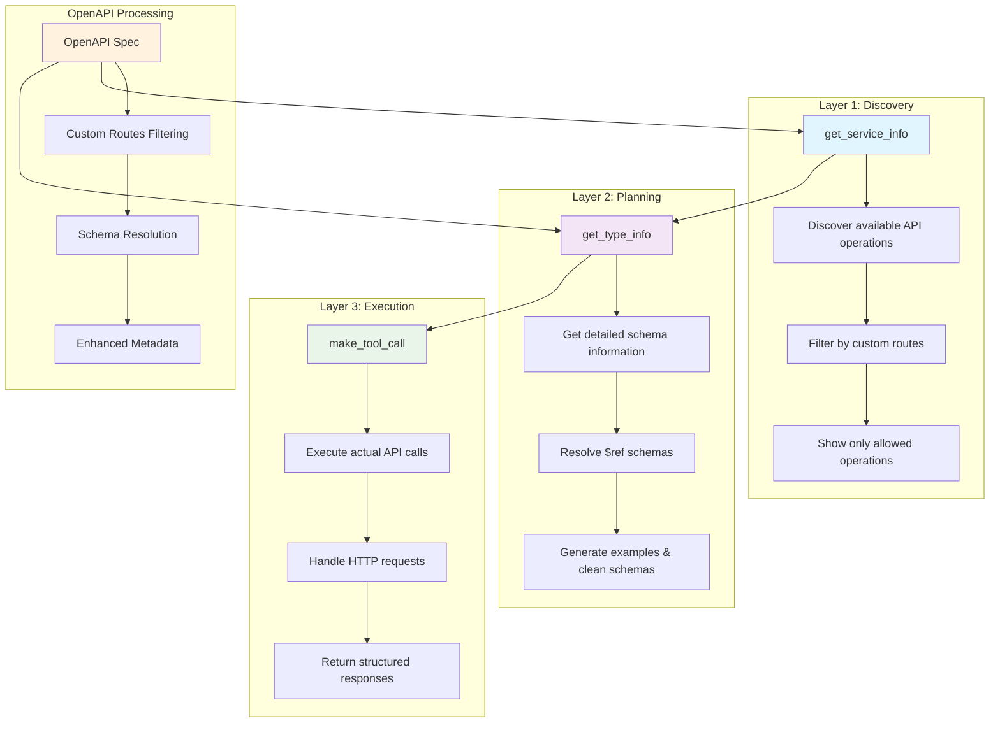

# MCP Composer OpenAPI Flow: From Config to Tools

## 🌟 **Inspired by Block's Layered Tool Pattern**

This implementation follows the **"Layered Tool Pattern"** pioneered by [Block's Engineering team](https://engineering.block.xyz/blog/build-mcp-tools-like-ogres-with-layers), which demonstrates how to build MCP tools like ogres - with layers! 

> "Ogres are like onions. Onions have layers. Ogres have layers." - Shrek

The same principle applies to AI tools. Rather than building monolithic tools that overwhelm LLMs, we use distinct functional layers that work together to guide AI agents through progressive steps.

---

## 🏗️ **Reference Architecture: Layered Tool Pattern**



**Key Benefits of Layering:**
- **Discovery Layer**: Guides AI to understand what's available
- **Planning Layer**: Helps AI formulate correct API calls
- **Execution Layer**: Performs the actual operations
- **Progressive Complexity**: Each layer builds on the previous one

---

## 🔄 **Complete Flow Overview**

This document explains the step-by-step process of how MCP Composer processes OpenAPI specifications with `orges: true`, from configuration to final tool organization, implementing the Layered Tool Pattern.

---

## 📋 **Step 1: Configuration (config.json)**

```json
{
  "id": "mcp-hybrid-mesh",
  "type": "openapi",
  "open_api": {
    "endpoint": "https://app.hybridcloudmesh.ibm.com/api/v1",
    "spec_filepath": "./spec/hybrid_mesh.json",
    "orges": true,
    "custom_routes": [
      {
        "methods": ["GET"],
        "pattern": ".*",
        "mcp_type": "TOOL"
      },
      {
        "methods": ["POST", "DELETE", "PUT", "PATCH"],
        "pattern": ".*",
        "mcp_type": "EXCLUDE"
      }
    ]
  }
}
```

**Key Points:**
- **`orges: true`** → Triggers use of `OgreOpenAPIFactory` instead of standard `FastMCP.from_openapi()`
- **`custom_routes`** → Defines filtering rules for API operations
- **Pattern `".*"`** → Matches all paths
- **GET = TOOL** → Include GET operations as tools
- **POST/DELETE/PUT/PATCH = EXCLUDE** → Completely exclude these operations

---

## 🏭 **Step 2: OgreOpenAPIFactory Initialization**

When `orges: true`, the builder creates an `OgreOpenAPIFactory` instance:

```python
# From MCPServerBuilder.build()
if openapi_config["orges"]:
    mcp = OgreOpenAPIFactory(
        openapi_spec=spec,
        client=http_client,
        custom_routes=custom_mappings,  # Converted from custom_routes
        custom_routes_exclude_all=exclude_all_route
    )
```

**What Happens:**
1. **Loads OpenAPI spec** from `hybrid_mesh.json`
2. **Converts custom_routes** to `RouteMap` objects
3. **Initializes with instructions** for LLM understanding
4. **Builds service metadata** with custom routes filtering

---

## 📚 **Step 3: Factory Instructions for LLMs**

The factory provides clear instructions to LLMs about available tools:

```python
super().__init__(
    name="Ogre OpenAPI FastMCP",
    instructions="""This MCP server provides access to OpenAPI-based tools with three main capabilities:

1. **get_service_info** - Discover and list all available API operations/tools:
   - Call without parameters to see all available services
   - Call with a specific service name to get detailed information including schema summaries
   - Use this to understand what API operations are available

2. **get_type_info** - Get detailed parameter, input, and output information for a specific service:
   - Call with a service name (operationId) to get comprehensive details
   - Returns parameter schemas, request body schemas, response schemas, and examples
   - Use this to understand how to call a specific API operation

3. **make_tool_call** - Execute an actual API call to the specified service:
   - Call with a service name and optional request parameters
   - This is the tool that actually performs the HTTP request to the underlying API
   - Use this after understanding the service details from the other tools

Usage workflow:
1. First use get_service_info() to see what's available
2. Then use get_type_info(service_name) to understand the specific service
3. Finally use make_tool_call(service_name, request_data) to execute the API call

All tools automatically resolve OpenAPI schema references and provide enhanced metadata including examples and cleaned schemas."""
)
```

**LLM Workflow:**
1. **Explore** → Use `get_service_info()` to see available operations
2. **Understand** → Use `get_type_info(service_name)` for detailed schema info
3. **Execute** → Use `make_tool_call(service_name, request_data)` to make API calls

---

## 🔍 **Step 4: Service Metadata Building with Custom Routes Filtering**

The factory processes the OpenAPI spec and applies custom routes filtering:

```python
def _build_service_metadata(self) -> Dict[str, Dict]:
    services = {}
    
    # Parse OpenAPI paths
    for path, path_item in self.openapi_spec['paths'].items():
        for http_method, operation in path_item.items():
            if http_method.lower() in ['get', 'post', 'put', 'delete', 'patch']:
                # 🔑 KEY: Apply custom routes filtering
                if self._should_include_operation(http_method.upper(), path):
                    operation_id = operation.get('operationId')
                    if operation_id:
                        services[operation_id] = {
                            'name': operation_id,
                            'http_method': http_method.upper(),
                            'path': path,
                            'parameters': self._extract_parameter_schemas(...),
                            'request_body': self._extract_request_body_schema(...),
                            'responses': self._extract_response_schemas(...),
                            # ... other metadata
                        }
    return services
```

---

## 🚫 **Step 5: Custom Routes Filtering Logic**

The `_should_include_operation()` method implements the filtering:

```python
def _should_include_operation(self, http_method: str, path: str) -> bool:
    if not self.custom_routes:
        return True  # Include all if no custom routes
    
    operation_handled = False
    should_include = False
    
    for route_rule in self.custom_routes:
        methods = getattr(route_rule, 'methods', [])
        pattern = getattr(route_rule, 'pattern', '.*')
        mcp_type = getattr(route_rule, 'mcp_type', 'TOOL')
        
        if http_method in methods and self._matches_pattern(path, pattern):
            operation_handled = True
            
            if mcp_type == MCPType.TOOL or mcp_type == MCPType.RESOURCE:
                should_include = True
            elif mcp_type == MCPType.EXCLUDE:
                return False  # EXCLUDE takes precedence
    
    if operation_handled:
        return should_include
    
    return False  # Default: exclude if not explicitly handled
```

**Filtering Results for Hybrid Mesh:**
- **GET operations** → Match pattern `".*"` → `mcp_type: "TOOL"` → **INCLUDED** ✅
- **POST operations** → Match pattern `".*"` → `mcp_type: "EXCLUDE"` → **EXCLUDED** ❌
- **DELETE operations** → Match pattern `".*"` → `mcp_type: "EXCLUDE"` → **EXCLUDED** ❌
- **PUT operations** → Match pattern `".*"` → `mcp_type: "EXCLUDE"` → **EXCLUDED** ❌
- **PATCH operations** → Match pattern `".*"` → `mcp_type: "EXCLUDE"` → **EXCLUDED** ❌

---

## 🧠 **Step 6: Enhanced Schema Processing**

For each included operation, the factory enhances schema information:

### **Parameter Schema Extraction**
```python
def _extract_parameter_schemas(self, parameters):
    for param in parameters:
        schema = param.get('schema', {})
        
        # 🔑 Resolve $ref schemas
        if '$ref' in schema:
            original_ref = schema['$ref']
            resolved_schema = self._resolve_schema_reference(original_ref)
            if resolved_schema:
                schema = resolved_schema
        
        # Clean schema for display
        cleaned_schema = clean_schema_for_display(schema)
        
        enhanced_param = {
            'name': param.get('name'),
            'in': param.get('in'),
            'schema': cleaned_schema,
            'original_ref': original_ref  # Preserve reference for context
        }
```

### **Request Body Processing**
```python
def _extract_request_body_schema(self, request_body):
    # Extract from content.application/json.schema
    content = request_body.get('content', {})
    json_content = content.get('application/json', {})
    schema = json_content.get('schema', {})
    
    if '$ref' in schema:
        original_ref = schema['$ref']
        resolved_schema = self._resolve_schema_reference(original_ref)
        if resolved_schema:
            schema = resolved_schema
    
    # Clean and generate example
    cleaned_schema = clean_schema_for_display(schema)
    example = generate_example_from_schema(schema)
    
    return {
        'schema': cleaned_schema,
        'example': example,
        'original_ref': original_ref
    }
```

### **Response Schema Analysis**
```python
def _extract_response_schemas(self, responses):
    # Use FastMCP utility for comprehensive extraction
    output_schema = extract_output_schema_from_responses(responses)
    
    if output_schema:
        cleaned_schema = clean_schema_for_display(output_schema)
        return cleaned_schema
    
    # Fallback: manual processing with $ref resolution
    # ... similar to parameters and request body
```

---

## 🎯 **Step 7: Final Tool Organization**

After processing, the factory registers exactly 3 tools:

```python
# Add our custom tools
self.add_tool(Tool.from_function(self.get_service_info))
self.add_tool(Tool.from_function(self.get_type_info))
self.add_tool(Tool.from_function(self.make_tool_call))
```

**Available Tools:**
1. **`get_service_info`** → Lists filtered services (only GET operations)
2. **`get_type_info`** → Provides detailed schema information for a service
3. **`make_tool_call`** → Executes actual API calls

---

## 📊 **Step 8: Real-World Example - Hybrid Mesh**

### **Original OpenAPI Spec**
- **Total operations**: 162 (mix of GET, POST, PUT, DELETE, PATCH)
- **Paths**: Various API endpoints for hybrid cloud management

### **After Custom Routes Filtering**
- **Included operations**: 58 (only GET operations)
- **Excluded operations**: 104 (POST, PUT, DELETE, PATCH)
- **Result**: Clean, read-only API interface

### **Schema Enhancement Examples**
```json
// Before (with $ref)
{
  "parameters": [
    {
      "name": "application_id",
      "schema": {
        "$ref": "#/components/schemas/UUID"
      }
    }
  ]
}

// After (resolved and enhanced)
{
  "parameters": [
    {
      "name": "application_id",
      "schema": {
        "type": "string",
        "format": "uuid",
        "description": "Unique identifier for the application"
      },
      "original_ref": "#/components/schemas/UUID"
    }
  ]
}
```

---
## Example 


## 🔄 **Summary: The Complete Flow**

1. **Config Loaded** → `orges: true` triggers `OgreOpenAPIFactory`
2. **Custom Routes Parsed** → Converted to `RouteMap` objects
3. **OpenAPI Spec Loaded** → Full specification from `hybrid_mesh.json`
4. **Custom Routes Applied** → Only GET operations included (58 out of 162)
5. **Schema Enhancement** → `$ref` resolution, examples, cleaned schemas
6. **Tool Registration** → Exactly 3 tools registered
7. **LLM Instructions** → Clear workflow for exploration and execution

**Key Benefits:**
- **Selective API Exposure** → Only safe, read-only operations
- **Enhanced Schema Information** → Resolved references, examples, cleaned schemas
- **LLM-Friendly Interface** → Clear instructions and workflow
- **Consistent Tool Count** → Always 3 tools for orges servers

This creates a powerful, controlled interface where LLMs can safely explore and interact with OpenAPI-based services while maintaining security and providing rich schema information.
