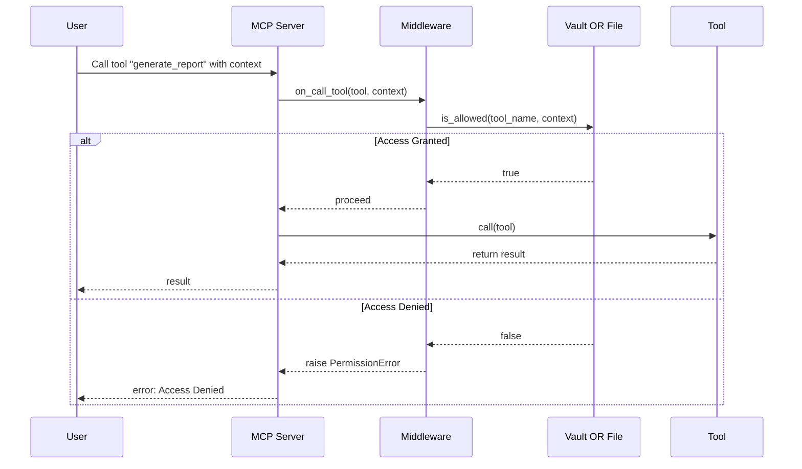

# 🛡️ Context-Aware RBAC with FastMCP + Vault + File-Based Policy

This demo MCP server supports pluggable policy enforcement using the Adapter pattern.  
It implements **context-aware RBAC** using two interchangeable enforcers:

- ✅ `HashiCorpVaultPolicyEnforcer`
- ✅ `FilePolicyEnforcer`

---

## How It Works

When a tool is called via FastMCP, the `PolicyMiddleware` intercepts the request using the `on_call_tool` hook.  
It delegates access checks to the active enforcer based on role and context.

---

## Mermaid Diagram



---

##  Quick Start


### 1. Vault Mode

#### Install vault on your local machine

```bash
brew tap hashicorp/tap
brew install hashicorp/tap/vault
```

#### Start Vault in Dev Mode

```bash
vault server -dev
```

In a new terminal:

```bash
export VAULT_ADDR=http://127.0.0.1:8200
export VAULT_TOKEN=root
```

check the vault status by running `vault status`


#### Store Policies

```bash
vault kv put secret/mcp-policies/agent_worker tools='["generate_report", "check_status"]'
vault kv put secret/mcp-policies/user tools='["start_cluster", "read_user_data", "check_status"]'
vault kv put secret/mcp-policies/agent_supervisor tools='["terminate_cluster", "start_cluster", "generate_report"]'
```

So the tool access policy are as follows:

| Tool Name             | Description                | Who Can Access                     |
| --------------------- | -------------------------- | ---------------------------------- |
| `start_cluster()`     | Starts a compute cluster   | `agent_supervisor`, `user`     |
| `check_status()`      | Checks service health      | all roles                          |
| `terminate_cluster()` | Terminates compute cluster | `agent_supervisor` only            |
| `generate_report()`   | Creates compliance report  | `agent_worker`, `agent_supervisor` |
| `read_user_data()`    | Fetch PII data (sensitive) | `user` only                    |


#### Run the Server

```bash
export POLICY_ENFORCER_MODE=vault
uv run test/test_policy.py
```

---

###  3. File Mode

#### `policy.json`

```json
{
  "agent_worker": ["generate_report", "check_status"],
  "user": ["start_cluster", "read_user_data", "check_status"],
  "agent_supervisor": ["terminate_cluster", "start_cluster", "generate_report"]
}
```

#### Run the Server

```bash
export POLICY_ENFORCER_MODE=file
uv run test/test_policy.py
```

---

##  Test Example Tool Call

Example context:

```json
{
  "role": "agent_worker"
}
```

If the tool is `generate_report`, access is granted ✅  
If the tool is `terminate_cluster`, access is denied ❌

---

##  Tools Provided

- `start_cluster`
- `terminate_cluster`
- `generate_report`
- `check_status`
- `read_user_data`

---

##  Extending

You can add new enforcers (e.g., OPA, JWT, Permit) via the Adapter interface in `BasePolicyEnforcer`.

---

##  Demo with MCP Inspector


