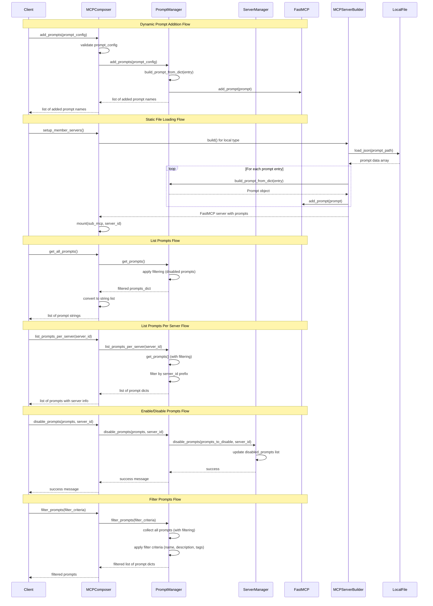

# Prompt Management in MCP Composer

MCP Composer provides a comprehensive prompt management system that allows you to dynamically add, list, manage, enable, and disable prompts across your MCP infrastructure. The system supports both runtime prompt addition and static prompt loading from configuration files. As part of prompt management in MCP Composer, you will add prompts dynamically, list all registered prompts, get prompts from specific servers, filter prompts based on criteria, enable/disable prompts, and apply safety and validation rules. Among them, add prompts dynamically, list all registered prompts, list prompts per server, filter prompts, and enable/disable prompts are currently supported.

Here is the roadmap for prompt management in MCP Composer:


P.S - features those are in purple are supported today. 

## Key Functionality

Based on the mind map shown, MCP Composer currently supports the following prompt management operations:

- **Add**: Dynamically add new prompts to the system*  
- **List**: Retrieve all registered prompts (excluding disabled ones)*
- **List per Server**: Get prompts from specific servers (excluding disabled ones)*
- **Filter**: Filter prompts based on criteria*
- **Enable/Disable**: Enable or disable prompts across servers*

The following feature is planned to be implemented:

- **Guardrails**: Apply safety and validation rules

## Core Components

### 1. Prompt Management Tools

MCP Composer exposes six main tools for prompt management:

```python
# Add prompts dynamically
self.add_tool(Tool.from_function(self.add_prompts))

# List all prompts
self.add_tool(Tool.from_function(self.get_all_prompts))

# List prompts per server
self.add_tool(Tool.from_function(self.list_prompts_per_server))

# Filter prompts
self.add_tool(Tool.from_function(self.filter_prompts))

# Enable prompts
self.add_tool(Tool.from_function(self.enable_prompts))

# Disable prompts
self.add_tool(Tool.from_function(self.disable_prompts))
```

### 2. Prompt Management Flow

The following sequence diagram illustrates the flow of prompt management operations:



### 3. Prompt Structure

Each prompt follows a standardized structure defined in `test/data/prompts.json`:

```json
{
    "name": "prompt_name",
    "description": "Description of what the prompt does",
    "template": "Template string with {{variable}} placeholders",
    "arguments": [
        {
            "name": "variable",
            "type": "string",
            "required": true,
            "description": "Description of the variable"
        }
    ]
}
```

## Adding Prompts

### Method 1: Dynamic Addition via API

You can add prompts dynamically using the `add_prompts` function:

```python
async def add_prompts(self, prompt_config: Union[dict, list[dict]]) -> list[str]:
    """
    Add one or more prompts based on the provided configuration.
    Returns a list of registered prompt names.
    """
    if not isinstance(prompt_config, list):
        raise TypeError("Prompt config must be a dict or a list of dicts")

    added = []
    for entry in prompt_config:
        prompt = await build_prompt_from_dict(entry)
        super().add_prompt(prompt)
        added.append(prompt.name)
    return added
```

#### Example Usage:

```python
# Add a single prompt
prompt_config = [{
    "name": "app_top_errors_yesterday",
    "description": "Show top erroneous calls handled by an application since yesterday",
    "template": "Show top erroneous calls handled by '{{ application }}' application since yesterday",
    "arguments": [
        {
            "name": "application",
            "type": "string",
            "required": true,
            "description": "The name of the application"
        }
    ]
}]

added_prompts = await composer.add_prompts(prompt_config)
print(f"Added prompts: {added_prompts}")
```

### Method 2: Static Loading from Local Files

Prompts can be loaded from local JSON files using the "local" server type:

#### Configuration Example:

```json
{
    "id": "mcp-prompt",
    "type": "local",
    "prompt_path": "./test/data/prompts.json",
    "_id": "mcp-prompt"
}
```

#### Implementation Details:

The local file loading is handled by the `MCPServerBuilder._build_from_local_file()` method:

```python
async def _build_from_local_file(self) -> FastMCP:
    mcp = FastMCP(self.config.get(ConfigKey.ID, ""))
    data = await load_json(self.config[ConfigKey.PROMPT_PATH])
    for entry in data:
        prompt = await build_prompt_from_dict(entry)
        logger.info("Prompt: %s", prompt)
        mcp.add_prompt(prompt)
    return mcp
```

## Listing Prompts

### Get All Prompts

The `get_all_prompts` function retrieves all registered prompts (excluding disabled ones):

```python
async def get_all_prompts(self) -> list[str]:
    """Get all registered prompts mapped to their textual form from composer and mounted servers."""
    prompts_dict = await self._prompt_manager.get_prompts()
    return [str(prompt) for prompt in prompts_dict.values()]
```

#### Example Usage:

```python
# Get all registered prompts (excluding disabled ones)
all_prompts = await composer.get_all_prompts()
for prompt in all_prompts:
    print(prompt)
```

### List Prompts Per Server

The `list_prompts_per_server` function retrieves all prompts from a specific server (excluding disabled ones):

```python
async def list_prompts_per_server(self, server_id: str) -> list[dict]:
    """List all prompts from a specific server."""
    return await self._prompt_manager.list_prompts_per_server(server_id)
```

#### Example Usage:

```python
# List prompts from a specific server (excluding disabled ones)
prompts = await composer.list_prompts_per_server("my-server")
for prompt in prompts:
    print(f"Prompt: {prompt['name']} from server: {prompt['server_id']}")
    print(f"  Description: {prompt['description']}")
    print(f"  Template: {prompt['template']}")
```

#### Implementation Details:

The method checks if the server exists and retrieves prompts from the specific server, automatically filtering out disabled prompts:

```python
async def list_prompts_per_server(self, server_id: str) -> List[Dict]:
    """List all prompts from a specific server."""
    try:
        if not self._server_manager or not self._server_manager.has_member_server(server_id):
            return []

        # Use our filtered get_prompts method which automatically excludes disabled prompts
        all_prompts = await self.get_prompts()
        server_prompts = {}
        for key, prompt in all_prompts.items():
            if key.startswith(f"{server_id}_"):
                server_prompts[key] = prompt
        result = []
        for key, prompt in server_prompts.items():
            name = getattr(prompt, 'name', key)
            description = getattr(prompt, 'description', '')
            result.append({
                "name": name,
                "description": description,
                "template": str(prompt),
                "server_id": server_id
            })
        return result
    except Exception as e:
        logger.error("Error listing prompts for server '%s': %s", server_id, e)
        return []
```

## Enabling and Disabling Prompts

### Enable Prompts

The `enable_prompts` function allows you to enable previously disabled prompts:

```python
async def enable_prompts(self, prompts: list[str], server_id: str) -> str:
    """Enable prompts from a specific server."""
    return await self._prompt_manager.enable_prompts(prompts, server_id)
```

#### Example Usage:

```python
# Enable a single prompt
result = await composer.enable_prompts(["app_top_errors_yesterday"], "mcp-prompt")
print(result)  # "Enabled ['mcp-prompt_app_top_errors_yesterday'] prompts from server mcp-prompt"

# Enable multiple prompts
result = await composer.enable_prompts(["prompt1", "prompt2"], "my-server")
print(result)  # "Enabled ['my-server_prompt1', 'my-server_prompt2'] prompts from server my-server"
```

### Disable Prompts

The `disable_prompts` function allows you to disable prompts:

```python
async def disable_prompts(self, prompts: list[str], server_id: str) -> str:
    """Disable prompts from a specific server."""
    return await self._prompt_manager.disable_prompts(prompts, server_id)
```

#### Example Usage:

```python
# Disable a single prompt
result = await composer.disable_prompts(["app_top_errors_yesterday"], "mcp-prompt")
print(result)  # "Disabled ['mcp-prompt_app_top_errors_yesterday'] prompts from server mcp-prompt"

# Disable multiple prompts
result = await composer.disable_prompts(["prompt1", "prompt2"], "my-server")
print(result)  # "Disabled ['my-server_prompt1', 'my-server_prompt2'] prompts from server my-server"
```

#### Implementation Details:

The enable/disable functionality works by:

1. **Finding prompts by name**: The system searches for prompts by their `name` attribute
2. **Server-specific**: Prompts are disabled/enabled per server
3. **Persistent storage**: Changes are persisted to the database
4. **Filtering**: Disabled prompts are automatically filtered out from `get_all_prompts()` and `list_prompts_per_server()`

```python
async def disable_prompts(self, prompts: list[str], server_id: str) -> str:
    """
    Disable a prompt or multiple prompts from the member server
    """
    if not self._server_manager:
        return "Server manager not available"

    try:
        self._server_manager.check_server_exist(server_id)
        server_prompts = await self.get_prompts()
        # Check if prompts exist in the server
        available_prompts = [name for name in server_prompts.keys() if name.startswith(f"{server_id}_")]
        prompts_to_disable = []
        for prompt in prompts:
            full_prompt_name = f"{server_id}_{prompt}"
            if full_prompt_name in available_prompts:
                prompts_to_disable.append(full_prompt_name)

        if not prompts_to_disable:
            return f"No prompts found to disable: {prompts}"

        self._server_manager.disable_prompts(prompts_to_disable, server_id)
        logger.info("Disabled %s prompts from server", prompts_to_disable)
        return f"Disabled {prompts_to_disable} prompts from server {server_id}"
    except Exception as e:
        logger.error("Error disabling prompts: %s", e)
        return f"Failed to disable prompts: {str(e)}"
```

### Filtering Disabled Prompts

Disabled prompts are automatically filtered out from all listing operations:

```python
def _filter_disabled_prompts(self, prompts: dict[str, Prompt]) -> dict[str, Prompt]:
    """Filter prompts by removing disabled ones."""
    try:
        if not self._server_manager:
            return prompts

        server_config = self._server_manager.list()
        if not server_config:
            return prompts

        remove_set = set()
        for member in server_config:
            if member.health_status == HealthStatus.unhealthy:
                continue
            if member.disabled_prompts:
                remove_set.update(member.disabled_prompts)

        filtered_prompts = {}
        for name, prompt in prompts.items():
            # Check if this prompt should be filtered out
            should_remove = False
            
            # Check exact key match first
            if name in remove_set:
                should_remove = True
            else:
                # Check if any disabled prompt matches this prompt by name
                prompt_name = getattr(prompt, 'name', None)
                if prompt_name:
                    for disabled_prompt in remove_set:
                        if '_' in disabled_prompt:
                            disabled_prompt_name = disabled_prompt.split('_', 1)[1]
                            if prompt_name.lower() == disabled_prompt_name.lower():
                                should_remove = True
                                break
            
            if should_remove:
                continue
            
            filtered_prompts[name] = prompt
        return filtered_prompts
    except Exception as e:
        logger.exception("Prompts filtering failed: %s", e)
        raise
```

## Filtering Prompts

### Filter Prompts by Criteria

The `filter_prompts` function allows filtering prompts based on various criteria (excluding disabled ones):

```python
async def filter_prompts(self, filter_criteria: dict) -> list[dict]:
    """Filter prompts based on criteria like name, description, tags, etc."""
    return await self._prompt_manager.filter_prompts(filter_criteria)
```

#### Example Usage:

```python
# Filter by name
result = await composer.filter_prompts({"name": "test"})

# Filter by description
result = await composer.filter_prompts({"description": "response"})

# Filter by multiple criteria
result = await composer.filter_prompts({
    "name": "prompt",
    "description": "test"
})
```

#### Implementation Details:

The filtering method collects prompts from both the composer and all mounted servers (excluding disabled ones), then applies the filter criteria:

```python
async def filter_prompts(self, filter_criteria: dict) -> List[Dict]:
    """Filter prompts based on criteria like name, description, tags."""
    try:
        prompts_dict = await self.get_prompts()  # This already excludes disabled prompts
        result = []

        for key, prompt in prompts_dict.items():
            match = True
            name = getattr(prompt, 'name', key)
            description = getattr(prompt, 'description', '')
            tags = getattr(prompt, 'tags', [])

            if 'name' in filter_criteria and filter_criteria['name']:
                if filter_criteria['name'].lower() not in name.lower():
                    match = False

            if match and 'description' in filter_criteria and filter_criteria['description']:
                if filter_criteria['description'].lower() not in description.lower():
                    match = False

            if match and 'tags' in filter_criteria and filter_criteria['tags']:
                if not any(tag in tags for tag in filter_criteria['tags']):
                    match = False

            if match:
                result.append({
                    "name": name,
                    "description": description,
                    "template": str(prompt)
                })

        return result
    except Exception as e:
        logger.error("Error filtering prompts: %s", e)
        return []
```

## Example Prompts

The system comes with a comprehensive set of pre-defined prompts for common operations:

### Application Monitoring Prompts

```json
{
    "name": "app_top_errors_yesterday",
    "description": "Show top erroneous calls handled by an application since yesterday",
    "template": "Show top erroneous calls handled by '{{ application }}' application since yesterday",
    "arguments": [
        {
            "name": "application",
            "type": "string",
            "required": true,
            "description": "The name of the application"
        }
    ]
}
```

### Performance Monitoring Prompts

```json
{
    "name": "promo_http_avg_response",
    "description": "Average response time of promo HTTP calls handled by a cluster",
    "template": "What is the average response time of promo HTTP calls handled by Kubernetes cluster {{ cluster }}?",
    "arguments": [
        {
            "name": "cluster",
            "type": "string",
            "required": true,
            "description": "The name of the Kubernetes cluster"
        }
    ]
}
```

### Infrastructure Monitoring Prompts

```json
{
    "name": "queue_depth_check",
    "description": "Current queue depth of a given AMQ queue",
    "template": "What is the current queue depth of {{ queue_name }} from the queue manager running on namespace {{ namespace }}?",
    "arguments": [
        {
            "name": "queue_name",
            "type": "string",
            "required": true,
            "description": "The name of the AMQ queue"
        },
        {
            "name": "namespace",
            "type": "string",
            "required": true,
            "description": "The namespace of the queue manager"
        }
    ]
}
```

## Testing Prompt Management

### Unit Tests

The system includes comprehensive unit tests for prompt management:

```python
@pytest.mark.asyncio
async def test_add_prompts():
    composer = MCPComposer("composer")
    config = [{
        "name": "promo_http_avg_response",
        "description": "Average response time of promo HTTP calls handled by a cluster",
        "template": "What is the average response time of promo HTTP calls handled by Kubernetes cluster {{ cluster }}?",
        "arguments": [
            {
                "name": "cluster",
                "type": "string",
                "required": "true",
                "description": "The name of the Kubernetes cluster"
            }
        ]
    }]
    res = await composer.add_prompts(config)     
    assert len(res) == 1, "Composer should return a dictionary of prompts"
```

### Integration Tests

```python
@pytest.mark.asyncio
async def test_builder_local():    
    config = [{
        "id": "mcp-prompt",
        "type": "local",
        "prompt_path": "./test/data/prompts.json"
    }]
    composer = MCPComposer("composer")
    await composer.setup_member_servers()
    prompts = await composer.get_all_prompts()
    assert len(prompts) == 16, "Composer should return 16 prompts from local file"
    assert isinstance(prompts, list), "Should return a list of prompts"
```

### Enable/Disable Tests

```python
@pytest.mark.asyncio
async def test_disable_and_enable_prompts():
    """Test the full disable/enable prompt flow."""
    composer = MCPComposer("composer")
    
    # Test disabling prompts
    result = await composer.disable_prompts(["app_top_errors_yesterday"], "mcp-prompt")
    assert "Disabled" in result or "No prompts found to disable" in result
    
    # Test enabling prompts
    result = await composer.enable_prompts(["app_top_errors_yesterday"], "mcp-prompt")
    assert "Enabled" in result or "No prompts disabled" in result
```

### Filter Tests

```python
@pytest.mark.asyncio
async def test_filter_prompts():
    """Test filtering prompts by criteria."""
    composer = MCPComposer("test-composer")

    # Add test prompts
    prompt_config = [
        {
            "name": "test_prompt_1",
            "description": "First test prompt",
            "template": "Template 1"
        },
        {
            "name": "test_prompt_2",
            "description": "Second test prompt",
            "template": "Template 2"
        },
        {
            "name": "another_prompt",
            "description": "Another prompt",
            "template": "Template 3"
        }
    ]

    composer.add_prompts(prompt_config)

    # Test filtering by name
    result = await composer.filter_prompts({"name": "test"})
    assert len(result) == 2
    assert any(r["name"] == "test_prompt_1" for r in result)
    assert any(r["name"] == "test_prompt_2" for r in result)

    # Test filtering by description
    result = await composer.filter_prompts({"description": "First"})
    assert len(result) == 1
    assert result[0]["name"] == "test_prompt_1"

    # Test filtering with no matches
    result = await composer.filter_prompts({"name": "nonexistent"})
    assert len(result) == 0
```

### List Per Server Tests

```python
@pytest.mark.asyncio
async def test_list_prompts_per_server():
    """Test listing prompts from a specific server."""
    composer = MCPComposer("test-composer")

    # Mock server manager to return a mock server
    mock_server = MagicMock()
    mock_server.server = MagicMock()

    # Create proper mock prompts
    mock_prompt1 = MagicMock()
    mock_prompt1.name = "prompt1"
    mock_prompt1.description = "Test prompt 1"

    mock_prompt2 = MagicMock()
    mock_prompt2.name = "prompt2"
    mock_prompt2.description = "Test prompt 2"

    mock_server.server.get_prompts = AsyncMock(return_value={
        "prompt1": mock_prompt1,
        "prompt2": mock_prompt2
    })

    composer._server_manager.has_member_server = MagicMock(return_value=True)
    composer._server_manager.get_member = MagicMock(return_value=mock_server)

    result = await composer.list_prompts_per_server("test-server")
    assert len(result) == 2
    assert result[0]["name"] == "prompt1"
    assert result[1]["name"] == "prompt2"
    assert result[0]["server_id"] == "test-server"
```

## API Endpoints

### REST API Support

MCP Composer also exposes prompt management through REST endpoints:

#### Add Prompts

```http
POST /mcp/tools/add_prompts
Content-Type: application/json

{
  "arguments": {
    "prompt_config": [
      {
        "name": "prompt_name",
        "description": "Prompt description",
        "template": "Template with {{variable}}",
        "arguments": [
          {
            "name": "variable",
            "type": "string",
            "required": true,
            "description": "Variable description"
          }
        ]
      }
    ]
  }
}
```

#### Get All Prompts

```http
POST /mcp/tools/get_all_prompts
Content-Type: application/json

{
  "arguments": {}
}
```

#### List Prompts Per Server

```http
POST /mcp/tools/list_prompts_per_server
Content-Type: application/json

{
  "arguments": {
    "server_id": "my-server"
  }
}
```

#### Filter Prompts

```http
POST /mcp/tools/filter_prompts
Content-Type: application/json

{
  "arguments": {
    "filter_criteria": {
      "name": "test",
      "description": "response"
    }
  }
}
```

#### Enable Prompts

```http
POST /mcp/tools/enable_prompts
Content-Type: application/json

{
  "arguments": {
    "prompts": ["prompt1", "prompt2"],
    "server_id": "my-server"
  }
}
```

#### Disable Prompts

```http
POST /mcp/tools/disable_prompts
Content-Type: application/json

{
  "arguments": {
    "prompts": ["prompt1", "prompt2"],
    "server_id": "my-server"
  }
}
```

## Best Practices

### 1. Prompt Naming

- Use descriptive, lowercase names with underscores
- Include the domain/context in the name (e.g., `app_`, `cluster_`, `jvm_`)

### 2. Template Design

- Use clear, natural language templates
- Include all required variables with `{{ variable_name }}` syntax
- Provide meaningful descriptions for each argument

### 3. Argument Validation

- Always specify `required: true` for mandatory arguments
- Use appropriate types (`string`, `integer`, `boolean`)
- Provide clear descriptions for each argument

### 4. Error Handling

- Templates should handle missing arguments gracefully
- Use try-catch blocks in prompt functions when appropriate

### 5. Filtering Best Practices

- Use case-insensitive filtering for better user experience
- Combine multiple criteria for more precise filtering
- Consider performance when filtering large numbers of prompts

### 6. Server-Specific Operations

- Always verify server existence before listing prompts
- Handle server connection errors gracefully
- Include server_id in results for clarity

## Configuration Files

### Prompt Servers Configuration

Location: `test/data/prompt_servers.json`

```json
[
  {
    "id": "mcp-prompt",
    "type": "local",
    "prompt_path": "./src/mcp-composer/test/data/prompts.json",
    "_id": "mcp-prompt"
  }
]
```

### Prompts Data

Location: `test/data/prompts.json`

Contains 16 pre-defined prompts covering:
- Application monitoring
- Performance analysis
- Infrastructure checks
- Security assessments
- Cost optimization

## Conclusion

MCP Composer's prompt management system provides a flexible and powerful way to handle dynamic prompt creation and management. The current implementation supports adding prompts both dynamically and through static configuration files, with comprehensive listing capabilities including server-specific listing and filtering functionality. The system now includes advanced enable/disable functionality that allows you to control prompt visibility across servers, with automatic filtering of disabled prompts from all listing operations.

### Key Features Implemented

- **Dynamic Prompt Addition**: Add prompts on-the-fly with custom templates and arguments
- **Comprehensive Listing**: List all prompts, server-specific prompts with full metadata
- **Advanced Filtering**: Filter prompts by name, description, tags, and other criteria
- **Enable/Disable Management**: Enable or disable prompts per server with persistent storage
- **Automatic Filtering**: Disabled prompts are automatically filtered out from all listing operations
- **Server-Specific Operations**: All operations can be performed on specific servers or across the entire system
- **Error Handling**: Robust error handling with meaningful error messages
- **Type Safety**: Support for structured prompt objects with validation

### Architecture Benefits

- **Extensible Design**: Built on FastMCP framework for easy extension and customization
- **Persistent Storage**: All changes are persisted to the database (local file, Cloudant, etc.)
- **Server Management**: Integrated with the server management system for seamless operation
- **Filtering Logic**: Intelligent filtering that handles prompt naming conventions and server prefixes
- **Performance Optimized**: Efficient prompt discovery and filtering algorithms

The prompt management system complements the resource management system, providing a complete solution for managing both natural language templates (prompts) and structured data (resources) within the MCP Composer ecosystem. The enable/disable functionality adds a crucial layer of control, allowing administrators to manage prompt visibility and access across their MCP infrastructure.

### Future Enhancements

The system is designed to be extensible, allowing for future enhancements like:
- **Advanced Guardrails**: Apply safety and validation rules
- **Prompt Versioning**: Version control for prompts and templates
- **Access Control**: Fine-grained permissions for prompt access
- **Prompt Dependencies**: Manage dependencies between prompts
- **Prompt Monitoring**: Track prompt usage and performance metrics 