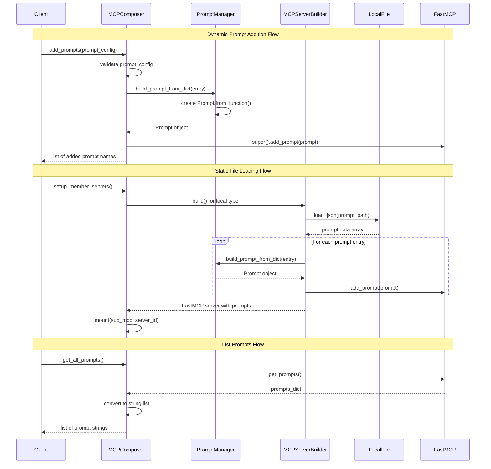

# Prompt Management in MCP Composer


MCP Composer provides a comprehensive prompt management system that allows you to dynamically add, list, and manage prompts across your MCP infrastructure. The system supports both runtime prompt addition and static prompt loading from configuration files. As part of prompt management in MCP Composer, you will add prompts dynamically, list all registered prompts, get prompts from specific servers, filter prompts based on criteria, and apply safety and validation rules. Among them  add prompts dynamically, list all registered prompts are currently supported.

Here is the roadmap for prompt management in MCP Composer:


P.S - features those are in purple are supporetd today. 

## Key Functionality

Based on the mind map shown, MCP Composer currently supports the following prompt management operations:

- **Add**: Dynamically add new prompts to the system*  
- **List**: Retrieve all registered prompts*

The following features are planned to be implemented:

- **List per Server**: Get prompts from specific servers
- **Filter**: Filter prompts based on criteria
- **Guardrails**: Apply safety and validation rules

## Core Components

### 1. Prompt Management Tools

MCP Composer exposes two main tools for prompt management:

```python
# Add prompts dynamically
self.add_tool(Tool.from_function(self.add_prompts))

# List all prompts
self.add_tool(Tool.from_function(self.get_all_prompts))
```

### 2. Prompt Management Flow

The following sequence diagram illustrates the flow of prompt management operations:



### 3. Prompt Structure

Each prompt follows a standardized structure defined in `test/data/prompts.json`:

```json
{
    "name": "prompt_name",
    "description": "Description of what the prompt does",
    "template": "Template string with {{variable}} placeholders",
    "arguments": [
        {
            "name": "variable",
            "type": "string",
            "required": true,
            "description": "Description of the variable"
        }
    ]
}
```

## Adding Prompts

### Method 1: Dynamic Addition via API

You can add prompts dynamically using the `add_prompts` function:

```python
async def add_prompts(self, prompt_config: Union[dict, list[dict]]) -> list[str]:
    """
    Add one or more prompts based on the provided configuration.
    Returns a list of registered prompt names.
    """
    if not isinstance(prompt_config, list):
        raise TypeError("Prompt config must be a dict or a list of dicts")

    added = []
    for entry in prompt_config:
        prompt = await build_prompt_from_dict(entry)
        super().add_prompt(prompt)
        added.append(prompt.name)
    return added
```

#### Example Usage:

```python
# Add a single prompt
prompt_config = [{
    "name": "app_top_errors_yesterday",
    "description": "Show top erroneous calls handled by an application since yesterday",
    "template": "Show top erroneous calls handled by '{{ application }}' application since yesterday",
    "arguments": [
        {
            "name": "application",
            "type": "string",
            "required": true,
            "description": "The name of the application"
        }
    ]
}]

added_prompts = await composer.add_prompts(prompt_config)
print(f"Added prompts: {added_prompts}")
```

### Method 2: Static Loading from Local Files

Prompts can be loaded from local JSON files using the "local" server type:

#### Configuration Example:

```json
{
    "id": "mcp-prompt",
    "type": "local",
    "prompt_path": "./test/data/prompts.json",
    "_id": "mcp-prompt"
}
```

#### Implementation Details:

The local file loading is handled by the `MCPServerBuilder._build_from_local_file()` method:

```python
async def _build_from_local_file(self) -> FastMCP:
    mcp = FastMCP(self.config.get(ConfigKey.ID, ""))
    data = await load_json(self.config[ConfigKey.PROMPT_PATH])
    for entry in data:
        prompt = await build_prompt_from_dict(entry)
        logger.info("Prompt: %s", prompt)
        mcp.add_prompt(prompt)
    return mcp
```

## Listing Prompts

### Get All Prompts

The `get_all_prompts` function retrieves all registered prompts:

```python
async def get_all_prompts(self) -> list[str]:
    """Get all registered prompts mapped to their textual form."""
    prompts_dict = await self.get_prompts()
    return [str(prompt) for prompt in prompts_dict.values()]
```

#### Example Usage:

```python
# Get all registered prompts
all_prompts = await composer.get_all_prompts()
for prompt in all_prompts:
    print(prompt)
```

## Prompt Building Process

### The `build_prompt_from_dict` Function

This utility function converts prompt dictionaries into FastMCP Prompt objects:

```python
async def build_prompt_from_dict(entry: dict) -> Prompt:
    name = entry["name"]
    template = entry["template"]
    description = entry.get("description", "")
    arguments = entry.get("arguments", [])

    def fn() -> str:
        """
        Replaces placeholders in the template string with values from arguments.
        """
        try:
            result = template.format(**arguments)
            return result
        except KeyError as e:
            raise ValueError(f"Missing required argument: {e.args[0]}")

    # Wrap into a FastMCP Prompt
    prompt = Prompt.from_function(fn, name=name, description=description)
    prompt.arguments = arguments
    return prompt
```

## Example Prompts

The system comes with a comprehensive set of pre-defined prompts for common operations:

### Application Monitoring Prompts

```json
{
    "name": "app_top_errors_yesterday",
    "description": "Show top erroneous calls handled by an application since yesterday",
    "template": "Show top erroneous calls handled by '{{ application }}' application since yesterday",
    "arguments": [
        {
            "name": "application",
            "type": "string",
            "required": true,
            "description": "The name of the application"
        }
    ]
}
```

### Performance Monitoring Prompts

```json
{
    "name": "promo_http_avg_response",
    "description": "Average response time of promo HTTP calls handled by a cluster",
    "template": "What is the average response time of promo HTTP calls handled by Kubernetes cluster {{ cluster }}?",
    "arguments": [
        {
            "name": "cluster",
            "type": "string",
            "required": true,
            "description": "The name of the Kubernetes cluster"
        }
    ]
}
```

### Infrastructure Monitoring Prompts

```json
{
    "name": "queue_depth_check",
    "description": "Current queue depth of a given AMQ queue",
    "template": "What is the current queue depth of {{ queue_name }} from the queue manager running on namespace {{ namespace }}?",
    "arguments": [
        {
            "name": "queue_name",
            "type": "string",
            "required": true,
            "description": "The name of the AMQ queue"
        },
        {
            "name": "namespace",
            "type": "string",
            "required": true,
            "description": "The namespace of the queue manager"
        }
    ]
}
```

## Testing Prompt Management

### Unit Tests

The system includes comprehensive unit tests for prompt management:

```python
@pytest.mark.asyncio
async def test_add_prompts():
    composer = MCPComposer("composer")
    config = [{
        "name": "promo_http_avg_response",
        "description": "Average response time of promo HTTP calls handled by a cluster",
        "template": "What is the average response time of promo HTTP calls handled by Kubernetes cluster {{ cluster }}?",
        "arguments": [
            {
                "name": "cluster",
                "type": "string",
                "required": "true",
                "description": "The name of the Kubernetes cluster"
            }
        ]
    }]
    res = await composer.add_prompts(config)     
    assert len(res) == 1, "Composer should return a dictionary of prompts"
```

### Integration Tests

```python
@pytest.mark.asyncio
async def test_builder_local():    
    config = [{
        "id": "mcp-prompt",
        "type": "local",
        "prompt_path": "./test/data/prompts.json"
    }]
    composer = MCPComposer("composer")
    await composer.setup_member_servers()
    prompts = await composer.get_all_prompts()
    assert len(prompts) == 16, "Composer should return 16 prompts from local file"
    assert isinstance(prompts, list), "Should return a list of prompts"
```

## API Endpoints

### REST API Support

MCP Composer also exposes prompt management through REST endpoints:

#### Add Prompts

```http
POST /mcp/tools/add_prompts
Content-Type: application/json

{
  "arguments": {
    "prompt_config": [
      {
        "name": "prompt_name",
        "description": "Prompt description",
        "template": "Template with {{variable}}",
        "arguments": [
          {
            "name": "variable",
            "type": "string",
            "required": true,
            "description": "Variable description"
          }
        ]
      }
    ]
  }
}
```

#### Get All Prompts

```http
POST /mcp/tools/get_all_prompts
Content-Type: application/json

{
  "arguments": {}
}
```

## Best Practices

### 1. Prompt Naming

- Use descriptive, lowercase names with underscores
- Include the domain/context in the name (e.g., `app_`, `cluster_`, `jvm_`)

### 2. Template Design

- Use clear, natural language templates
- Include all required variables with `{{ variable_name }}` syntax
- Provide meaningful descriptions for each argument

### 3. Argument Validation

- Always specify `required: true` for mandatory arguments
- Use appropriate types (`string`, `integer`, `boolean`)
- Provide clear descriptions for each argument

### 4. Error Handling

- Templates should handle missing arguments gracefully
- Use try-catch blocks in prompt functions when appropriate

## Configuration Files

### Prompt Servers Configuration

Location: `test/data/prompt_servers.json`

```json
[
  {
    "id": "mcp-prompt",
    "type": "local",
    "prompt_path": "./src/mcp-composer/test/data/prompts.json",
    "_id": "mcp-prompt"
  }
]
```

### Prompts Data

Location: `test/data/prompts.json`

Contains 16 pre-defined prompts covering:
- Application monitoring
- Performance analysis
- Infrastructure checks
- Security assessments
- Cost optimization

## Conclusion

MCP Composer's prompt management system provides a flexible and powerful way to handle dynamic prompt creation and management. The current implementation supports adding prompts both dynamically and through static configuration files, with comprehensive listing capabilities. The system is designed to be extensible, allowing for future enhancements like filtering, removal, and advanced guardrails. 