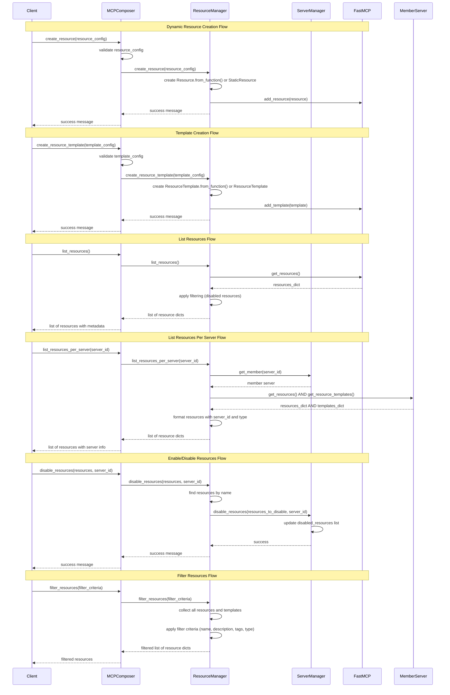

# Resource Management in MCP Composer

MCP Composer provides a comprehensive resource management system that allows you to dynamically create, list, manage, enable, and disable resources and resource templates across your MCP infrastructure. The system supports both runtime resource creation and static resource loading from configuration files. As part of resource management in MCP Composer, you will create resources and templates dynamically, list all registered resources, get resources from specific servers, filter resources based on criteria, enable/disable resources, and apply safety and validation rules. Among them, create resources and templates dynamically, list all registered resources, list resources per server, filter resources, and enable/disable resources are currently supported.


## Key Functionality

Based on the mind map shown, MCP Composer currently supports the following resource management operations:

- **Create**: Dynamically create new resources and templates to the system*  
- **List**: Retrieve all registered resources and templates*
- **List per Server**: Get resources from specific servers (both resources and templates)*
- **Filter**: Filter resources based on criteria*
- **Enable/Disable**: Enable or disable resources and templates across servers*

The following feature is planned to be implemented:

- **Guardrails**: Apply safety and validation rules

## Core Components

### 1. Resource Management Tools

MCP Composer exposes nine main tools for resource management:

```python
# Create resource templates
self.add_tool(Tool.from_function(self.create_resource_template))

# Create actual resources
self.add_tool(Tool.from_function(self.create_resource))

# List all resources
self.add_tool(Tool.from_function(self.list_resources))

# List all resource templates
self.add_tool(Tool.from_function(self.list_resource_templates))

# List resources per server
self.add_tool(Tool.from_function(self.list_resources_per_server))

# Filter resources
self.add_tool(Tool.from_function(self.filter_resources))

# Enable resources
self.add_tool(Tool.from_function(self.enable_resources))

# Disable resources
self.add_tool(Tool.from_function(self.disable_resources))
```

### 2. Resource Management Flow

The following sequence diagram illustrates the flow of resource management operations:



### 3. Resource Structure

Each resource follows a standardized structure defined in the resource configuration:

```json
{
    "name": "resource_name",
    "description": "Description of what the resource provides",
    "uri": "resource://resource_name",
    "mime_type": "text/plain",
    "content": "Actual content of the resource",
    "tags": ["tag1", "tag2"],
    "enabled": true
}
```

### 4. Resource Template Structure

Each resource template follows a standardized structure:

```json
{
    "name": "template_name",
    "description": "Description of what the template provides",
    "uri_template": "resource://{name}",
    "mime_type": "text/plain",
    "parameters": {
        "name": {
            "type": "string",
            "required": true,
            "description": "The name parameter"
        }
    },
    "tags": ["template", "example"],
    "enabled": true
}
```

## Creating Resources

### Method 1: Dynamic Creation via API

You can create resources dynamically using the `create_resource` function:

```python
async def create_resource(self, resource_config: dict) -> str:
    """
    Create a resource in the composer using FastMCP's built-in add_resource.
    Returns a success message.
    """
    return await self._resource_manager.create_resource(resource_config)
```

#### Example Usage:

```python
# Create a simple resource
resource_config = {
    "name": "my_resource",
    "description": "An actual resource with content",
    "uri": "resource://my_resource",
    "mime_type": "text/plain",
    "content": "This is the actual content of the resource",
    "tags": ["resource", "example"],
    "enabled": True
}

result = await composer.create_resource(resource_config)
print(result)  # "Resource 'my_resource' created successfully"
```

### Method 2: Function-Based Resources

You can also create resources with custom functions:

```python
# Create a resource with a custom function
resource_config = {
    "name": "dynamic_resource",
    "description": "A resource with dynamic content",
    "uri": "resource://dynamic_resource",
    "mime_type": "application/json",
    "function": lambda: json.dumps({"timestamp": time.time(), "data": "dynamic"})
}

result = await composer.create_resource(resource_config)
```

## Creating Resource Templates

### Method 1: Dynamic Creation via API

You can create resource templates dynamically using the `create_resource_template` function:

```python
async def create_resource_template(self, resource_config: dict) -> str:
    """
    Add a resource template to the composer using FastMCP's built-in add_template.
    Returns a success message.
    """
    return await self._resource_manager.create_resource_template(resource_config)
```

#### Example Usage:

```python
# Create a resource template
template_config = {
    "name": "my_template",
    "description": "A template for creating resources",
    "uri_template": "resource://{name}",
    "mime_type": "text/plain",
    "tags": ["template", "example"],
    "enabled": True
}

result = await composer.create_resource_template(template_config)
print(result)  # "Resource template 'my_template' added successfully"
```

### Method 2: Function-Based Templates

You can also create templates with custom functions:

```python
# Create a template with a custom function
template_config = {
    "name": "dynamic_template",
    "description": "A template with dynamic content",
    "uri_template": "resource://{name}",
    "mime_type": "application/json",
    "function": lambda name: json.dumps({"name": name, "timestamp": time.time()})
}

result = await composer.create_resource_template(template_config)
```

## Listing Resources

### List All Resources

The `list_resources` function retrieves all registered resources (excluding disabled ones):

```python
async def list_resources(self) -> list[dict]:
    """List all available resources from composer and mounted servers."""
    resources = await self._resource_manager.list_resources()
    return [
        {
            "name": resource.name,
            "description": resource.description,
            "uri": str(resource.uri),
            "mime_type": resource.mime_type,
            "tags": list(resource.tags) if resource.tags else []
        }
        for resource in resources
    ]
```

#### Example Usage:

```python
# Get all registered resources (excluding disabled ones)
all_resources = await composer.list_resources()
for resource in all_resources:
    print(f"Resource: {resource['name']} - {resource['description']}")
    print(f"  URI: {resource['uri']}")
    print(f"  MIME Type: {resource['mime_type']}")
    print(f"  Tags: {resource['tags']}")
```

### List All Resource Templates

The `list_resource_templates` function retrieves all registered resource templates (excluding disabled ones):

```python
async def list_resource_templates(self) -> list[dict]:
    """List all available resource templates from composer and mounted servers."""
    templates = await self._resource_manager.list_resource_templates()
    return [
        {
            "name": template.name,
            "description": template.description,
            "uri_template": str(template.uri_template),
            "mime_type": template.mime_type,
            "tags": list(template.tags) if template.tags else []
        }
        for template in templates
    ]
```

#### Example Usage:

```python
# Get all registered resource templates (excluding disabled ones)
all_templates = await composer.list_resource_templates()
for template in all_templates:
    print(f"Template: {template['name']} - {template['description']}")
    print(f"  URI Template: {template['uri_template']}")
    print(f"  MIME Type: {template['mime_type']}")
    print(f"  Tags: {template['tags']}")
```

## Listing Resources Per Server

### List Resources Per Server

The `list_resources_per_server` function retrieves all resources and templates from a specific server:

```python
async def list_resources_per_server(self, server_id: str) -> list[dict]:
    """List all resources and templates from a specific server."""
    return await self._resource_manager.list_resources_per_server(server_id)
```

#### Example Usage:

```python
# List resources and templates from a specific server
resources = await composer.list_resources_per_server("my-server")
for resource in resources:
    print(f"Resource: {resource['name']} from server: {resource['server_id']}")
    print(f"  Type: {resource['type']}")  # 'resource' or 'template'
    print(f"  Description: {resource['description']}")
    if resource['type'] == 'resource':
        print(f"  URI: {resource['uri']}")
    else:
        print(f"  URI Template: {resource['uri_template']}")
```

#### Implementation Details:

The method checks if the server exists and retrieves both resources and templates from the specific server:

```python
async def list_resources_per_server(self, server_id: str) -> List[Dict]:
    """List all resources and templates from a specific server."""
    try:
        if not self._server_manager or not self._server_manager.has_member_server(server_id):
            return []

        server = self._server_manager.get_member(server_id)
        if server and hasattr(server, 'server') and server.server:
            result = []
            
            # Get resources
            try:
                resources = await server.server.get_resources()
                for key, resource in resources.items():
                    if hasattr(resource, 'name'):
                        result.append({
                            "name": resource.name,
                            "description": getattr(resource, 'description', ''),
                            "uri": str(getattr(resource, 'uri', '')),
                            "type": "resource",
                            "server_id": server_id
                        })
            except Exception as e:
                logger.warning("Error getting resources from server %s: %s", server_id, e)
            
            # Get resource templates
            try:
                templates = await server.server.get_resource_templates()
                for key, template in templates.items():
                    if hasattr(template, 'name'):
                        result.append({
                            "name": template.name,
                            "description": getattr(template, 'description', ''),
                            "uri_template": str(getattr(template, 'uri_template', '')),
                            "type": "template",
                            "server_id": server_id
                        })
            except Exception as e:
                logger.warning("Error getting resource templates from server %s: %s", server_id, e)
            
            return result
        return []
    except Exception as e:
        logger.error("Error listing resources for server %s: %s", server_id, e)
        return []
```

## Filtering Resources

### Filter Resources by Criteria

The `filter_resources` function allows filtering resources based on various criteria:

```python
async def filter_resources(self, filter_criteria: dict) -> list[dict]:
    """Filter resources based on criteria like name, description, tags, etc."""
    return await self._resource_manager.filter_resources(filter_criteria)
```

#### Example Usage:

```python
# Filter by name
result = await composer.filter_resources({"name": "test"})

# Filter by description
result = await composer.filter_resources({"description": "resource"})

# Filter by type (resource or template)
result = await composer.filter_resources({"type": "resource"})

# Filter by tags
result = await composer.filter_resources({"tags": ["example", "test"]})

# Filter by multiple criteria
result = await composer.filter_resources({
    "name": "resource",
    "type": "template",
    "description": "test"
})
```

#### Implementation Details:

The filtering method collects resources and templates from both the composer and all mounted servers, then applies the filter criteria:

```python
async def filter_resources(self, filter_criteria: dict) -> List[Dict]:
    """
    Filter both resources and templates based on criteria like name, description, tags, etc.
    """
    try:
        result = []

        # Get all resources and templates using FastMCP's built-in methods
        resources = await self.list_resources()
        templates = await self.list_resource_templates()

        # Combine resources and templates for filtering
        all_items = []

        # Add resources with type indicator
        for resource in resources:
            all_items.append({
                "item": resource,
                "type": "resource",
                "name": getattr(resource, 'name', ''),
                "description": getattr(resource, 'description', ''),
                "uri": str(getattr(resource, 'uri', '')),
                "tags": getattr(resource, 'tags', set())
            })

        # Add templates with type indicator
        for template in templates:
            all_items.append({
                "item": template,
                "type": "template",
                "name": getattr(template, 'name', ''),
                "description": getattr(template, 'description', ''),
                "uri_template": str(getattr(template, 'uri_template', '')),
                "tags": getattr(template, 'tags', set())
            })

        # Apply filters
        for item_data in all_items:
            match = True

            # Filter by name
            if 'name' in filter_criteria and filter_criteria['name']:
                search_name = filter_criteria['name'].lower()
                item_name = item_data['name'].lower()
                if search_name not in item_name:
                    match = False

            # Filter by description
            if match and 'description' in filter_criteria and filter_criteria['description']:
                search_desc = filter_criteria['description'].lower()
                item_desc = item_data['description'].lower()
                if search_desc not in item_desc:
                    match = False

            # Filter by tags
            if match and 'tags' in filter_criteria and filter_criteria['tags']:
                search_tags = set(tag.lower() for tag in filter_criteria['tags'])
                item_tags = set(tag.lower() for tag in item_data['tags'])
                if not search_tags.intersection(item_tags):
                    match = False

            # Filter by type (resource or template)
            if match and 'type' in filter_criteria and filter_criteria['type']:
                if filter_criteria['type'].lower() != item_data['type']:
                    match = False

            # Filter by URI pattern
            if match and 'uri_pattern' in filter_criteria and filter_criteria['uri_pattern']:
                if item_data['type'] == 'resource':
                    uri = item_data['uri']
                else:
                    uri = item_data['uri_template']

                if filter_criteria['uri_pattern'].lower() not in uri.lower():
                    match = False

            if match:
                # Create result entry
                result_entry = {
                    "name": item_data['name'],
                    "description": item_data['description'],
                    "type": item_data['type'],
                    "source": "composer"  # Could be enhanced to track actual source
                }

                # Add type-specific fields
                if item_data['type'] == 'resource':
                    result_entry["uri"] = item_data['uri']
                else:
                    result_entry["uri_template"] = item_data['uri_template']

                # Add tags if present
                if item_data['tags']:
                    result_entry["tags"] = list(item_data['tags'])

                result.append(result_entry)

        return result
    except Exception as e:
        logger.error("Error filtering resources: %s", e)
        return []
```

## Enabling and Disabling Resources

### Enable Resources

The `enable_resources` function allows you to enable previously disabled resources or templates:

```python
async def enable_resources(self, resources: list[str], server_id: str) -> str:
    """Enable resources or templates from a specific server."""
    return await self._resource_manager.enable_resources(resources, server_id)
```

#### Example Usage:

```python
# Enable a single resource
result = await composer.enable_resources(["finance_reference"], "mcp-stock-info")
print(result)  # "Enabled ['mcp-stock-info_finance_reference'] resources/templates from server mcp-stock-info"

# Enable multiple resources
result = await composer.enable_resources(["resource1", "resource2"], "my-server")
print(result)  # "Enabled ['my-server_resource1', 'my-server_resource2'] resources/templates from server my-server"
```

### Disable Resources

The `disable_resources` function allows you to disable resources or templates:

```python
async def disable_resources(self, resources: list[str], server_id: str) -> str:
    """Disable resources or templates from a specific server."""
    return await self._resource_manager.disable_resources(resources, server_id)
```

#### Example Usage:

```python
# Disable a single resource
result = await composer.disable_resources(["finance_reference"], "mcp-stock-info")
print(result)  # "Disabled ['mcp-stock-info_finance_reference'] resources/templates from server mcp-stock-info"

# Disable multiple resources
result = await composer.disable_resources(["resource1", "resource2"], "my-server")
print(result)  # "Disabled ['my-server_resource1', 'my-server_resource2'] resources/templates from server my-server"
```

#### Implementation Details:

The enable/disable functionality works by:

1. **Finding resources by name**: The system searches for resources and templates by their `name` attribute
2. **Handling both types**: Works with both `Resource` and `ResourceTemplate` objects
3. **Server-specific**: Resources are disabled/enabled per server
4. **Persistent storage**: Changes are persisted to the database
5. **Filtering**: Disabled resources are automatically filtered out from `list_resources()` and `list_resource_templates()`

```python
async def disable_resources(self, resources: list[str], server_id: str) -> str:
    """
    Disable a resource or multiple resources from the member server.
    This method handles both Resources and Resource Templates.
    """
    if not self._server_manager:
        return "Server manager not available"

    try:
        self._server_manager.check_server_exist(server_id)
        
        # Get all resources and templates using the list methods
        all_resources = await self.list_resources()
        all_templates = await self.list_resource_templates()
        
        # Find resources to disable by matching names
        resources_to_disable = []
        
        for resource_name in resources:
            # Check in resources
            for resource in all_resources:
                actual_name = getattr(resource, 'name', None)
                if actual_name and resource_name.lower() == actual_name.lower():
                    full_key = f"{server_id}_{resource_name}"
                    resources_to_disable.append(full_key)
                    break
            
            # Check in templates
            for template in all_templates:
                actual_name = getattr(template, 'name', None)
                if actual_name and resource_name.lower() == actual_name.lower():
                    full_key = f"{server_id}_{resource_name}"
                    resources_to_disable.append(full_key)
                    break

        if not resources_to_disable:
            return f"No resources or resource templates found to disable: {resources}"

        self._server_manager.disable_resources(resources_to_disable, server_id)
        return f"Disabled {resources_to_disable} resources/templates from server {server_id}"
    except Exception as e:
        return f"Failed to disable resources: {str(e)}"
```

### Filtering Disabled Resources

Disabled resources are automatically filtered out from all listing operations:

```python
def _filter_disabled_resources(self, resources: dict[str, Resource]) -> dict[str, Resource]:
    """Filter resources by removing disabled ones."""
    try:
        if not self._server_manager:
            return resources

        server_config = self._server_manager.list()
        if not server_config:
            return resources

        remove_set = set()
        for member in server_config:
            if member.health_status == HealthStatus.unhealthy:
                continue
            if member.disabled_resources:
                remove_set.update(member.disabled_resources)

        filtered_resources = {}
        for name, resource in resources.items():
            # Check if this resource should be filtered out
            should_remove = False
            
            # Check exact key match first
            if name in remove_set:
                should_remove = True
            else:
                # Check if any disabled resource matches this resource by name
                resource_name = getattr(resource, 'name', None)
                if resource_name:
                    for disabled_resource in remove_set:
                        if '_' in disabled_resource:
                            disabled_resource_name = disabled_resource.split('_', 1)[1]
                            if resource_name.lower() == disabled_resource_name.lower():
                                should_remove = True
                                break
            
            if should_remove:
                continue
            
            filtered_resources[name] = resource
        return filtered_resources
    except Exception as e:
        logger.exception("Resources filtering failed: %s", e)
        raise
```

## Example Resources

The system supports various types of resources for different use cases:

### Static Content Resources

```json
{
    "name": "api_documentation",
    "description": "API documentation for the service",
    "uri": "resource://api/docs",
    "mime_type": "text/markdown",
    "content": "# API Documentation\n\nThis is the API documentation...",
    "tags": ["documentation", "api"],
    "enabled": true
}
```

### Dynamic Function-Based Resources

```json
{
    "name": "system_status",
    "description": "Current system status information",
    "uri": "resource://system/status",
    "mime_type": "application/json",
    "function": "lambda: json.dumps({'status': 'healthy', 'timestamp': time.time()})",
    "tags": ["system", "monitoring"],
    "enabled": true
}
```

### Resource Templates

```json
{
    "name": "user_profile_template",
    "description": "Template for user profile resources",
    "uri_template": "resource://users/{user_id}/profile",
    "mime_type": "application/json",
    "parameters": {
        "user_id": {
            "type": "string",
            "required": true,
            "description": "The user ID"
        }
    },
    "tags": ["template", "user"],
    "enabled": true
}
```

## Testing Resource Management

### Unit Tests

The system includes comprehensive unit tests for resource management:

```python
@pytest.mark.asyncio
async def test_create_resource():
    """Test creating an actual resource."""
    composer = MCPComposer("test-composer")

    resource_config = {
        "name": "test_resource",
        "description": "A test resource",
        "content": "Test content",
        "uri": "resource://test/resource"
    }

    result = await composer.create_resource(resource_config)
    assert "created successfully" in result
```

### Integration Tests

```python
@pytest.mark.asyncio
async def test_list_resources_via_composer():
    """Test listing resources through the composer interface."""
    composer = MCPComposer("test-composer")

    # Add a test resource first
    resource_config = {
        "name": "test_resource",
        "description": "A test resource",
        "content": "Test content"
    }
    await composer.create_resource(resource_config)

    result = await composer.list_resources()
    assert len(result) >= 1
    assert isinstance(result, list)
    assert isinstance(result[0], dict)
    assert any(r["name"] == "test_resource" for r in result)
```

### Enable/Disable Tests

```python
@pytest.mark.asyncio
async def test_disable_and_enable_resources():
    """Test the full disable/enable resource flow."""
    composer = MCPComposer("test-composer")

    # Test disabling resources
    result = await composer.disable_resources(["test_resource"], "test-server")
    assert "Disabled" in result or "No resources found to disable" in result

    # Test enabling resources
    result = await composer.enable_resources(["test_resource"], "test-server")
    assert "Enabled" in result or "No resources disabled" in result
```

### Filter Tests

```python
@pytest.mark.asyncio
async def test_filter_resources():
    """Test filtering resources by criteria."""
    composer = MCPComposer("test-composer")

    # Add test resources
    resource_configs = [
        {
            "name": "test_resource_1",
            "description": "First test resource",
            "content": "Content 1",
            "tags": ["test", "resource"]
        },
        {
            "name": "test_resource_2", 
            "description": "Second test resource",
            "content": "Content 2",
            "tags": ["test", "example"]
        },
        {
            "name": "another_resource",
            "description": "Another resource",
            "content": "Content 3",
            "tags": ["other"]
        }
    ]

    for config in resource_configs:
        await composer.create_resource(config)

    # Test filtering by name
    result = await composer.filter_resources({"name": "test"})
    assert len(result) == 2
    assert any(r["name"] == "test_resource_1" for r in result)
    assert any(r["name"] == "test_resource_2" for r in result)

    # Test filtering by description
    result = await composer.filter_resources({"description": "First"})
    assert len(result) == 1
    assert result[0]["name"] == "test_resource_1"

    # Test filtering by tags
    result = await composer.filter_resources({"tags": ["example"]})
    assert len(result) == 1
    assert result[0]["name"] == "test_resource_2"

    # Test filtering with no matches
    result = await composer.filter_resources({"name": "nonexistent"})
    assert len(result) == 0
```

## API Endpoints

### REST API Support

MCP Composer also exposes resource management through REST endpoints:

#### Create Resource

```http
POST /mcp/tools/create_resource
Content-Type: application/json

{
  "arguments": {
    "resource_config": {
      "name": "resource_name",
      "description": "Resource description",
      "uri": "resource://resource_name",
      "mime_type": "text/plain",
      "content": "Resource content",
      "tags": ["tag1", "tag2"],
      "enabled": true
    }
  }
}
```

#### Create Resource Template

```http
POST /mcp/tools/create_resource_template
Content-Type: application/json

{
  "arguments": {
    "resource_config": {
      "name": "template_name",
      "description": "Template description",
      "uri_template": "resource://{name}",
      "mime_type": "text/plain",
      "parameters": {
        "name": {
          "type": "string",
          "required": true,
          "description": "Parameter description"
        }
      },
      "tags": ["template", "example"],
      "enabled": true
    }
  }
}
```

#### List Resources

```http
POST /mcp/tools/list_resources
Content-Type: application/json

{
  "arguments": {}
}
```

#### List Resource Templates

```http
POST /mcp/tools/list_resource_templates
Content-Type: application/json

{
  "arguments": {}
}
```

#### List Resources Per Server

```http
POST /mcp/tools/list_resources_per_server
Content-Type: application/json

{
  "arguments": {
    "server_id": "my-server"
  }
}
```

#### Filter Resources

```http
POST /mcp/tools/filter_resources
Content-Type: application/json

{
  "arguments": {
    "filter_criteria": {
      "name": "test",
      "type": "resource",
      "tags": ["example"]
    }
  }
}
```

#### Enable Resources

```http
POST /mcp/tools/enable_resources
Content-Type: application/json

{
  "arguments": {
    "resources": ["resource1", "resource2"],
    "server_id": "my-server"
  }
}
```

#### Disable Resources

```http
POST /mcp/tools/disable_resources
Content-Type: application/json

{
  "arguments": {
    "resources": ["resource1", "resource2"],
    "server_id": "my-server"
  }
}
```

## Best Practices

### 1. Resource Naming

- Use descriptive, lowercase names with underscores
- Include the domain/context in the name (e.g., `api_`, `user_`, `system_`)
- Use consistent naming conventions across your organization

### 2. URI Design

- Use clear, hierarchical URI structures
- Include versioning when appropriate (e.g., `resource://api/v1/docs`)
- Use consistent patterns for similar resources

### 3. MIME Type Selection

- Choose appropriate MIME types for your content
- Use `application/json` for structured data
- Use `text/plain` for simple text content
- Use `text/markdown` for documentation

### 4. Tag Usage

- Use consistent tag naming conventions
- Group related resources with common tags
- Use tags for filtering and organization

### 5. Content Management

- Keep resource content concise and focused
- Use templates for dynamic content
- Consider content versioning for important resources

### 6. Error Handling

- Provide meaningful error messages
- Handle missing resources gracefully
- Validate resource configurations

### 7. Performance Considerations

- Cache frequently accessed resources
- Use appropriate content compression
- Consider resource size limits

### 8. Security Best Practices

- Validate resource access permissions
- Sanitize dynamic content
- Use secure URI patterns

## Configuration Files

### Resource Servers Configuration

Location: `test/data/resource_servers.json`

```json
[
  {
    "id": "mcp-resource",
    "type": "local",
    "resource_path": "./src/mcp-composer/test/data/resources.json",
    "_id": "mcp-resource"
  }
]
```

### Resources Data

Location: `test/data/resources.json`

Contains pre-defined resources covering:
- API documentation
- System status information
- User profile templates
- Configuration examples
- Monitoring data

## Conclusion

MCP Composer's resource management system provides a flexible and powerful way to handle dynamic resource creation and management. The current implementation supports creating resources and templates both dynamically and through static configuration files, with comprehensive listing capabilities including server-specific listing and filtering functionality. The system now includes advanced enable/disable functionality that allows you to control resource visibility across servers, with automatic filtering of disabled resources from all listing operations.

### Key Features Implemented

- **Dynamic Resource Creation**: Create resources and templates on-the-fly with custom functions or static content
- **Comprehensive Listing**: List all resources, templates, or server-specific resources with full metadata
- **Advanced Filtering**: Filter resources by name, description, tags, type, and URI patterns
- **Enable/Disable Management**: Enable or disable resources and templates per server with persistent storage
- **Automatic Filtering**: Disabled resources are automatically filtered out from all listing operations
- **Server-Specific Operations**: All operations can be performed on specific servers or across the entire system
- **Error Handling**: Robust error handling with meaningful error messages
- **Type Safety**: Support for both `Resource` and `ResourceTemplate` objects
- **Architecture Benefits**: Built on FastMCP framework for easy extension and customization
- **Persistent Storage**: All changes are persisted to the database (local file, Cloudant, etc.)
- **Server Management**: Integrated with the server management system for seamless operation
- **Filtering Logic**: Intelligent filtering that handles resource naming conventions and URI patterns
- **Performance Optimized**: Efficient resource discovery and filtering algorithms

The resource management system complements the prompt management system, providing a complete solution for managing both structured data (resources) and natural language templates (prompts) within the MCP Composer ecosystem. The enable/disable functionality adds a crucial layer of control, allowing administrators to manage resource visibility and access across their MCP infrastructure.

### Future Enhancements

The system is designed to be extensible, allowing for future enhancements like:
- **Advanced Guardrails**: Apply safety and validation rules
- **Resource Versioning**: Version control for resources and templates
- **Access Control**: Fine-grained permissions for resource access
- **Resource Dependencies**: Manage dependencies between resources
- **Resource Monitoring**: Track resource usage and performance metrics 