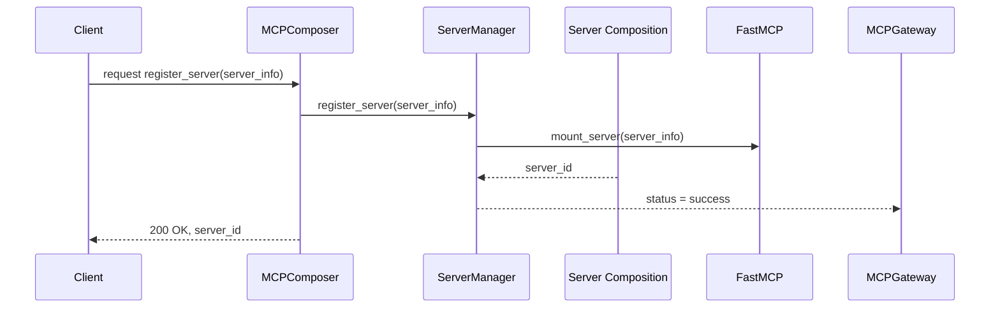
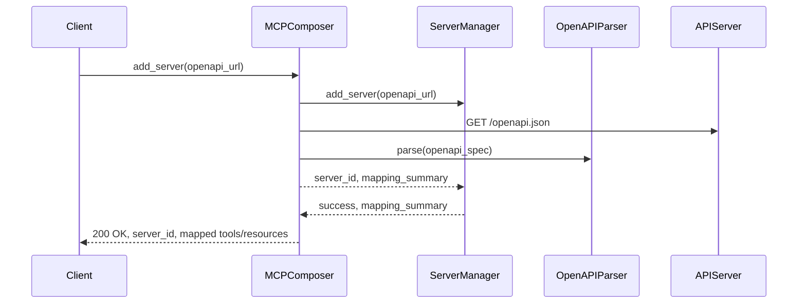

# MCP Server Management 

MCP Composer provides comprehensive server management capabilities with support for multiple server types, authentication methods, and dynamic tool generation. The MCP Composer acts as the single front-door MCP server that exposes all tools, prompts, and resources across all registered member MCP servers in a uniform way.

- Abstracts underlying protocol, transport, and auth complexities
- Presents all tools under a consistent `call_tool(tool_id, input)` interface
- Supports `local`, `stream` and `nonstream` communication modes

The composer is the front door. Registered member servers show up as one set of tools, prompts, and resources.

Implemented operations:

- Register a member server from OpenAPI, GraphQL, or another MCP server
- Update, activate, deactivate, and delete a member server
- Health checks and listing
- Restore the last saved configuration from the database or a local file

---

## Adding Servers


MCP Composer supports multiple types of member servers that can be added dynamically at runtime. Each server can have its own authentication, tools, and resources. The Composer allows the registration of external or embedded MCP servers (called Member MCP Servers).

- Function: `register_mcp_server`
- Accepts a JSON config describing:
  - server ID
  - Type (`openapi`, `cli`, `client`, `mcp`)
  - Endpoint or command
  - Transport type (`http`)
  - Authentication strategy and credentials
- Automatically registers the member’s tools, prompts, and resources

For example, here is a simple MCP server registration input for MCP Composer 

```
{
  "id": "customer-service",
  "type": "client",
  "endpoint": "http://0.0.0.0:8080/mcp",
  "auth_strategy": "apikey",
  "auth": {
    "apikey": "your_api_key"
  }
}
```
Once the server is registered, MCP Composer can expose the tools for "customer-service" MCP server.

Following is the MCP server registration flow:



### 🚀 Server Types

| Server Type | Description | Use Case |
|-------------|-------------|----------|
| **HTTP** | Standard HTTP/HTTPS endpoints (Streamable HTTP) | REST APIs |
| **STDIO** | Standard input/output communication | Local scripts, command-line tools |
| **OpenAPI** | REST APIs with OpenAPI specifications | Third-party APIs, internal services |
| **GraphQL** | GraphQL APIs with schema files | Modern APIs, flexible data queries |


#### 1. HTTP Servers

MCP servers accessible via HTTP/HTTPS (Streamable HTTP transport).

```python
# Basic HTTP server
await composer.register_mcp_server({
    "id": "customer-api",
    "type": "http",
    "endpoint": "https://api.customers.com/mcp"
})

# Additional HTTP server
await composer.register_mcp_server({
    "id": "http-server",
    "type": "http",
    "endpoint": "https://api.example.com/mcp"
})
```

**Configuration Options:**
- `id`: Unique identifier for the server
- `type`: Must be "http"
- `endpoint`: Full URL to the MCP server endpoint
- `auth_strategy`: Authentication strategy (optional)
- `auth`: Authentication configuration (required if `auth_strategy` is provided)
- `headers`: Additional HTTP headers (optional)

#### 2. STDIO Servers

MCP servers that communicate via standard input/output.

```python
# STDIO server
await composer.register_mcp_server({
    "id": "stdio-server",
    "type": "stdio",
    "command": "python",
    "args": ["server.py"],
    "cwd": "/path/to/server",
    "env": {
        "API_KEY": "your_key"
    }
})
```

**Configuration Options:**
- `id`: Unique identifier for the server
- `type`: Must be "stdio"
- `command`: Command to execute
- `args`: Command arguments (optional)
- `cwd`: Working directory (optional)
- `env`: Environment variables (optional)

#### 3. OpenAPI Servers

Use this server type to integrate third-party or internal APIs defined by an OpenAPI specification. MCP Composer reads the spec and dynamically generates tools or resource templates from the endpoints, using the `custom_routes` rules to control behavior.

##### Example:

```python
await composer.register_mcp_server({
    "id": "openapi-server",
    "type": "openapi",
    "open_api": {
        "endpoint": "https://api.example.com/v1",
        "spec_filepath": "/path/to/openapi-spec.json", // this could be also spec_url
        "custom_routes": [
            {
                "methods": ["GET"],
                "pattern": "./users/.",
                "mcp_type": "RESOURCE_TEMPLATE"
            },
            {
                "methods": ["GET"],
                "pattern": "./events/.",
                "mcp_type": "TOOL"
            },
            {
                "methods": ["POST"],
                "pattern": ".*/",
                "mcp_type": "EXCLUDE"
            }
        ]
    },
    "auth_strategy": "bearer",
    "auth": {
        "token": "your_token"
    }
})
```

##### Configuration Fields

- `endpoint`: The base URL for the live API.
- `spec_filepath`: Absolute path to the OpenAPI spec file (JSON or YAML).
- `custom_routes`: A list of rules that map HTTP methods and path patterns to MCP behavior.

##### `custom_routes` Field Reference

| Field       | Description                                                             |
|-------------|-------------------------------------------------------------------------|
| `methods`   | List of HTTP methods to match (e.g., `["GET"]`)                         |
| `pattern`   | Regex-like string pattern for matching paths (e.g., `"./users/."`)       |
| `mcp_type`  | One of `TOOL`, `RESOURCE_TEMPLATE`, or `EXCLUDE`                         |

**MCP Types:**
- `TOOL`: Generates a callable MCP tool for the matching endpoint.
- `RESOURCE_TEMPLATE`: Extracts reusable schemas (like input/output definitions).
- `EXCLUDE`: Prevents this route from being included at all.

This Composer can compose of different type. Here is a sequence of composing server using openAPI 

The input to MCP Composer will look like 

```
[
  {
    "id": "mcp-example",
    "type": "openapi",
    "open_api": {
      "endpoint": "https://api.example.com",
      "spec_filepath": "./example-openapi.json", // this could be also spec_url
      "custom_routes": [
        {
          "methods": [
            "GET"
          ],
          "pattern": ".*/monitoring/.*",
          "mcp_type": "TOOL"
        },
        {
          "methods": [
            "POST"
          ],
          "pattern": ".*/",
          "mcp_type": "EXCLUDE"
        }
      ]
    },
    "auth_strategy": "bearer",
    "auth": {
      "auth_prefix": "apiToken",
      "token": "xxxxxxx"
    }
  }
]
```
The sequence of server composition can be described as follows:




#### 4. GraphQL Servers

MCP servers that provide GraphQL endpoints. MCP Composer can integrate with GraphQL APIs by reading the schema file and dynamically generating tools based on the available queries and mutations.

##### Basic Configuration

```python
await composer.register_mcp_server({
    "id": "graphql-server",
    "type": "graphql",
    "graphql": {
        "endpoint": "https://api.example.com/graphql",
        "schema_filepath": "/path/to/schema.graphql"
    },
    "auth_strategy": "bearer",
    "auth": {
        "token": "your_token"
    }
})
```


An example graphql schema would look like 

```json
type Query {
  countries: [Country!]!
  country(code: ID!): Country
  continents: [Continent!]!
  continent(code: ID!): Continent
  languages: [Language!]!
  language(code: ID!): Language
}

type Country {
  code: ID!
  name: String!
  native: String!
  phone: String!
  continent: Continent!
  capital: String
  currency: String
  languages: [Language!]!
  emoji: String!
  emojiU: String!
  states: [State!]!
}

type Continent {
  code: ID!
  name: String!
  countries: [Country!]!
}

type Language {
  code: ID!
  name: String
  native: String
  rtl: Boolean!
}

type State {
  code: String
  name: String!
  country: Country!
}
```

This will expose one tool 


**Configuration Options:**
- `id`: Unique identifier for the server
- `type`: Must be "graphql"
- `graphql.endpoint`: The GraphQL API endpoint URL
- `graphql.schema_filepath`: Path to the GraphQL schema file (.graphql or .gql)
- `auth_strategy`: Authentication strategy (optional)
- `auth`: Authentication configuration (required if `auth_strategy` is provided)

##### How GraphQL Integration Works

1. **Schema Parsing**: MCP Composer reads the GraphQL schema file to understand the available types, queries, and mutations
2. **Tool Generation**: Based on the schema, it automatically generates MCP tools for each query and mutation
3. **Type Mapping**: GraphQL types are mapped to appropriate MCP parameter types
4. **Dynamic Execution**: When tools are called, MCP Composer constructs and executes GraphQL queries/mutations

##### Example: Countries API

Here's a complete example using the Countries GraphQL API:

**Configuration:**
```json
{
  "id": "mcp-countries",
  "type": "graphql",
  "graphql": {
    "endpoint": "https://countries.trevorblades.com/",
    "schema_filepath": "./countries.graphql"
  }
}
```

**Schema File (countries.graphql):**
```graphql
type Query {
  countries: [Country!]!
  country(code: ID!): Country
  continents: [Continent!]!
  continent(code: ID!): Continent
  languages: [Language!]!
  language(code: ID!): Language
}

type Country {
  code: ID!
  name: String!
  native: String!
  phone: String!
  continent: Continent!
  capital: String
  currency: String
  languages: [Language!]!
  emoji: String!
  emojiU: String!
  states: [State!]!
}

type Continent {
  code: ID!
  name: String!
  countries: [Country!]!
}

type Language {
  code: ID!
  name: String
  native: String
  rtl: Boolean!
}

type State {
  code: String
  name: String!
  country: Country!
}
```

**Generated Tools:**
- `countries`: Returns all countries with their details
- `country`: Returns a specific country by code
- `continents`: Returns all continents
- `continent`: Returns a specific continent by code
- `languages`: Returns all languages
- `language`: Returns a specific language by code

##### Example: Pokemon API

**Configuration:**
```json
{
  "id": "mcp-pokemon",
  "type": "graphql",
  "graphql": {
    "endpoint": "https://graphqlpokemon.favware.tech/v8",
    "schema_filepath": "./pokemon.graphql"
  }
}
```

##### Authentication with GraphQL

GraphQL servers support all standard authentication methods:

```python
# Bearer token authentication
await composer.register_mcp_server({
    "id": "auth-graphql-server",
    "type": "graphql",
    "graphql": {
        "endpoint": "https://api.example.com/graphql",
        "schema_filepath": "/path/to/schema.graphql"
    },
    "auth_strategy": "bearer",
    "auth": {
        "token": "your_bearer_token"
    }
})

# API Key authentication
await composer.register_mcp_server({
    "id": "apikey-graphql-server",
    "type": "graphql",
    "graphql": {
        "endpoint": "https://api.example.com/graphql",
        "schema_filepath": "/path/to/schema.graphql"
    },
    "auth_strategy": "apikey",
    "auth": {
        "apikey": "your_api_key",
        "auth_prefix": "X-API-Key"
    }
})
```

##### Advanced Configuration

**With Custom Headers:**
```python
await composer.register_mcp_server({
    "id": "custom-graphql-server",
    "type": "graphql",
    "graphql": {
        "endpoint": "https://api.example.com/graphql",
        "schema_filepath": "/path/to/schema.graphql"
    },
    "auth_strategy": "bearer",
    "auth": {
        "token": "your_token"
    },
    "headers": {
        "User-Agent": "MCP-Composer/1.0",
        "Accept": "application/json"
    }
})
```

### Working with Generated Tools

Once registered, GraphQL tools work like any other MCP tool:

```python
# Get all countries
countries_result = await composer.call_tool("mcp-countries", "countries", {})

# Get a specific country
country_result = await composer.call_tool("mcp-countries", "country", {
    "code": "US"
})

# Get all continents
continents_result = await composer.call_tool("mcp-countries", "continents", {})
```

### Best Practices

1. **Schema Validation**: Ensure your GraphQL schema file is valid and up-to-date
2. **Endpoint Testing**: Test the GraphQL endpoint before registering the server
3. **Authentication**: Use appropriate authentication for protected GraphQL APIs
4. **Error Handling**: GraphQL errors are automatically handled and returned as tool errors
5. **Performance**: Large schemas may take longer to process during registration

### Troubleshooting

**Common Issues:**
- **Schema File Not Found**: Ensure the schema file path is correct and accessible
- **Invalid Schema**: Validate your GraphQL schema file syntax
- **Authentication Errors**: Verify your authentication credentials and strategy
- **Endpoint Unreachable**: Check network connectivity and endpoint URL

**Debug Mode:**
```python
import logging
logging.getLogger("mcp_composer.tools.graphql").setLevel(logging.DEBUG)

# Register GraphQL server with debug logging
await composer.register_mcp_server(graphql_config)
```

## 🔐 Authentication Configuration

MCP Composer supports multiple authentication strategies for securing connections to member servers. Each authentication method is designed to work with different API security patterns and can be configured per server.

### Supported Authentication Methods

Here are the authentication handler implemented in MCP Compsoer :

| Method | Description | Use Case | Configuration |
|--------|-------------|----------|---------------|
| **Bearer Token** | Standard OAuth2 bearer tokens | OAuth2 APIs, JWT tokens | `auth_strategy: "bearer"` |
| **API Key** | Custom API key headers | REST APIs, service-to-service | `auth_strategy: "apikey"` |
| **Basic Auth** | Username/password authentication | Legacy APIs, internal services | `auth_strategy: "basic"` |
| **JSESSIONID** | Session-based authentication | Web applications, session cookies | `auth_strategy: "jsessionid"` |
| **API Token** | Generic token-based auth | Custom token systems | `auth_strategy: "apiToken"` |
| **OAuth 2.0** | Full OAuth2 flow support | Modern web APIs, user consent | `auth_strategy: "oauth"` |
| **No Auth** | No authentication required | Public APIs, development | No auth configuration |

### Authentication Features

- **Automatic Token Refresh**: Tokens are refreshed before expiry during usage
- **Secure Storage**: Credentials are stored securely in environment variables or vaults
- **Per-Server Configuration**: Each server can use different authentication methods
- **Dynamic Updates**: Authentication can be updated without server restart
- **Error Handling**: Comprehensive error handling for authentication failures

---

### Bearer Token

```json
"auth_strategy": "bearer",
"auth": {
    "token": "your_bearer_token"
}
```

### API Key

```json
"auth_strategy": "apikey",
"auth": {
    "apikey": "your_api_key",
    "auth_prefix": "X-API-Key"  // Optional: custom header
}
```

### Basic Authentication

```json
"auth_strategy": "basic",
"auth": {
    "username": "your_username",
    "password": "your_password"
}
```

Behavior:
- Exchanges the `apikey` at the `token_url` to retrieve a Bearer token.
- Uses `media_type` for the request format (default: "json").

### JSESSIONID Authentication
```json
{
  "auth_strategy": "jessionid",
  "auth": {
    "auth_prefix": "Cookie",
    "token": "your_token"
  }
}
```

### API Token
```json
{
  "auth_strategy": "apiToken",
  "auth": {
    "token": "your_token",
    "auth_prefix": "Bearer"  // Optional
  }
}
```

> 🔁 Tokens are automatically refreshed before expiry during usage.

### OAuth 2.0

For OAuth2 authentication, see the [Authentication Guide](/guide/authentication.md) for detailed configuration and usage examples.

## 📝 Complete Server Configuration Examples

### Development Server

```python
await composer.register_mcp_server({
    "id": "dev-server",
    "name": "Development Server",
    "type": "http",
    "endpoint": "http://localhost:8001/mcp",
    "auth_strategy": "apikey",
    "auth": {
        "apikey": "apikey",
        "auth_prefix": "dev_key_123"
    },
    "headers": {
        "User-Agent": "MCP-Composer/1.0"
    }
})
```

### OpenAPI Server with Custom Routes

```python
await composer.register_mcp_server({
    "id": "eventbrite-api",
    "type": "openapi",
    "open_api": {
        "endpoint": "https://www.eventbriteapi.com/v3",
        "spec_filepath": "./spec/eventbrite-openapi.json",
        "custom_routes": [
            {
                "methods": ["GET"],
                "pattern": ".*/users/.*",
                "mcp_type": "RESOURCE_TEMPLATE"
            },
            {
                "methods": ["GET"],
                "pattern": ".*/events/.*",
                "mcp_type": "TOOL"
            },
            {
                "methods": ["POST"],
                "pattern": ".*/",
                "mcp_type": "EXCLUDE"
            }
        ]
    },
    "auth_strategy": "bearer",
    "auth": {
        "token": "your_eventbrite_token"
    }
})
```

## 🔄 Dynamic Server Management

### Update Server Configuration

```python
# Update server configuration
new_config = {
    "endpoint": "https://new-api.customers.com/mcp",
    "auth_strategy":"apiToken",
    "auth": {"token": "new_token"},
    "headers": {"User-Agent": "Updated-Agent"}
}

await composer.update_mcp_server_config("customer-api", new_config)
```

### Activate/Deactivate Servers

```python
# Deactivate server (temporarily disable)
await composer.deactivate_mcp_server("customer-api")

# Activate server (re-enable)
await composer.activate_mcp_server("customer-api")
```

### Remove Server

```python
# Remove server completely
await composer.delete_mcp_server("customer-api")
```

## 🏥 Health Monitoring

### Check Server Health

```python
# Get health status of all servers
health_status = await composer.member_health()

for server in health_status:
    status = "🟢" if server.get("healthy") else "🔴"
    print(f"{status} {server['name']}: {server.get('status', 'Unknown')}")
```

## 🔍 Validation and Error Handling

### Server Configuration Validation

```python
from mcp_composer.utils import ServerConfigValidator, ValidationError

# Validate server configuration
validator = ServerConfigValidator({
    "id": "test-server",
    "type": "http",
    "endpoint": "https://api.test.com/mcp"
})

try:
    validator.validate()
    print("✅ Configuration is valid")
except ValidationError as e:
    print(f"❌ Configuration error: {e}")
```

### Error Handling

```python
# Handle server registration errors
try:
    await composer.register_mcp_server(server_config)
    print(f"✅ Server {server_config['id']} registered successfully")
except Exception as e:
    print(f"❌ Failed to register server: {e}")
    # Handle the error appropriately
```

## 📊 Monitoring and Logging

### Server Registration Logging

```python
import logging

# Enable detailed logging
logging.getLogger("mcp_composer.member_servers").setLevel(logging.DEBUG)

# Register server with logging
await composer.register_mcp_server({
    "id": "logged-server",
    "type": "http",
    "endpoint": "https://api.logged.com/mcp"
})
```

## 🚀 Best Practices

### 1. Use Environment Variables

```python
import os

await composer.register_mcp_server({
    "id": "env-server",
    "type": "http",
    "endpoint": os.getenv("API_URL"),
    "auth_strategy": "bearer",
    "auth": {
        "token": os.getenv("API_TOKEN")
    }
})
```

### 2. Use Server Groups

```python
# Group related servers
customer_servers = [
    {"id": "customer-api", "type": "http", "endpoint": "https://api.customers.com/mcp"},
    {"id": "customer-analytics", "type": "http", "endpoint": "https://analytics.customers.com/mcp"},
    {"id": "customer-support", "type": "http", "endpoint": "https://support.customers.com/mcp"}
]

for server_config in customer_servers:
    await composer.register_mcp_server(server_config)
```

### 3. Monitor Server Health

```python
# Regular health checks
async def health_monitor():
    while True:
        health = await composer.member_health()
        for server in health:
            if not server.get("healthy"):
                logging.warning(f"Server {server['name']} is unhealthy")
        await asyncio.sleep(60)  # Check every minute

# Start health monitoring
asyncio.create_task(health_monitor())
```

## 📚 Next Steps

- **[Examples](/examples)** - See real-world server configuration examples
- **[API Reference](/api/)** - Complete API documentation
- **[Configuration Guide](/guide/configuration)** - Learn about configuration options 