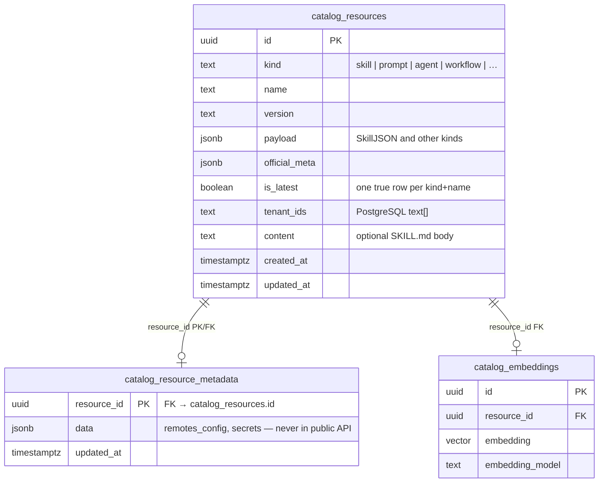
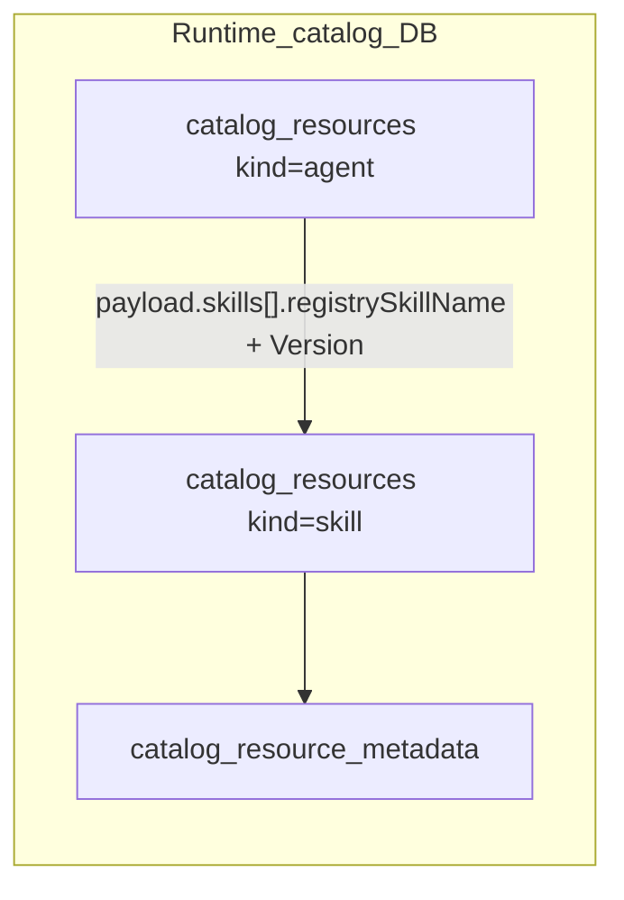

# Skill management

*MCP Composer — how Skills are modeled, published, discovered, and governed.*

For database tables, connection environment variables, Catalog Composer, and all **`kind`** values (not only skills), see [Catalog management](./catalog-management.md). For multi-step playbooks as MCP tools, see [Workflow management](./workflow-management.md).

The sections below cover **`kind = skill`** in depth: what Skills are for, how they sit in **catalog management** (`catalog_resources` and related tables), how operators manage them day-to-day (Section 3), how they relate to MCP tools and servers, discovery, security expectations, and UI/workflow positioning. It is grounded in the current implementation (`SkillJSON`, skill catalog, MCP surfaces).

---

## 1. Conceptual definition

In this platform, a **Skill** is primarily a **registered, versioned artifact** that tells an **agent** (or IDE automation) *what to do*, *when to use it*, and *which capabilities it may rely on*. Concretely:

- **Declarative registry document**: Published JSON aligned with **[agentskills.io](https://agentskills.io)** semantics, extended with **agentregistry-style** operational fields (status, tenant visibility, remotes, references, repository links).
- **Optional rich body**: Extended instructions and bundled docs can live in **`metadata.instructions`** (bounded length at publish time) and/or in **`content`** (e.g. Markdown `SKILL.md`) exposed via progressive disclosure.
- **Not an MCP tool by default**: A Skill is **not** automatically a callable MCP tool. It is **guidance + metadata** that may **reference** tools by name (`allowed-tools`) and **point at** MCP deployments (`remotes`).

**Thin wrapper vs. fresh logic**

| Pattern | Role in platform |
|--------|-------------------|
| **Instruction-heavy Skill** | Default shape: routing phrases in `description`, workflow text in `metadata.instructions`, optional HTTPS-backed `references`. No new backend code required—**behavior is in the model’s reasoning**, constrained by declared `allowed-tools`. |
| **Logic at the MCP layer** | Implemented as **normal MCP tools** on member servers (OpenAPI, GraphQL, custom FastMCP apps). Skills **declare** which tool names are in scope via `allowed-tools`; they do not replace server-side implementations. |
| **Bundled automation** | Optional scripts/assets referenced through `references` / private catalog metadata—still orchestrated by the agent unless you expose explicit tools elsewhere. |

So: Skills are **expected to combine declarative guidance with declared capability boundaries**, not to duplicate every MCP tool as a wrapper class. New **business logic** belongs in **tools/servers**; Skills **describe how agents should use them**.

---

## 2. Catalog management, ERD, and Skills

**Catalog management** in MCP Composer (runtime) is the **PostgreSQL-backed registry** of versioned resources. **Skills** are one **`kind`** of row in that registry; the same physical schema also stores **prompts**, **agents**, **workflows**, and future kinds—see [`scripts/sql/catalog_schema.sql`](../../scripts/sql/catalog_schema.sql) and [`catalog_database.py`](../../modules/mcp_composer/src/mcp_composer/store/catalog_database.py).

### 2.1 Two different “catalog” ideas (do not confuse)

| Concern | What it is | Where to read more |
|--------|-------------|---------------------|
| **Runtime catalog (DB)** | Authoritative rows in **`catalog_resources`** (+ private metadata, optional embeddings). Skills are **`kind = 'skill'`** rows. | [Catalog management](./catalog-management.md) and DDL above |
| **Backstage / file catalog generation** | CLI scans live MCP servers and emits **YAML** descriptors (`mcp-composer catalog generate-catalog`). **Not** the same tables as the runtime registry. | [Catalog and Tool Tagging](./catalog-and-tool-tagging.md) |

Skills **publish, list, and resolve** through the **runtime** catalog APIs and MCP tools; Backstage export is a **separate discoverability pipeline** for IDP-style documentation.

### 2.2 Entity-relationship view (Skills and neighbors)

Physical tables (abbreviated columns):

**Cardinality**

- **`catalog_resources` → `catalog_resource_metadata`**: **0..1** metadata row per resource (created when private data is needed); delete resource cascades metadata.
- **`catalog_resources` → `catalog_embeddings`**: **0..1** embedding row per resource (semantic search when enabled).

**`is_latest`**: Partial unique index enforces **at most one** row with `is_latest = true` per `(kind, name)`; consumers resolve “latest” without semver range parsing.

### 2.3 Logical link: Agent catalog rows → Skill catalog rows

Published **agents** are also **`catalog_resources`** rows (typically **`kind = 'agent'`**). Their **`payload`** includes **`skills: [SkillRef]`** with optional **`registrySkillName` / `registrySkillVersion`**.

There is **no foreign key** in the database from agent to skill: the bond is **by convention**—orchestration resolves `SkillRef` to a **`catalog_resources`** row where **`kind = 'skill'`** and **`name` + `version`** match (or latest when the client omits version). Treat this as an **application-level reference**, like a document link, not a relational FK.

### 2.4 How Skills relate to MCP tools (still not DB rows)

**MCP tools** are **not** rows in `catalog_resources`. Skills reference tool **names** in the **`payload`** tool allowlist (**`allowed-tools`** in the Skill document—see **§5.1**). Tool definitions live on **member MCP servers** (and optionally in generated Backstage YAML from [Catalog and Tool Tagging](./catalog-and-tool-tagging.md)), not in this ERD.

---

## 3. How we manage Skills (and the catalog)

**Managing** a Skill means creating, updating, and retiring **rows in the runtime catalog** and serving them through **MCP tools**, **HTTP APIs**, and **`skill://`** resources. There is no parallel “Skill filesystem of record” in production: **the catalog database is authoritative** (Backstage YAML export is a separate documentation pipeline—**§2.1**).

### 3.1 What the catalog stores for each Skill

Everything operators and agents rely on resolves to **`catalog_resources`** plus optional sidecars:

| Layer | Role |
|-------|------|
| **Identity** | `kind = 'skill'`, stable **`name`**, semver **`version`**, UUID **`id`**. |
| **Public document** | **`payload`** JSONB holds the agentskills.io-shaped document: `description`, **`allowed-tools`** tool-name list, `metadata` (title, category, instructions, tags, …), public **`remotes`** URLs, `status`, etc. Filter columns mirror common queries; **`official_meta`** holds registry-style extensions. |
| **Tenancy** | **`tenant_ids`** (PostgreSQL `text[]`) restricts who can list or fetch the Skill. |
| **Latest pointer** | **`is_latest`**—at most one `true` per `(kind, name)`—so clients can resolve “current” without semver range logic (**§2.2**). |
| **Heavy body** | Optional **`content`** (e.g. Markdown `SKILL.md`) loaded only when needed so list endpoints stay small. |
| **Secrets** | **`catalog_resource_metadata.data`**, keyed by **`resource_id` → `catalog_resources.id`**, stores remote headers and other sensitive JSON. It is **never** copied into public list/get payloads. |

**`SkillManager`** (`core/catalog/skill_manager.py`) performs validation, upserts, metadata merges, and `is_latest` maintenance. The physical ERD is in **§2.2**.

### 3.2 Lifecycle: operator intent → catalog

| Intent | Typical entrypoint | Effect on the catalog |
|--------|-------------------|------------------------|
| Register or replace a version | MCP **`add_skill`** / **`publish_skill_bundle`**, or HTTP `POST /v0/skills` — **§3.4** | Upsert **`catalog_resources`**; create/update **`catalog_resource_metadata`** when remotes need private transport config |
| Discover for agents or UIs | **`list_skills`**, **`get_skill`**, **`skill://{name}/…`** resources — **§3.4** | Read rows with tenant and search filters (**§6**) |
| Change lifecycle | **`update_skill_status`** — **§3.4** | Updates `status` (and related fields) inside **`payload`**—e.g. `deprecated`, **`load-onstartup`** |
| Retire / remove | **`delete_skill`** — **§3.4** | Removes or soft-deletes per product policy |
| Fetch referenced docs | **`load_skill_reference`** — **§3.4** | HTTPS GET only for URLs allowed by **`payload.references`** |

**Catalog Composer** (`composers/catalog_composer.py`) may **poll** Skills marked **`load-onstartup`** so runtimes stay aligned without hardcoded lists—details in **§6.5**.

### 3.3 Where this lives in code

| Concern | Module |
|---------|--------|
| Publish / list / delete rules | **`SkillManager`** — `modules/mcp_composer/src/mcp_composer/core/catalog/skill_manager.py` |
| Compact list rows (no full skill parse) | **`SkillManager.list_summaries`** — same filters as **`list`**, maps DB **`payload`** to **`name` / `description` / `tags` / `category`** |
| MCP tool definitions | **`skill_catalog_mcp.py`** — `modules/mcp_composer/src/mcp_composer/core/tools/catalog/skill_catalog_mcp.py` |
| Kind-agnostic DB access | **`CatalogDatabaseInterface`** + Postgres adapter — `modules/mcp_composer/src/mcp_composer/store/catalog_*.py` |
| `skill://` MCP resources | **`CatalogSkillsProvider`** — `modules/mcp_composer/src/mcp_composer/store/catalog_skills_provider.py` |

### 3.4 Skill catalog MCP tools — names, parameters, and usage

The skill catalog is exposed as a **FastMCP** sub-application (`skill_catalog_mcp.py`). When it is **mounted with namespace `skill-catalog`** (as in Catalog Composer), clients typically see tool names prefixed as **`skill-catalog_<tool>`** — for example `skill-catalog_list_skills`. The same handlers may appear as **`catalog_list_skills`** (or `list_skills`) if your composer uses a different mount prefix or no prefix; always check the **tool list** your client returns after connect.

Below, **REST** lines note parity with HTTP where the implementation mirrors registry routes.

#### `skill-catalog_list_skills` (`list_skills`)

| | |
|--|--|
| **Purpose** | Search and browse **active, latest** skills (one row per skill name). Draft / deprecated / deleted rows are **not** listed here. |
| **REST parity** | Mirrors **`GET /v0/skills`**. |
| **Parameters** | All optional. **`keywords`** — space-separated tokens; OR-match across skill **name**, **`metadata.products`**, **`metadata.tags`**. **`tenant`** — only skills visible to that tenant. **`offset`** — zero-based offset (default `0`; named **`offset`** instead of `start` to avoid Langflow component lifecycle collisions). **`limit`** — page size, 1–1000 (default `50`). **`verbose`** — default `false`. **`category`** — filter by **`metadata.category`** (optional); in **layered** mode (see below), omit on first call, then set for the second hop. |
| **Layered browse** | When the MCP host sets **`MCP_SKILL_CATALOG_LAYERED`** to a truthy value (`true`, `1`, `yes`, `on`), **`list_skills()`** with no **`category`** returns **`categories`** (name + skill_count); **`list_skills(category="…")`** returns skills in that category. There is no tool-level `layered` flag. Default env → flat paginated list only. |
| **Response** | `{"skills": [...], "metadata": {"count", "next_start"}}`. Layered index hop adds `"layered": true`, `"categories": [...]`, and `"skills": []`. Use **`metadata.next_start`** as the next **`offset`** value; `null` on the last page. |
| **`verbose=false` (default)** | Each `skills[]` item is **`{ "name", "description", "tags", "category" }`** (`tags` / `category` from `metadata`; `category` may be `null`). Served via **`SkillManager.list_summaries`**, which reads **`payload`** slices only and does **not** build **`SkillJSON`** per row (avoids validating large `instructions` / `references` on list). |
| **`verbose=true`** | Each item is the full registry shape **`{ "skill": {...}, "_meta": {...} }`**. |
| **Errors** | On DB failure, returns **`{"skills": [], "metadata": {"count": 0, "next_start": null}, "error": "<message>"}`** instead of raising so thin clients can degrade gracefully. |

**Typical usage:** call with no arguments for the first page of active skills; add **`keywords`** for product/tag search; paginate with **`offset`** / **`limit`**; set **`verbose=true`** when you need full payloads without N+1 **`get_skill`** calls.

#### `skill-catalog_get_skill` (`get_skill`)

| | |
|--|--|
| **Purpose** | Fetch one skill record by name, optionally pinned to a version. |
| **REST parity** | Mirrors **`GET /v0/skills/{name}/versions/{version}`** or **latest** when version is omitted. |
| **Parameters** | **`name`** (required) — catalog skill id, e.g. `ibm-instana-skill`. **`version`** (optional) — exact semver string; omit or null for **latest** (`isLatest` in registry). |
| **Response** | `{"skill": {...}, "_meta": {...}}`. Public **`skill`** document; **`_meta`** includes registry official block and optional **`metadata`** (private catalog metadata safe for API — not `remotes_config`; remote transport/headers merged per `SkillManager` rules). |
| **Errors** | **`ValueError`** if name is blank or no matching skill/version. |

**Typical usage:** after **`list_skills`**, call **`get_skill`** for the full **`metadata.instructions`**, **`allowed-tools`**, **`remotes`**, etc. Use a specific **`version`** for audit or rollback scenarios.

#### `skill-catalog_load_skill_reference` (`load_skill_reference`)

| | |
|--|--|
| **Purpose** | Fetch **one** referenced document (often Markdown) over **HTTPS** only, after resolving **`file`** against an allowlist. |
| **REST parity** | No separate REST name in docstrings; this is an MCP convenience for **progressive disclosure** (Level 3–style loading). |
| **Parameters** | **`name`** (required). **`file`** (required) — **basename only** (e.g. `finops-aws.md`); path segments and `..` are rejected. **`version`** (optional) — same semantics as **`get_skill`**. |
| **Behavior** | Merges **`skill.references`** with optional **`_meta.metadata.references`**, finds the entry whose **`file`** matches, then **GETs** that **https://** URL with size and timeout limits. |
| **Returns** | A **JSON string** (not a raw object in some clients) with keys **`name`**, **`version`**, **`file`**, **`url`**, **`content`** (body as string). |
| **Errors** | **`ValueError`** for blank name, unknown file, non-HTTPS URL, missing references list, HTTP errors, or oversize body. |

**Typical usage:** call **`get_skill`** first to see available reference filenames; then **`load_skill_reference`** for each extra doc the agent needs, instead of stuffing large files into the initial prompt.

#### `skill-catalog_add_skill` (`add_skill`)

| | |
|--|--|
| **Purpose** | **Register or update** a skill version (upsert on same **`name` + `version`**). |
| **REST parity** | Mirrors **`POST /v0/skills`**. |
| **Parameters** | **`skill_json`** (required) — a **JSON string** validating as **`SkillJSON`** (agentskills.io + extensions): required **`name`**, **`description`**, **`version`**; optional **`license`**, **`compatibility`**, **`allowed-tools`**, **`metadata`** (including **`instructions`**), **`status`**, **`websiteUrl`**, **`repository`**, **`references`**, **`remotes`**, etc. **`tenant_ids`** (optional) — list of tenant strings; omit for global visibility. |
| **Behavior** | Validates JSON; enforces **instruction length** when **`metadata.instructions`** is present; publishes via **`SkillManager.publish`**. Re-publish of the same version overwrites that row; **`isLatest`** is recomputed. |
| **Response** | Full **`SkillResponse`** shape as a dict (`skill` + `_meta`). |
| **Errors** | **`ValueError`** for malformed JSON, validation failures, or version cap exceeded. |

**Typical usage:** CI or an admin agent builds a minimal or full skill document, stringifies it, and calls **`add_skill`**; use **`publish_skill_bundle`** when you must attach **`catalog_resource_metadata`** (private fields) in one shot (see below).

#### Additional catalog tools (same mount)

| Tool (prefixed) | Role |
|-----------------|------|
| **`skill-catalog_publish_skill_bundle`** | Publish public **`catalog_resource`** / **`skill`** / **`payload`** plus optional **`catalog_resource_metadata`** in one JSON string bundle. |
| **`skill-catalog_delete_skill`** | Permanently delete a **`name` + `version`** row; may promote another version to **`isLatest`**. |
| **`skill-catalog_update_skill_status`** | Lifecycle transition (**`active`**, **`draft`**, **`deprecated`**, **`deleted`**) without resending the full payload. |

Implementation reference: `modules/mcp_composer/src/mcp_composer/core/tools/catalog/skill_catalog_mcp.py`.

**Summary:** Skill management **is** catalog management for `kind = 'skill'`: one schema, **`SkillManager`** as the orchestration layer, multiple surfaces (MCP, HTTP, resources).

---

## 4. Interaction with MCP servers and tools

### 4.1 `allowed-tools`

The optional **`allowed-tools`** array lists **pre-approved MCP tool names** the Skill may assume are available (e.g. after composer routing). This supports:

- **Safety / compliance**: Agents can be configured with a global allowlist (`MCP_COMPOSER_ALLOWED_TOOLS` in catalog composer); Skills may intersect that set when marked with `load-onstartup`-style workflows.
- **Documentation**: Clear contract between publishers and runtime (“this Skill expects `ibm_document_search`”).

This is **declarative**, not runtime enforcement inside every executor—enforcement is layered (agent config, middleware, policy).

### 4.2 `remotes`

Skills may list **`remotes`**: MCP server endpoints (`url`) associated with the Skill. Transport details can be stored privately:

- **Public payload**: URL-only list (spec-aligned, agent-readable).
- **Registry meta**: Non-sensitive transport type may surface under `_meta`.
- **Private DB metadata**: Headers and sensitive connection details stay in **`catalog_resource_metadata`** and are **not** duplicated into public API responses.

So one Skill can **span** multiple MCP deployments over time or geography while keeping **secrets out of the catalog JSON**.

### 4.3 Reuse across MCP servers

**Yes — by design.** The catalog is a **shared registry**:

- The same Skill **name + version** can be referenced by multiple **agents** (`SkillRef` in agent payloads links registry name/version).
- **`remotes`** can differ per deployment context while the **semantic identity** of the Skill (`name`, `version`, instructions) stays stable.
- **Tenant scoping** (`tenant_ids` on publish) controls **who may discover** a Skill, not “one server owns it exclusively.”

Multiple MCP servers exposing overlapping tools does not require duplicate Skill records unless the **published guidance** genuinely differs.

---

## 5. Schema, inputs/outputs, versioning, errors

### 5.1 Canonical payload (`SkillJSON`)

Required (agentskills.io):

| Field | Purpose |
|-------|---------|
| `name` | Stable id (validated pattern, max length). |
| `description` | What it does **and** when to use it (trigger phrases). |
| `version` | Concrete semver string (not ranges). |

Common optional fields:

| Field | Purpose |
|-------|---------|
| `license`, `compatibility` | Legal / environment constraints. |
| `allowed-tools` | Tool names the Skill may invoke. |
| `metadata` | Discovery: `title`, `category`, `products`, `tags`, `author`, **`instructions`**, etc. |
| `status` | Lifecycle: `active`, `draft`, `deprecated`, `deleted`, and operational values like **`load-onstartup`** (used by the startup loader). |
| `websiteUrl`, `repository` | Docs and source provenance. |
| `references` | `{ url, file }` pairs for bundled docs (HTTPS fetch path validates against this allowlist). |
| `remotes` | MCP endpoints for this Skill. |

**Instructions**: Long-form agent prompt content belongs in **`metadata.instructions`** (length validated on publish). **Response `_meta.metadata`** can hold private operational notes (e.g. internal “how-to-use”) separate from `skill.metadata`.

### 5.2 Versioning

- **Immutable versions**: Each `(name, version)` is a row; **republishing** the same pair is an **upsert** of that row.
- **`isLatest`**: Maintained by the catalog so consumers can resolve **latest** without guessing semver ranges.
- **Version cap**: New versions per Skill name are limited (`MAX_VERSIONS_PER_RESOURCE`) to control storage and lifecycle.

### 5.3 Inputs and outputs

There is **no separate Skill “invoke” IO schema** in the catalog: Skills are **not** RPC endpoints. **Typed inputs/outputs** belong to **MCP tools** (JSON Schema) that the Skill references via `allowed-tools`.

### 5.4 Error handling

- **Publish-time**: Invalid JSON, bad field shapes, or instruction length violations → validation errors (e.g. `add_skill` / HTTP API).
- **Read-time**: Missing Skill → `CatalogResourceNotFoundError` mapped to client-friendly errors.
- **Reference fetch**: `load_skill_reference` only retrieves **HTTPS** URLs present in the merged reference allowlist; size limits apply.

---

## 6. Discovery and registration

### 6.1 Progressive disclosure (three levels)

Implemented pattern (see `CatalogSkillsProvider`):

1. **List** — minimal tokens: by default **`catalog_list_skills`** returns **`name`**, **`description`**, **`metadata.tags`**, and **`metadata.category`** per skill; set **`verbose=true`** for the full `skill` + `_meta` object (legacy list shape). Same progressive pattern as catalog list / `list_skills`. When **`MCP_SKILL_CATALOG_LAYERED`** is set on the host, follow category-first listing per MCP server instructions.
2. **Get** — full JSON payload + `_meta` (`get_skill`).
3. **Raw document** — MCP resource **`skill://{name}/SKILL.md`** (and manifest resource) for unconstrained Markdown body from DB.

### 6.2 Registration paths

For **who mutates the catalog when** (publish, status, delete), see **§3**. For **parameter-by-parameter MCP tool usage** (including `skill-catalog_*` names when mounted), see **§3.4**. Implemented surfaces:

- **MCP tools** on the skill-catalog server: `list_skills`, `get_skill`, `add_skill`, `publish_skill_bundle`, `delete_skill`, `update_skill_status`, `load_skill_reference` (see `skill_catalog_mcp.py`).
- **HTTP API parity**: Tool docstrings note REST equivalents (`GET/POST /v0/skills`, etc.) where applicable.
- **Database**: `catalog_resources` stores **payload JSONB** + optional **`content`** (Markdown); indexes support keyword/tag/product search.

### 6.3 Agent linkage

Published **agents** may include **`skills: [SkillRef]`** with optional **`registrySkillName` / `registrySkillVersion`** so orchestration knows which catalog Skills attach to an agent image. (See **§2.3** for how this maps to rows—there is **no FK** between agent and skill rows.)

### 6.4 Catalog Composer: optional catalog MCP mounts

**Catalog Composer** exposes the runtime registry through up to **three** mounted FastMCP sub-applications: **`skill-catalog`**, **`agent-catalog`**, and **`workflow-catalog`**. Each mount can be turned **off** independently so deployments can expose only the surfaces they need (for example, skill management without agent or workflow tools).

Flags are read from the environment **when the module loads** (before `main()`), using the same truthy/falsey parsing as the implementation: values **`true`**, **`1`**, **`yes`**, **`on`** (case-insensitive) enable; **`false`**, **`0`**, **`no`**, **`off`** disable. If the variable is **unset** or set to an unrecognized string, the **default is enabled** (`true`).

| Variable | Default | Effect when disabled |
|----------|---------|----------------------|
| **`MCP_ENABLE_SKILL_CATALOG_MCP`** | on | Skill catalog tools are **not** mounted (`skill-catalog_*` unavailable from this composer). |
| **`MCP_ENABLE_AGENT_CATALOG_MCP`** | on | Agent catalog tools are **not** mounted. |
| **`MCP_ENABLE_WORKFLOW_CATALOG_MCP`** | on | Workflow catalog tools are **not** mounted. |

Implementation: `modules/mcp_composer/composers/catalog_composer.py` (`_env_flag` and `setup_catalog_mcp`). Startup logs include `skill=… agent=… workflow=…` booleans for quick verification.

**Not** controlled by these flags: the optional **`load-onstartup`** poller and related env (`MCP_COMPOSER_TENANT_ID`, `MCP_COMPOSER_ALLOWED_TOOLS`, `MCP_COMPOSER_SKILL_REFRESH_INTERVAL_SECS`) still run whenever Catalog Composer starts—see **§6.5**.

### 6.5 Startup refresh

**Catalog Composer** optionally polls Skills with status **`load-onstartup`** (tenant-filtered, intersected with `MCP_COMPOSER_ALLOWED_TOOLS`) on an interval—useful for environments that need to **track** which Skills are active without embedding static lists in clients.

---

## 7. Security and governance

Principles reflected in code:

| Topic | Behavior |
|-------|----------|
| **Secret handling** | Remote **headers** and sensitive remote config live in **`catalog_resource_metadata`**, not in the public `skill` JSON. `remotes_config` is stripped from `_meta.metadata` in API responses. |
| **Reference fetching** | Only **https://** URLs from declared references; streaming body size cap. |
| **Tenant isolation** | **`tenant_ids`** on publish + list filters restrict visibility. |
| **Tool policy** | Composer-side **policy / ACL** (see [Policy Based ACL](./policy-acl.md)), middleware, and agent-level **`MCP_COMPOSER_ALLOWED_TOOLS`** intersect with Skill `allowed-tools` where configured. |
| **Lifecycle** | `status` transitions (`update_skill_status`) support deprecation and controlled retirement without deleting history immediately. |

**Deployment note**: egress for reference URLs, credential storage, and audit logging are deployment concerns. They are not fields in the Skill JSON.

---

## 8. Backend vs. UI / workflow integration

| Layer | Expectation |
|-------|-------------|
| **Backend / orchestration** | Primary: catalog storage, MCP tools/resources, tenant filtering, progressive disclosure, agent `SkillRef` wiring. |
| **Agent / IDE** | Primary consumer: loads instructions and discovers tools by name. |
| **UI** | **`metadata.title`**, **`category`**, **`products`**, **`tags`** support listing and routing UIs; not a separate UI protocol today. |
| **Workflow products** | Skills describe tools and instructions. They do not replace a workflow engine. |

So: Skills are **not only** backend artifacts—they are **agent- and UI-adjacent** through metadata—but **there is no distinct “Skill UI schema”** beyond registry fields and MCP resources.

---

## 9. Reference implementations

### 9.1 In this repository

| Component | Location / role |
|-----------|-----------------|
| **`SkillJSON` model** | `modules/mcp_composer/src/mcp_composer/core/models/catalog_skill.py` |
| **`SkillManager`** | `modules/mcp_composer/src/mcp_composer/core/catalog/skill_manager.py` |
| **Skill catalog MCP** | `modules/mcp_composer/src/mcp_composer/core/tools/catalog/skill_catalog_mcp.py` |
| **MCP resources (`skill://…`)** | `modules/mcp_composer/src/mcp_composer/store/catalog_skills_provider.py` |
| **Catalog Composer** | `modules/mcp_composer/composers/catalog_composer.py` |
| **DDL / indexes** | `scripts/sql/catalog_schema.sql` |

### 9.2 External alignment

- **[agentskills.io](https://agentskills.io)** — base Skill document shape.
- **Agentregistry extensions** — official extensions block, `remotes`, repository fields, list pagination metadata.

### 9.3 Cursor-style repo Skills vs. catalog Skills

**Cursor Agent Skills** (e.g. `.cursor/skills/**/SKILL.md`) are **local developer ergonomics** for this repo. **Catalog Skills** are **central registry records** with versioning, tenancy, MCP exposure, and optional DB-backed `SKILL.md` content. Conceptually similar (**instructions + metadata**), different **distribution and lifecycle**.

---

## Summary answers

1. **Definition**: Versioned **agent guidance + discovery metadata**, aligned with agentskills.io; optional rich Markdown; **not** inherently executable code.
2. **Catalog / ERD**: Skills are **`catalog_resources`** rows with **`kind = 'skill'`**; private data in **`catalog_resource_metadata`**; optional **`catalog_embeddings`**; agents link via **`SkillRef`** in payload (**logical** reference, not a DB FK). Distinct from **Backstage YAML** catalog generation (see **§2.1**).
3. **How we manage them**: Publish and lifecycle through MCP/HTTP against the **runtime catalog**; **`SkillManager`** owns rules; **`publish_skill_bundle`**, **`update_skill_status`**, **`delete_skill`**, list/get/resources as in **§3** (see also **§6**).
4. **Wrappers vs logic**: Prefer **declarative Skills** + **real tools on MCP servers**; Skills declare **`allowed-tools`** and **`remotes`** rather than replacing server logic.
5. **MCP interaction**: **`allowed-tools`** names permitted tools; **`remotes`** links MCP endpoints with secrets in private metadata.
6. **Reuse**: One catalog Skill can serve many agents/servers; tenants and remotes configure **who** sees it and **where** it runs.
7. **Schema**: **`SkillJSON`** + **`SkillResponse`** (`skill` + `_meta`); versioning per semver row; instructions bounded at publish.
8. **Discovery**: MCP tools + **`skill://`** resources + DB indexes for keywords/tags/products.
9. **Security**: Split public/private metadata, HTTPS-only reference fetch, tenant lists, policy middleware—plus organizational controls outside the JSON.
10. **UI/workflows**: Metadata supports discoverability. A workflow engine is a separate system.

For operational catalog scanning and tool tagging (Backstage export path, not the runtime DB), see [Catalog and Tool Tagging](./catalog-and-tool-tagging.md).
