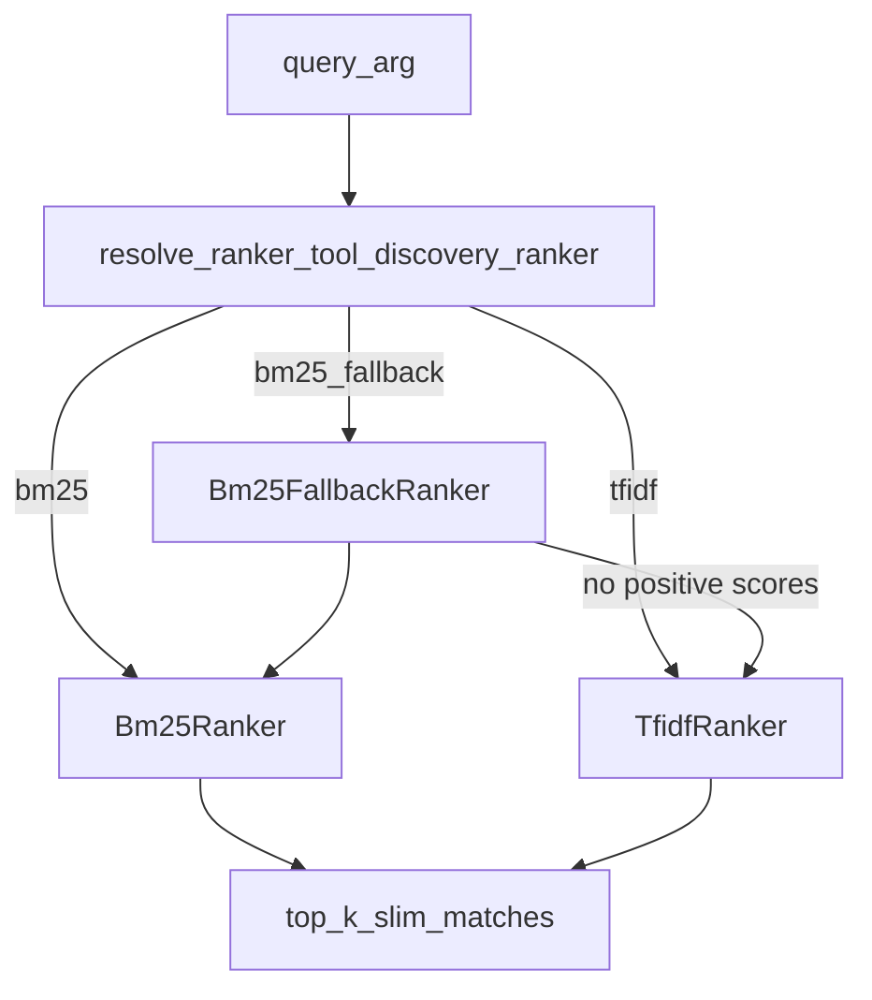

# Tool discovery ranker

Configures how layered `get_service_info(query=...)` ranks inner tools (OpenAPI operations or native MCP tools) before returning a slim top-k shortlist.

Related:

- Agent workflow guide: [Layered MCP Server](./layered_mcp_server.md)
- Design decision: [Query-first layered tool discovery](../design-doc/design-decisions/tool-discovery.md)

## Why

Large member catalogs (hundreds of operations) must not dump every tool into agent context. Agents search with `query`; Composer ranks and returns at most `limit` slim matches (default 20, hard cap 50).

Char n-gram TF-IDF alone often scores almost every entry above zero, so the top-k fills with noise. Word-level Okapi BM25 yields real zeros and better natural-language recall. A camelCase/snake_case tokenizer keeps `operationId`s like `getDatabaseSecurityPolicies` matchable from queries such as “database security policies”.

## Configuration

| Name | Kind | Values |
|------|------|--------|
| `tool_discovery_ranker` | Config key (logical name) | `bm25_fallback` · `bm25` · `tfidf` |
| `MCP_TOOL_DISCOVERY_RANKER` | Environment variable | Same values |

**Default:** `bm25_fallback`.

```bash
# Default — BM25 first; char TF-IDF only when BM25 finds no positive hits
export MCP_TOOL_DISCOVERY_RANKER=bm25_fallback

# BM25 only (strict zeros; no typo / partial-id recovery via TF-IDF)
export MCP_TOOL_DISCOVERY_RANKER=bm25

# Legacy char n-gram TF-IDF only (substring if sklearn is missing)
export MCP_TOOL_DISCOVERY_RANKER=tfidf
```

Aliases accepted by the resolver: `hybrid` / `bm25_then_tfidf` → `bm25_fallback`; `idf` / `tf_idf` → `tfidf`. Unknown values log a warning and fall back to `bm25_fallback`.

## Adapters

Code: `modules/mcp_composer/src/mcp_composer/core/member_servers/layered_rankers.py`

| Adapter | Role |
|---------|------|
| `Bm25Ranker` | Okapi BM25 (`k1=1.5`, `b=0.75`) over camelCase/snake/kebab tokens (length ≥ 2) |
| `TfidfRanker` | Char n-gram TF-IDF (`char_wb`, 2–4); substring overlap if sklearn is unavailable |
| `Bm25FallbackRanker` | Composes the two: BM25 → TF-IDF when every BM25 score is zero |

`rank_entries` in `layered_discovery.py` calls `resolve_ranker()` (or an injected adapter in tests), keeps scores `> 0`, sorts descending, and applies `limit`.



## Agent contract (unchanged)

Discovery still uses the three-tool surface:

1. `get_service_info(query='...')` — ranked shortlist
2. `get_type_info(service_name)` — schemas
3. `make_tool_call(service_name, ...)` — execute

Changing `tool_discovery_ranker` only changes **how** Layer 1 ranks; it does not rename tools or response keys.

## Tests

`modules/mcp_composer/tests/unit/test_layered_discovery.py` covers tokenizer splitting, BM25 zero omission, TF-IDF fallback, config resolve, and injected adapters.
