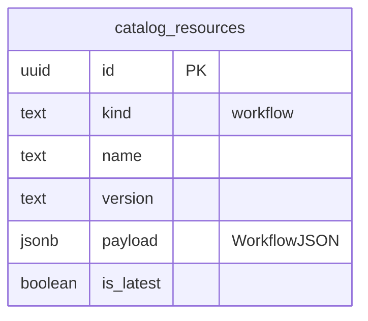

# Workflow management

*MCP Composer — how workflows are authored, stored in the catalog, exposed as MCP tools, and executed by agents.*

For database tables, Catalog Composer startup, and all catalog **`kind`** values, see [Catalog management](./catalog-management.md) and [Catalog Composer](./catalog-composer.md). For layered member servers (`make_tool_call`), see [Layered MCP server](./layered_mcp_server.md).

---

## 1. What a workflow is

A **workflow** is a **versioned, multi-step playbook** stored in the runtime catalog (`kind = workflow`). Each workflow:

- Describes **what to accomplish** (`instruction` / `description`, `goal`).
- Lists **ordered steps** that call product MCP tools in sequence.
- Is exposed on **`workflow-catalog`** as **its own MCP tool** (tool name = workflow `name`, description = user-facing instruction).

Calling a workflow tool **does not run the steps automatically**. It returns an **execution plan** (JSON). The host agent runs each step on the **composer** against mounted member servers—similar to [Layered MCP](./layered_mcp_server.md) (discover → call) and **sequential** step-by-step execution with outputs feeding the next step.

| Concept | Workflow | Skill (contrast) |
|--------|----------|------------------|
| Primary role | Ordered tool invocation plan | Declarative guidance for agents |
| MCP surface | One tool per workflow + catalog CRUD | `list_skills` / `get_skill` + optional `skill://` resources |
| Execution | Agent calls member tools after loading plan | Agent follows instructions; tools via `allowed-tools` |

---

## 2. Storage: one row per workflow

Authoring files and the database use **different shapes**, but the catalog always stores **one workflow per row**.

| Layer | Shape | Notes |
|-------|--------|------|
| **Bundle files** | Four JSON arrays under `resources/workflows/` | Each **array element** is one workflow definition. |
| **PostgreSQL** | `catalog_resources` where `kind = 'workflow'` | Unique key `(kind, name, version)`. |
| **File catalog** | `catalog/workflows/<name>/<version>.json` | Same semantics as Postgres when `MCP_USE_LOCAL_FILE_STORAGE=true`. |

After sync, the **database (or file catalog tree) is authoritative** for runtime; bundle files are the usual bootstrap source in development.



Each published workflow also registers **one dynamic MCP tool** via `CatalogWorkflowsProvider` (refreshed after sync).

---

## 3. Authoring bundle files

Default location: **`resources/workflows/`** at the repository root (override with `MCP_WORKFLOW_FILES_DIR`).

| File | Typical content |
|------|-----------------|
| `workflows_easy.json` | Single-step workflows |
| `workflows_medium.json` | Multi-step, cross-product |
| `workflows_complex.json` | Long orchestrations (many steps) |
| `workflows_single_product.json` | Deep dives on one product (often tagged `[product]` in `instruction`) |

### Entry schema (inside each array)

| Field | Required | Maps to catalog |
|-------|----------|-----------------|
| `name` | Recommended | `WorkflowJSON.name` (MCP tool name) |
| `instruction` | Yes | `description` (MCP tool description) |
| `version` | No (default `1.0.0`) | `version` |
| `goal` | No | `goal` (defaults to `instruction`) |
| `prefixes` | No | Resolves `product` → mounted server id (e.g. `scanner` → `mcp-scanner`) |
| `output` | Yes | `steps[]` |

### Step object

| Field | Required | Notes |
|-------|----------|------|
| `step` | No | Step number (default: order in array) |
| `product` | Yes | Key for `prefixes` (e.g. `scanner`, `service-a`) |
| `tool` | Yes | Underlying tool on that server |
| `tool_prefix` | No | Overrides `prefixes` for this step |
| `input` | No | Arguments; may use `{{placeholders}}` from prior steps |

Example (one element from a bundle file):

```json
{
  "name": "list-open-issues",
  "instruction": "List all open issues across monitored stores",
  "version": "1.0.0",
  "prefixes": { "scanner": "mcp-scanner" },
  "output": [
    {
      "step": 1,
      "product": "scanner",
      "tool": "list_issues",
      "input": {
        "filter": { "status": "OPEN" },
        "pagination": { "offset": 0, "limit": 50 }
      }
    }
  ]
}
```

Explicit `prefixes` mappings can be defined in the workflow file (e.g. `{"scanner": "mcp-scanner"}`).

---

## 4. Configuration

Set these **before** starting Catalog Composer (read at import / first sync).

### Enable workflow catalog MCP

| Variable | Default | Effect |
|----------|---------|--------|
| `MCP_ENABLE_WORKFLOW_CATALOG_MCP` | `true` | Mount `workflow-catalog` on the composer |

Use Catalog Composer when you need workflow catalog tools.

### Catalog database (where workflows are stored)

Same as other catalog kinds—see [Catalog Composer — Database setup](./catalog-composer.md#2-database-setup-for-catalog-composer).

**PostgreSQL (recommended for shared environments):**

```bash
MCP_DATABASE_TYPE=postgres
MCP_DATABASE_URL=postgresql://<db_user>:<db_dwp>@<db_host>:5432/<db_name> # pragma: allowlist secret (example only)
psql "$MCP_DATABASE_URL" -f scripts/sql/catalog_schema.sql
```

**Local file catalog:**

```bash
MCP_USE_LOCAL_FILE_STORAGE=true
MCP_CATALOG_FILE_PATH=./catalog
```

Workflow rows appear under `catalog/workflows/<name>/<version>.json`.

### Bootstrap from bundle files

| Variable | Default | Effect |
|----------|---------|--------|
| `MCP_WORKFLOW_FILES_SYNC` | `true` | On Catalog Composer startup, publish all `workflows_*.json` entries to the catalog |
| `MCP_WORKFLOW_FILES_DIR` | `<repo>/resources/workflows` | Directory containing bundle files |

Disable file sync when the database is already populated and files are not used:

```bash
MCP_WORKFLOW_FILES_SYNC=false
```

### Example: Catalog Composer with Postgres + workflow sync

```bash
export MCP_MODE=sse
export MCP_ENABLE_WORKFLOW_CATALOG_MCP=true
export MCP_DATABASE_TYPE=postgres
export MCP_DATABASE_USER=postgres
export MCP_DATABASE_dwp=<db_dwp> # pragma: allowlist secret (example only)
export MCP_DATABASE_HOST=localhost
export MCP_DATABASE_PORT=5432
export MCP_DATABASE_NAME=mcp_catalog
export MCP_WORKFLOW_FILES_SYNC=true
export MCP_WORKFLOW_FILES_DIR=/path/to/mcp-composer/resources/workflows

cd modules/mcp_composer && uv run python composers/catalog_composer.py
```

---

## 5. MCP tools on `workflow-catalog`

Tool names on the client may be prefixed with the mount namespace (e.g. `workflow-catalog_list_workflows`). List tools after connect to see exact names.

### Catalog management

| Tool | Purpose |
|------|---------|
| `list_workflows` | Active, latest workflows (paginated) |
| `get_workflow` | Full `WorkflowJSON` by name (optional version) |
| `add_workflow` | Publish from `workflow_json` string |
| `publish_workflow_bundle` | Publish payload + optional `catalog_resource_metadata` |
| `delete_workflow` | Remove one version |
| `update_workflow_status` | Lifecycle: `active`, `draft`, `deprecated`, `deleted` |
| `sync_workflows_from_files` | Reload `workflows_*.json` → catalog; refresh workflow tools |

### Agent playbook

| Tool | Purpose |
|------|---------|
| `get_workflow_catalog_execution_guide` | Structured guide (phases, layered vs direct invocation) |
| **`<workflow-name>`** (one per catalog workflow) | Returns execution plan JSON for that playbook |

---

## 6. How agents should use workflows

### Recommended sequence

1. **Orient** — Read server instructions or call `get_workflow_catalog_execution_guide`.
2. **Select** — Match user intent to a workflow tool description (or `list_workflows` / `get_workflow`).
3. **Plan** — Call the workflow tool (optional `input` for known placeholder values).
4. **Execute sequentially** — For each step in `steps`:
   - Resolve `{{...}}` in `input` from prior step results.
   - Call the composer using **`mcp_tool_name`** (direct) or **`layered_make_tool_call`** with `tool_name` + `arguments` when the server is layered.
   - Confirm `expected_behaviour` when present; revise on failure before continuing.
5. **Report** — Summarize outcomes for the user.

### Invocation patterns

| Pattern | When | Action |
|---------|------|--------|
| **Direct** | Member server exposes tools with prefix | Call `mcp_tool_name` (e.g. `mcp-scanner_list_issues`) with resolved `input` |
| **Layered** | Server exposes `get_service_info`, `get_type_info`, `make_tool_call` | Use `{server_id}_make_tool_call` with `tool_name` from the plan and `arguments` = resolved `input`; use `get_type_info` when schema is unclear |

See [Layered MCP server](./layered_mcp_server.md) for the discovery trio.

### Plan response shape (workflow tool result)

Key fields returned to the agent:

- `goal`, `description`, `steps[]`
- Per step: `mcp_tool_name`, `layered_make_tool_call`, `invoke_hint`, `input`
- `execution_guidance` — structured phases and notes
- `next_action` — short reminder for the model

---

## 7. Publishing without bundle files

Use MCP tools when workflows are maintained directly in the catalog:

```json
{
  "name": "my-workflow",
  "description": "What this playbook does (shown as MCP tool description).",
  "version": "1.0.0",
  "goal": "Outcome to achieve.",
  "steps": [
    {
      "step": 1,
      "toolname": "mcp-scanner",
      "tool": "list_issues",
      "input": {}
    }
  ],
  "status": "active"
}
```

Pass as `workflow_json` to `add_workflow`, or wrap with `catalog_resource_metadata` in `publish_workflow_bundle`.

---

## 8. Related documentation

- [Catalog management](./catalog-management.md) — Registry model, `kind`, enabling MCP mounts
- [Catalog Composer](./catalog-composer.md) — Runbook, DB setup, tool list
- [Configuration](./configuration.md#catalog-and-workflow-configuration) — Environment variable reference
- [Layered MCP server](./layered_mcp_server.md) — `make_tool_call` execution path
- [Skill management](./skill-management.md) — Skills vs workflows in the same catalog

Implementation references:

- [`workflow_catalog_mcp.py`](../../modules/mcp_composer/src/mcp_composer/core/tools/catalog/workflow_catalog_mcp.py)
- [`workflow_file_loader.py`](../../modules/mcp_composer/src/mcp_composer/core/workflow_file_loader.py)
- [`catalog_workflows_provider.py`](../../modules/mcp_composer/src/mcp_composer/store/catalog_workflows_provider.py)
- [`catalog_workflow.py`](../../modules/mcp_composer/src/mcp_composer/core/models/catalog_workflow.py)
